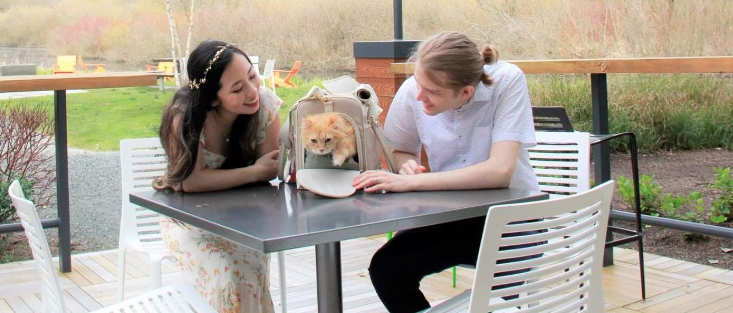

# Meet Your Instructor

Hi I'm Arend Peter!

I'm an ex-Amazon Software Engineer, and I'm currently a full time indie game developer as well as a Game Maker Instructor

Game Maker was my first experience with programming, and I've been using and teaching Game Maker now for over 13 years

In that time, I've helped release several major titles to pc and mobile, and they've all received some combination of awards and features. All of this was done in Game Maker

> Feel free to check out stargardengames.com to see the rest of the projects me and by buddies are working on

I also have experience tutoring math and computer science, and I've got over 200 Game Maker tutorials on YouTube (see [ArendPeterTeaches](https://www.youtube.com/user/SynforgeTutorials) and [SynforgeGames](https://www.youtube.com/user/SynforgeGames) although most of them are old and cringy 😫)

I'm currently living in Los Angelas with my lovely wife (and soon to be [hollywood star](https://www.yenahan.com/)) Yena Jean Han, as well as our spicy cat Kimchi (he has an [instagram](https://www.instagram.com/the.kimchi.kitty/))

