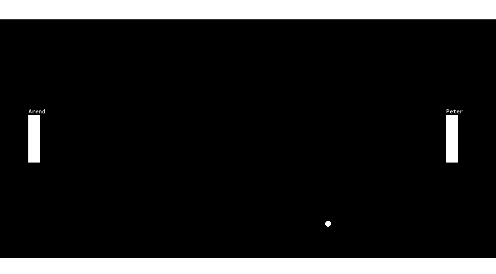
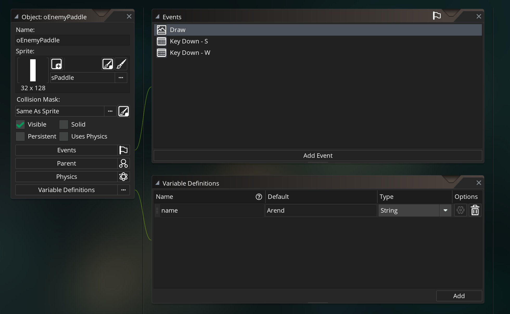

# Adding Paddle Names

This isn't exactly a standard pong feature, but it did feel like the next logic in your Game Maker journey so ima force it

This section is all about getting comfortable with drawing things to the screen 👩‍🎨

## Drawing name

I want there to be names above each paddle. So in addition to their sprites, each of the paddles will also be responsible for drawing some text

Anytime you're drawing things to the screen, you need to use the Draw event, let's add a draw event in oPaddle and add code to draw text

```
// oPaddle Draw Event
draw_text(x, y-20, "Peter");
```

> NOTE: I added // Draw Event to clarify the event, but you should need to use the comment (the event should already be clear). Now that you're comfortable w/ events I can just do this and make my descriptions a little shorter

New function, new definition

> **draw_text()**: Draws text to the screen
* Input: x/y position to draw the text, as well as the string you want to draw
* Action: Draws text at specified position
* Ouptut: none

For the position, I want it to be drawn above the paddle, so I'm using the same x position as the instance it's self, and I'm making the y position smaller. I landed on -20 after some trial and error, so don't feel like you need to get the perfect number on the first try

For the text parameter, I have to specify a `string` instead of a number. `string` is just programmer speak for text (not sure why they felt the need to invent a new word, but they did 🙄)

To ensure that game maker interprets the parameter as text instead of code, we need to surround the text with double quotes `""`

When we hit play you should see the text, but wait ... what happened to the paddle!??! 😲


## Drawing Self

On the one hand we shouldn't be surprised, it's only drawing the text, because we only wrote code for drawing the text right? But then why did the sprite show up earlier?

When people are first starting out, Game Maker wants you to get started quick w/o needing to understand how to code a draw event. Their solution is to have some hidden draw event code implemented for people who don't specify their own draw event, but now that've we've made our own draw event, the training wheels are off and we need to do everything ourselves

Luckily there's a simple function we can call to just make Game Maker do what it was already doing. Introducing ... ``draw_self()``. Here's our updated code:


```
// oPaddle Draw Event
draw_self();
draw_text(x, y-20, "Arend");
```

> **draw_self()**: Preforms default draw operation that occurs when Draw Event isn't specified
* Input: nada
* Action: Draws instance to the screen using the default settings
* Output: nope

Now it works as you'd expect, crisis averted 😪


## Storing name in a custom variable

We just have a tiny pong game, but in RPGs it's very common to let players specify a custom name


In larger games, the name could be referenced 1000s of times across the whole experience, at that point entering the string directly into our functions will become tedious. It would be nice if we could set the name in one spot and then refer back to it whenever we need it...

That's what variables are for! Previously we've only used built in variables (x, xstart, etc), but now we'll need to define a custom variable of our own. It's fairly straight forward, we can just use the same variable assignment format, and then we can name the variable whatever we want

```
// oPaddle Create Event
name = "Peter";

// oPaddle Draw Event (updated)
draw_self();
draw_text(x, y-20, name);
```

Awesome! In general taking advantage of variables in cases like these makes your code much easier to maintain. Going into the create event to tweak some variables will always be easier than having to dig into your draw event functions (or some other event) and the figuring out exactly which input you want to modify

## Adding name to oEnemyPaddle

Now see if you can add a name to the oEnemyPaddle as well :)

<details>
<summary><b>oEnemyPaddle implementation</b> Click to see</summary>

It should be pretty much identical to the other implementation

Luckily I have 2 names so I can play against myself :)

<pre><code>// oEnemyPaddle Create Event
name = "Arend";

// oEnemyPaddle Draw Event
draw_self();
draw_text(x, y-20, name);
</code></pre>



</details>


## Variable scope and "not set before reading" errors

Some of you probably have hit errors on that previous assignment (I'm actually hoping that some of you did, that's the best way to learn :) )

Here's one popular crash (please keep reading even if you didn't see it, you'll definitely see it eventually)

```
___________________________________________
############################################################################################
ERROR in
action number 1
of Draw Event
for object oEnemyPaddle:

Variable oEnemyPaddle.name(100016, -2147483648) not set before reading it.
 at gml_Object_oEnemyPaddle_Draw_0 (line 2) - draw_text(x, y-20, name);
############################################################################################
gml_Object_oEnemyPaddle_Draw_0 (line 2)
```

First off, if you see this, don't panic. You're going to see these a lot and crashes are usually the easiest bugs to fix, so think of them friendly reminders from Game Maker 😊

This means you likely copied the draw event code over w/o copying the code in the create event. It can't find the ``name`` variable because the variable was never created

This brings up **Initialization** vs **Usage/Reference**

 * **Initialization**: This is where you create a new variable, and initialize it with a value. Whenever you're using a assignment operator to create a new custom variable, you're **initializing** the variable (if the variable already existed, then I suppose you're reinitializing)
 * **Usage/Reference**: This is where you're using a variable but not changing it's value, you using (or referencing) it. This happens whenever you include variables on the right side of the assignment operator, or if when you use variables as inputs to functions

The most important thing about **Initialization** vs **Usage/Reference** is **ALWAYS INITIALIZE BEFORE YOU REFERENCE**, otherwise game maker will have no idea what to do with the reference variable

Most of you probably just forgot to copy the create event code, but some of you may have expected `oEnemyPaddle` to reference the variable initilized by `oPaddle`. This brings up variable scope. When you create variables, they only exist for that particular instance (they're instance variables, which means they're scoped to the instance, ). So creating a name variable in oPaddle, means it can only be used in oPaddle. If oEnemyPaddle wants a name, then it'll need to make it's own. One of the nice things about variable scope, is you can reuse the same variable names all you want. As long as the duplicate variable names, are in different scopes then you're fine

## Variable Definitions

Using the assignment operator isn't the only way to initialize variables

If you open up the **Variable Definitions** section of object you can specify the variables there instead



Initializing in Variable Definitions is kind of like using the assignment operator method in a "pre-create" event. So if you use Variable Definitions it's also important that you remove the initialization from the create event. Otherwise it will overwrite whatever you put in Variable Definitions

Variable Definitions are great for the following situations

1. It's usually more convenient if you plan to modify it frequently
1. If you work with other people (particularly if they aren't programmers), it'll be easier for them to edit via variable definitions
1. Variable Definitions can also be edited for individual instances using the instance inspector in the rooms. So if you have a single object but multiple instance w/ different values then Variable Definitions could be a good approach

## Allowing user to input names

Some of you may be disappointed that I used the RPG name input picture as an example, but didn't show you how to actually allow players to input custom names

I'm not planning to cover it, but if you're interested feel free to read the documentation for . It's not too tricky, I bet you can figure it out. And it's good practice getting used to reading through Game Maker's documentation
