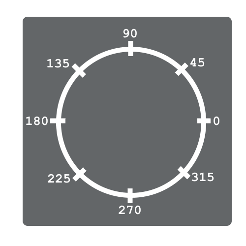

# Arms

Can you guess the next glaring most flaw in our game? Was it that she doesn't have any arms? Yes, I think so too

So the arms are holding a gun, and we're going to always have the arms/gun point toward the mouse

## point_direction

The ``point_direction()`` function is at the core piece to this effect. We give it x, y values for 2 points (a total of 4 parameters), and it returns the angle from the first point to the second. Let's use our debugging ``print()`` function again to get some intuition for this

```
// oPlayer Create
arm_dir = 0;

// oPlayer Step
//// ARM
{
    arm_dir = point_direction(x, y, mouse_x, mouse_y);
    print(arm_dir);
}
```

``arm_dir = point_direction(x, y, mouse_x, mouse_y);``: Here arm_dir represents the angle from our x,y to the mouse position

Go ahead and test it out to get some intuition. Here's the angle diagram again for reference



Here's a specific case where it's outputting 45, is this what we expect?


<details data-summary="Is 45 the expected angle for that case?">
Yep, that's right. Since we're using x, y as the starting position, and the x,y is at the player's bottom center we get 45

This represents the angle from the player's feet, to the mouse, but we want it to go from the player's arm (or shoulder I guess?) to the mouse. In that case we'd expect it to output 315. Let's add an offset to fix that
</details>

## Arm Offset

Let's add a better offset to fix the angle

```
// oPlayer Create
arm_x = 0;
arm_y = -32;

// oPlayer Step
//// ARM
{
    arm_dir = point_direction(x+gun_x, y+gun_y, mouse_x, mouse_y);
    print(arm_dir);
}
```

``gun_x`` / ``gun_y``: This represents the offset from the feet to the shoulder. Luckily the shoulder is always 32 pixels above the feet for all sprites (if this wasn't the case we'd have to account for ``gun_x`` / ``gun_y`` updates in our animation state logic)

When we test the direction again, we get a better angle


## Drawing the Arm

Now that we have a good angle, let's draw the arm!

```
//// oPlayer Draw Event
// back arm
draw_sprite_ext(sArm, 1, x+gun_x, y+gun_y, image_xscale, image_yscale, arm_angle, image_blend, image_alpha);
// body (essengially draw_self())
draw_sprite_ext(sprite_index, image_index, x, y, image_xscale, image_yscale, 0, image_blend, image_alpha);
// front arm / gun
draw_sprite_ext(sArm, 0, x+gun_x, y+gun_y, image_xscale, image_yscale, arm_angle, image_blend, image_alpha);
```

``image_angle``: This variable isn't present in the code, but I wanted to call it out anyway. You can update ``image_angle`` to change the angle of the entire sprite. In this case we want to have the body and the arms use different rotations so ``image_angle`` isn't the right tool for the job

``//back`` / ``//body`` / ``//front``: Since the body needs to be drawn between the 2 arms, we need to draw this in 3 phases, first the back arm, then the body, then the front arm (which also has the gun)

``//body``: We essentially want to do ``draw_self()`` here, but since the other ones need to use ``draw_sprite_ext()``, we may as well use it here too as a practice run. Normally you'd use ``draw_sprite()`` but that only let's you specify the sprite, frame, and position for the sprite. ``draw_sprite_ext()`` is the extended version. There you can specify the scale, angle, coloration, and transparency. ``draw_self()`` does all these things but it just relies on all the default variables (most of which you know). So the ``draw_self()`` equivalent would be ``draw_sprite_ext(sprite_index, image_index, x, y, image_xscale, image_yscale, image_angle, image_blend, image_alpha);``. For the body the I did differently was change ``image_angle`` to ``0``. I could have left it as is since ``image_angle`` is already ``0``, but I figured this was more clear

``//body`` / ``//front``: The main reason we're using ``draw_sprite_ext()`` is because these guys need to leverage the angle parameter. So instead of ``image_angle``, we use the arm_angle variable we computed in the step event. Then we want to draw the arm at the shoulder, so we do ``x+gun_x, y+gun_y`` for the position, and we want to use ``sArm`` for the sprite. Lastly, the only difference between the front and back arm is the frame, so we use ``1`` for the back arm and ``0`` for the front. Aside from that, all the other parameters use the ``draw_self()`` defaults

With all that out of the way we should have a gun attached to us (well sort of)


## Axis of rotation

Ok, so as you may have already guessed, this is an alignment issue. But I wanted to also mention that in addition to handling the position offset, the sprite offset also handles the axis of rotation, and the axis of rotation it a major determinant of how the rotation looks


So that said, make sure to set the arm offset to be right at the shoulder. That's the best axis of rotation, and it's also where we're drawing it

After fixing that, our arm looks good (well almost 😅)


## Mirroring the Arm

Now the arm looks good, except when we rotate the gun backwards, hmmm

Well for one thing, most people's shoulder's don't really bend that way, and for another, if the gun was facing that direction, it should be upside down, it should be mirrored

For the shoulder flexibility problem, let's make the player face toward the mouse, instead of the direction she's moving. I think you can do this one

<details data-summary="Make image_xscale follow mouse instead of movement" markdown="1">

```
// oPlayer Step Event
//// HORIZONTAL
{
    if((keyboard_check(vk_left) or keyboard_check(ord("A"))) and place_free(x-max_dx, y)){
        x -= max_dx;
        // image_xscale = -1; // old code
    }
    if((keyboard_check(vk_right) or keyboard_check(ord("D"))) and place_free(x+max_dx, y)){
        x += max_dx;
        // image_xscale = 1; // old code
    }
}
//// VERTICAL
//// ANIMATION
//// ARM
//// FACING
{
    if(x < mouse_x){
        image_xscale = 1;
    }else{
        image_xscale = -1;
    }
}
```

There we go, comment out the old code, and then for the new code it's just ``image_xscale = 1;`` if the mouse is to our right (i.e. ``x < mouse_x``), and ``image_xscale = -1;`` otherwise

Actually, this is also a good ternary operator opportunity, here's how that line would look with that

```
image_xscale = (x < mouse_x)? 1 : -1;
```

</details>

Now for the upside down gun problem, instead of letting the gun rotate into the 90-270 range, I'd rather it stay in the 270-90 range and mirror if we're pointing the gun left. We can do this by adding some ternary operators into our draw logic

```
//// oPlayer Draw Event
// back arm
draw_sprite_ext(sArm, 1, x+gun_x, y+gun_y, image_xscale, image_yscale, arm_angle+((image_xscale < 0)? 180 : 0), image_blend, image_alpha);
// body (essengially draw_self())
draw_sprite_ext(sprite_index, image_index, x, y, image_xscale, image_yscale, 0, image_blend, image_alpha);
// front arm / gun
draw_sprite_ext(sArm, 0, x+gun_x, y+gun_y, image_xscale, image_yscale, arm_angle+((image_xscale < 0)? 180 : 0), image_blend, image_alpha);
```

``((image_xscale < 0)? 180 : 0)``: So we're just adding this term to the angle of both of the arm draw functions. If the player is facing left (meaning the gun is in the 90-270 range), we want to add 180 to bring it back to the other side, otherwise we leave it. And since we're using ``image_xscale`` the fun should mirror along with the player

**TODO**: double check this logic, I feel like it should be ((image_xscale<0)? 180-arm_angle : arm_angle)

Now we can rotate the arm in all 360 directions without it looking weird 🥳


## Walking Backwards

If we're walking backwards, we really should have it animate backwards as well, don't you think?

<details data-summary="How to make the player animate backwards, when walking backwards" markdown="1">

```
// oPlayer Step Event
//// ANIMATION
{
	// jumping
	if(place_free(x,y+1)){
		sprite_index = sPlayerJump;
		image_speed = 0;
		if(dy < 0){
			image_index = 0;
		}else{
			image_index = 1;
		}
	// idle
	}else if(dx == 0){
		sprite_index = sPlayerIdle;
		image_speed = 0;
		image_index = 0;
	// walking
	}else{
		sprite_index = sPlayerWalk;
        // walking left
        if(dx < 0){
            image_speed = (image_xscale < 0)? 1 : -1;
        }else{
            image_speed = (image_xscale > 0)? 1 : -1;
        }
	}
}
```

So there's 4 cases to consider here. (Walking left, Facing left), (walking left, Facing right), (Walking right, Facing left), and (Walking right, Facing right). When they match she's walking forwards, otherwise she's walking backwards, so that gives us animation speeds of 1, -1, 1, -1 respectively

``dx < 0``: The first if statement checks if we're walking left

``image_speed = (image_xscale < 0)? 1 : -1;``: Each subcase has a ternary operator like this checking both the facings. The condition is just referces if we're moving the opposite direction

If you want an even more compact way to do this here's a one liner that does the same thing

``image_speed = (dx < 0 == image_xcale < 0)? 1 : -1;``: Remember that comparison operators just give back a boolean value. So if ``dx < 0`` and ``image_xscale < 0`` match that means we're walking in the same direction we're facing. We can use that to see if we're moving forward or backwards and then set the ``image_speed`` accordingly. This version is arguably less readable, so personal preference whether to use this approach or the original one

</details>

## Procedural Animation

This can be considering basic Procedural Animation. Procedural animation is when you use your programming skills to create animation rather than draw the animations by hand. Brad didn't have to create frames for all the arm rotations, we did 😁

[RujiK the Comatose](https://www.youtube.com/watch?v=z_fmMD-Gazw) and [Sokpop](https://www.youtube.com/watch?v=NscOxVT1T6c) are some examples of Game Maker users that having been making impressive use of procedural animation in their games
