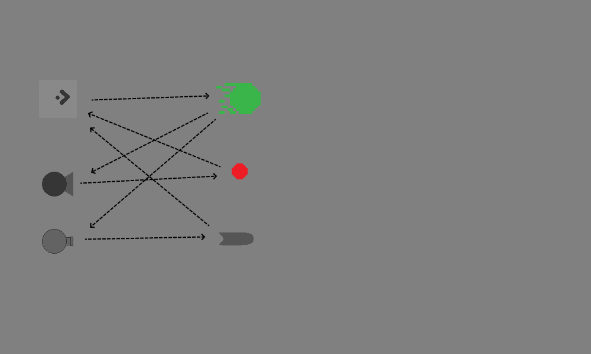
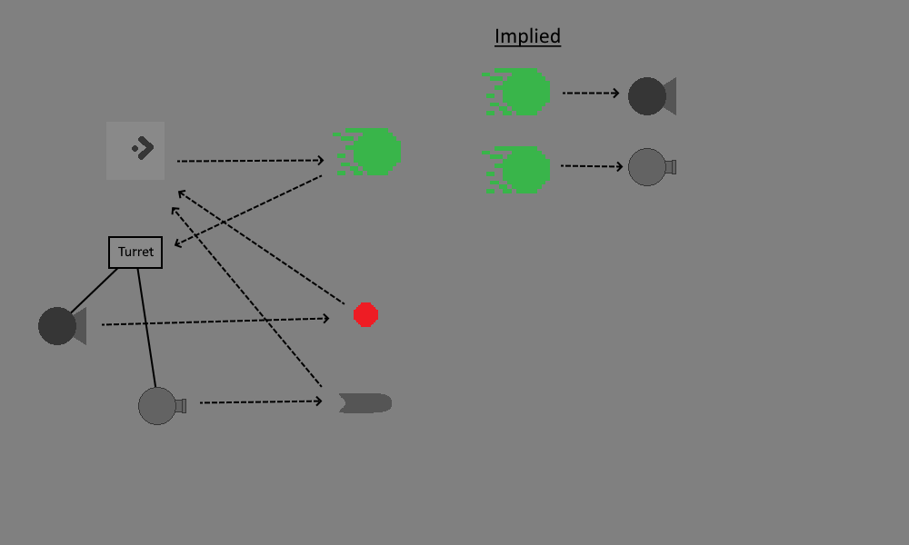
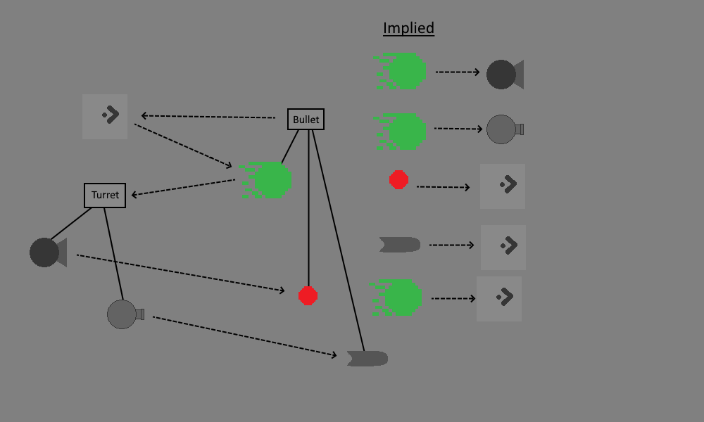
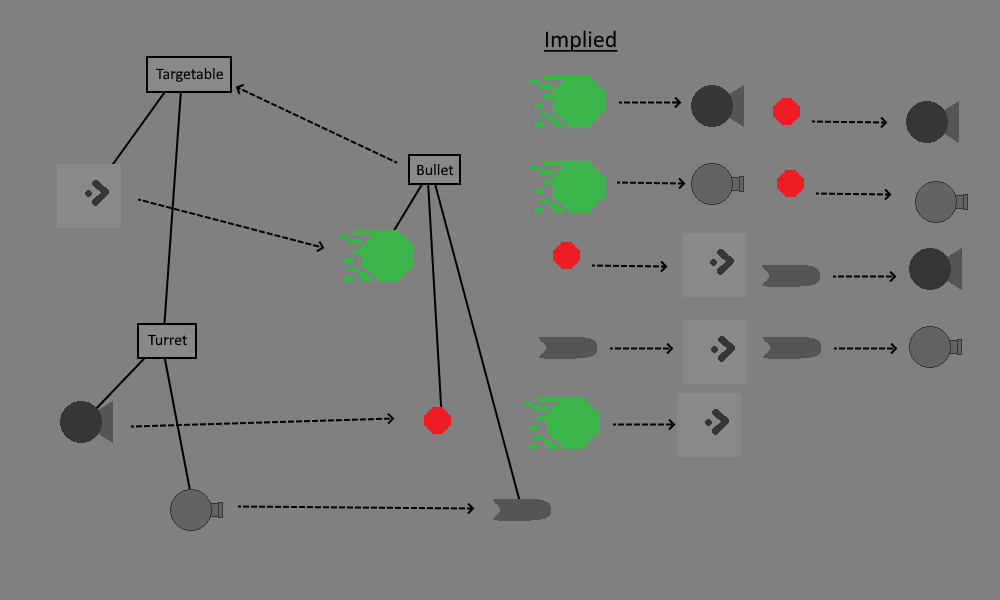

# Polymorphism

Let's add another 🤓 page to wrap this up. **Polymorphism** is a fancy latin term meaning "Multiple forms". It's really useful and it's a natural extension of parenting (generally known as **Inheritence** outside of the Game Maker world). Unfortunately, most people only experience polymorphism as an obscure vocab word their introductory programming class, and sometimes don't ever get to see the true power of the concept 😭

Luckily, this is game dev course, so we can drive polymorphism home with a neat gaming analogy. Let's talk about **Emergent Gameplay**

## Emergent Gameplay

Emergent gameplay happens when interactions between your game's systems results in interesting scenarios that you didn't explicitly intend

[Spelunky](https://spelunkyworld.com/whatis.html) is a classic example of a game that really leverages emergent gameplay (and it was made in Game Maker 😉). Heres an example of some of the game's systems

* The game has a shop w/ a shop keeper. You can either pay the shop keeper for his items, or just steal them and risk the shop keepers wrath
* One of the enemies throws boomerangs. When the boomerang doesn't come back, they walk over and pick it up

Well what if the boomerang man can't find his boomerang, but he walks into the shop and sees a boomerang that's available? Well the boomerang man will steal from the shop keeper, and the shop keeper will go berserk!!

> I couldn't find video of that exact interaction, but here are some similar ones [link](https://www.youtube.com/watch?v=tljIyu3Rn5I)

So here we have two Spelunky systems, and when we put them together we get new unexpected scenarios, and that's emergent gameplay! But emergent gamplay is a lot easier to implement when your take advantage of polymorphism

Here's another way we can describe the system. The shopkeeper doesn't care if the player or the boomerang man steals from him, he gets equally mad either way. In other words, the thief can take multiple forms, i.e. POLYMORPHISM 😍

## Polymorphism

Now let's jump back to our game and give a more concrete example

Here's what our object interactions would look like without inheritence

Each dotted line represents an interaction that we would need to code from scratch. For example, the player needs to create bullets. So I added an arrow from the player to the bullet. That's a lot of lines isn't it? And we've only got 6 objects!

Now here's how it changed when we decided to use parenting on our turrets

Sweet! Before we needed interactions for the ``oBullet`` collision w/ ``oMissileTurret`` as well as the ``oBullet`` collision w/ ``oFlameTurret``. But with parenting the bullet only needs to handle collisions with ``oTurret``, and that's because we're using polymorphism. ``oTurret`` can have multiple forms, so we we code up collisions w/ ``oTurret`` we're actually also getting implied collisions between ``oBullet`` / ``oMissileTurret``, and ``oBullet`` / ``oFlameTurret``

Alright, so we're down from 7 interactoins to 6, can we go further? Earlier I hinted that we could apply parenting to ``oBullet``/``oMissile``/``oSpark``, let's see what happens when we add that

We went from 6 to 5 🎉! Now we only need to handle the bullet colliding w/ the player instead of handling tha tcase for both ``oSpark``, and ``oMissile``. But we actually have a new interaction as well, and this is where emergent gameplay comes into play. The player's bullets can now hurt the player 😲. Granted, I'm not sure how that would happen with the game as it is now, but it could be interesting in the future. Like maybe one day you'll add bouncing bullets?

> **But what if I don't want the player's bullets to hurt the player?** You've got a couple of options 🤓! In addition to the general bullet parent, we could also have a ``oEnemyBullet`` which has the missile and sparks as it's children. That way you can handle movement in the general bullet, but leave the player damage to the ``oEnemyBullet``. Another option is to leave it as is but add an exception. So the if statement that handles damaging the player would include a ``and object_index != oPlayerBullet`` to verify that it's not the right bullet. Both optoins are viable depending on the situation. If you have 20 bullet types, and ``oPlayerBullet`` is the only problem case, then just add an exception. But if you find yourself adding exceptions for a lot of objects, then you're probably better off restructuring your parenting. Lot's of exception become hard to track very fast

But what if we went even further 😈. Here's what it would look like if we generalized both the turrets and the players to be targetable

This saves us another interaction. We could have the ``oBullet`` parent handle collisions with w/ ``oTargetable`` instead of needing to handle ``oPlayer`` and ``oTurret`` collisions separately. This one's interesting since ``oTargetable`` won't actually have any code (you may have noticed that the turret and player don't have much in common in terms of their behaviour). Instead we've used it to group the player and the turret's together so that the bullets can refer to them in a more general sense (a more polymorphic sense?)

In addition to the code savings, we also get a lot of emergent gameplay. Any bullet being able to hit any targetable, means that the turrets can now damage each other 😯. Pretty cool deal considering that we're getting all this functionality while at the same time writing much less code 😎

## But is this actually a good idea?

I went a little crazy up there, let's reel the conversation back in a bit

Using these technique is great if you like all the unintended side effects (emergent gameplay is good if it fits your vision for the game, otherwise those are just bugs). If you find that your objects aren't grouping together nicely for this pattern, then it might not be the right pattern for your game

Don't worry, there are other techniques for maximizing code reuse. For example, [custom functions](https://manual.yoyogames.com/GameMaker_Language/GML_Overview/Script_Functions.htm) are great for this. You can essentially define the shared code as a custom function and then call the function in all the places that need it. We'll be covering custom functions in the next section in case you want to give this a try

> **But my friends say inheritence and parenting are bad!?!?**: hmm, are you sure they're your friends? 🤓 Although to be fair, there are some critisisms of inheritence as a general pattern. Inheritence hierarchies can get hard to manage if you end up with a lot of layers (if your object has great-great-great-great-grandparents in addition to parents, then you've probably gone overboard). Also you might end up hitting edge cases on larger projects. For example, let's say you have ``oTurret`` and ``oHumanEnemy`` as parents, and then you grouped them under an ``oEnemy`` parent (grand-parent?). Now humans with flame throwers in addition to the flame turrets. They're flame throwers are probably similar but where do you put the shared code? ``oEnemy`` is their only common parent, but it would be weird to do it there since most of ``oEnemy``'s childeren are not flame throwers. These limitations is where the [composition > inheritence](https://www.youtube.com/watch?v=wfMtDGfHWpA) philosophy comes from, and that's also where the Unity component system comes from. But all that said, I find inheritence to be very intuitive way to share code and generalize my behaviours. I just try to keep my hierarchies shallow, and then rely on other patterns when I hit cases that inheritence doesn't handle well. Tbh, I've tried using the full component pattern in Game Maker before, but I've always found it to be overkill for my projects
