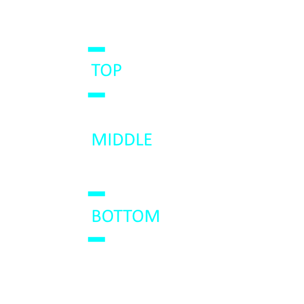
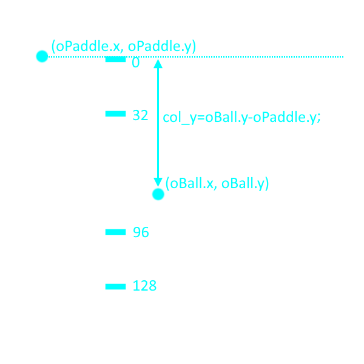

# Aiming The Ball

Now that we've got the basics implemented for our pong game, we're going to add some more mechanics to make our gameplay more deep and interesting

To start we'll allow paddles to "aim" the ball. In particular we want the ball to bounce at a sharper angle, whenver hit use the edge of our paddle, thus making it harder for the other player


## Introducing direction/speed (and Cartesian vs Polar)

Before we get into that, I want to chat a bit about different ways to represent 2d space, and how it applies to the Game Maker representations.

So far we've done this by representing our postition/speed in terms of it's horitzontal and vertical components (x, y, hspeed, vspeed). This system is called Cartesian

> **Quick side story** the cartesian (x/y) coordinate system was invented a French Mathematician named René Descartes (get it, *Cart*esian, Des*cart*es). Supposedly he invented it while lying in bed. He saw a fly on the ceiling and was trying to figure out how he could represent the fly's position on the ceiling (what a nerd)

Polar is a different system. Here we represent using an angle and a distance. As an example think of if your friend was giving you directions. If you're in NY City, they might say walk 5 blocks east, and 2 blocks north (the cartesian method). But if you're on a open field, they might say look toward that mountain in the distance (angle), and walk a half mile (distance).

In math, angle and distance are represented with r and θ, but this isn't used for postition in Game Maker. Currently x/y represents how much you would have to walk horizontally and vertically from the (0,0) point to reach your current position. A r/θ system for position would be harder to work with

> **Fun Fact** for me the coolest thing about polar coordinates, is the pretty pictures you get when you start plotting polar functions. For example sin curves looking kind of boring using a cartesian plot, but they turn into pretty flowers on polar plots. Something to look forward to when you get to your math classes in late high school / early college ;)


So position is weird, but speed is a different story. hspeed/vspeed represents our horizontal and vertical velocity, but that actually isn't super intuitive. If your friend asks how fast your driving, have you ever said "I'm driving 20 mph to the east, and 20 mph north". NO! You'd say "I'm going 28(ish) mph, and I know this wasn't part of your question, but that's in the the north east direction in case you're curious". Game Maker has the speed/direction vartiables for this purpuse

Sorry I kind of geeked out there, all you really needed to know is that direction and speed are new variables you can use instead of x/y

## Start ball at random direction

Cool, let's get back to coding! Update the ball's create event as follows (note that I'm using comments to disable the old code, this way we can keep it around for you to reference later)

```
// oBall Create Event (updated)
// cartesian approach
/*
hspeed = choose(-4, 4);
vspeed = choose(-4, 4);
*/

// polar approach
direction = random(360);
speed = 6;
```

First we set direction randomly between 0 and 360. For function documentation, I'm going to start letting you use the official Game Maker documentation instead of writing out simplified versions everytime

Here are 2 ways to access the documentation
1. Type the function name in the editor (for example ``random``), then ``right click + Keyword help`` on the code
1. Type the function name in the editor (for example ``random``), then ``left click + F1`` on the text
1. Go to google.com and type ``game maker <function name>`` (for example ``random``)

That should take you to [this page](https://manual.yoyogames.com/GameMaker_Language/GML_Reference/Maths_And_Numbers/Number_Functions/random.htm). This only thing to keep in mind when reading it is that they use the term "returns" instead of "outputs". return is the standard term in programming circles, I just thought output was a more clear term when explaining it the first time

So from reading the manual we see that random will return a random number between 0 and 360. I chose 360, because that's the largest number direction can have, and using random will allow the ball to randomly start in any direction. Here's a chart giving you an idea of how those numbers represent direction


So direction = 0 would make the ball go right, 90 would make it go up, etc

Then we set to speed to make the ball actually move in that direction (otherwise it won't move at all)

When we test this out, we should see more variation in the ball's starting direction


## oEnemy Paddle Collision

When the ball collides the the enemy paddle, let's break it down into multiple scenarios depending on where the ball hit the paddle



Here's the structure I'll use

```
// oBall Collision w/ oEnemyPaddle
col_y = y - oEnemyPaddle.y;
if(col_y < 32){
    // bounce up-right
}else if(col_y < 96){
    // bounce right
}else{
    // bounch down-right
}
```

This introduces a new format for our if statement. First off you can tack on an else to provide an alternative if the condition is false

```
if(<condition>){
    // code <- only occurs if <condition> is true
}else{
    // code <- only occurs if <condition> is false
}
```

And you can even use else if when you want to have multiple conditions

```
if(<conditionA>){
    // code <- only occurs if <conditionA> is true
}else if(<conditionB>){
    // code <- only occurs if all previous conditions are false AND <conditionB> is true
}else if(<conditionC>){
    // code <- only occurs if all previous conditions are false AND <conditionC> is true
}else{
    // code <- only occurs if all conditions are false
}
```

For the conditions I'm using col_y. Since x/y values actually correspond to the top left corner of the sprite (this is the default, but it can be changed). We can do this math to determine where on the paddle the ball is. 0 is the top, and 128 is the bottom (if you check sPaddle, you'll see that it's 128 units tall)



Now we actually need to set the ball direction (currently I only have comments indicating which direction to bounce). Why don't you use the direction circle to try figuring out some reasonable values and get back to me?


<details>
<summary><b>Update our collision code to set the direction for each case</b> Click to see </summary>

Here are the numbers I used, but they can definitely use some more tweaking (I used 45, but you may want to use sharper angles)

<pre><code>
// oBall Collision w/ oEnemy Paddle
col_y = oBall.y - y;
if(col_y < 32){
    direction = 45;
}else if(col_y < 96){
    direction = 0;
}else{
    direction = -45; // NOTE: this is identical to 315
}
</code></pre>

Since adding 360 to your direction takes the direction in a full circle, there's a lot of numbers you can use. I opted for -45 for down-right, but you add or subtract 360 to reach many other numbers. So 315 is also fine, and you could even go up do 1395 (not sure why you would, but you could)

</details>

At the end it should look something like this


## oEnemy Paddle Collision

Now try doing the same thing for the player paddle collisions. I don't think you need me for this on 😉

<details>
<summary><b>Write collision code for the ball/player</b> Click to see</summary>

Should be the same as the enemy code, just using different numbers

<pre><code>
// oBall Collision w/ oPaddle
col_y = y - oPaddle.y;
if(col_y < 32){
    direction = 135; // left-up
}else if(col_y < 96){
    direction = 180; // left
}else{
    direction = 225; // left-down
}
</code></pre>
</details>

## Add more cases

Currently we only have 3 cases, but you can add more to make things more interesting. Maybe you want to add regions closer to the edges for more extreme angles? Or maybe you want to make the central region smaller? (becuase moving straight is boring)

<details>
<summary><b>Add more cases to the collisions</b> Click to see</summary>

Here's an example of the oEnemyPaddle collision w/ 5 cases

<pre><code>
// oBall Collision w/ oEnemyPaddle
col_y = y - oEnemyPaddle.y;
if(col_y < 16){
    direction = 60; // sharp right-up
}else if(col_y < 48){
    direction = 45; // right-up
}else if(col_y < 80){
    direction = 0; // right
}else if(col_y < 112){
    direction = -45; // right-down
}else{
    direction = -60; // sharp right-down
}
</code></pre>
</details>

## Speed up the ball

Now that we've refactored the ball to use speed direction, we can pretty easily add an adjustment to make the ball get faster on every bounce. Ramp up the intesity as the game progresses 😉

```
// oBall collision w/ oPaddle and oEnemyPaddle

// insert previous collision code here

speed += 1; // same as speed = speed + 1;
```

Wait what 😲, what's ``+=``? Ah mb, ``+=`` is a handy short hand when you want to add (or subtract, multiply, etc) to a variable without directly setting it to a value. You may have already noticed that we do this sort of thing ALOT ``<variable> = <variable> + <some number>``. Well using this syntax you can do the same thing with fewer keystrokes 😎 ``<variable> += <some nubmer>``

And there is equivalent sytaxes for the other operations

| Operation | New Syntax | Old Syntax |
| --- | --- | --- |
| Addition | ``<variable> += <some number>;`` | ``<variable> = <variable> + <some number>;`` |
| Subtraction | ``<variable> -= <some number>;`` | ``<variable> = <variable> - <some number>;`` |
| Multiplication | ``<variable> *= <some number>;`` | ``<variable> = <variable> * <some number>;`` |
| Division | ``<variable> /= <some number>;`` | ``<variable> = <variable> / <some number>;`` |

> **WHAT'S SYNTAX MEAN!** oh, I guess this is the first time I used that word. Syntaxes are the rules that define the structure of your code. It's pretty much the programming equivalent of grammar. Isn't it annoying that programmers have to make up new words for everything 😢

Anyway, if you test the game now you should see the ball speed up over time
