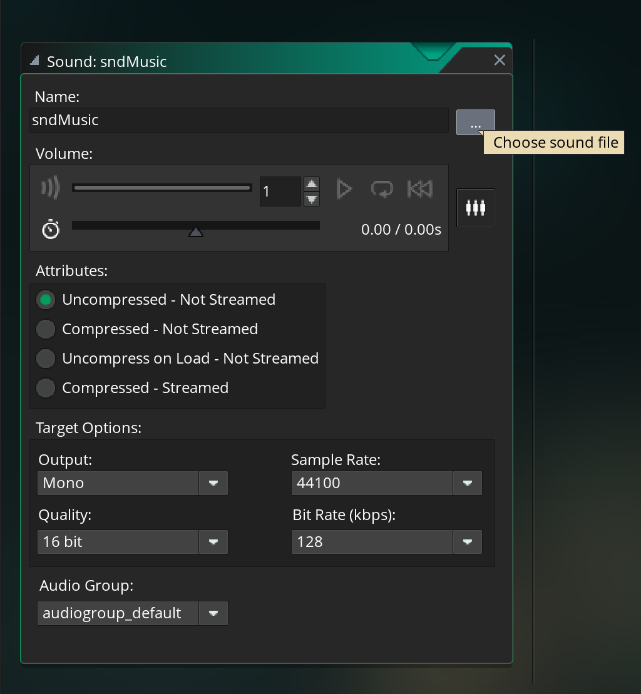
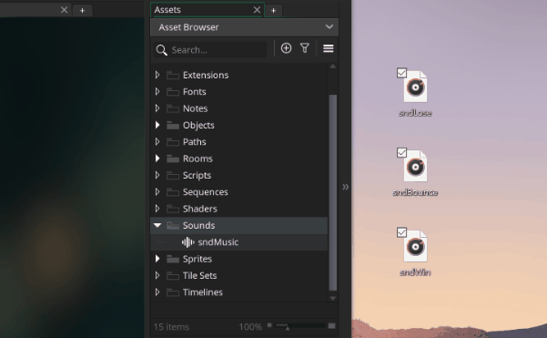

# Sound

Part of making our pong game more **Extreme** is to more with more of the game maker resources, and to start let's add some sound

## Music

Let's add some background music!

The first step in each of these sound sections is to import sounds someone else made. I'm afraid I don't know how to make sounds, just program them. This a track was made by my friend Julianna, go ahead and download it from sound cloud

- [https://soundcloud.com/yuli_indigo/traversing](https://soundcloud.com/yuli_indigo/traversing)

Next we can jump into Game Maker and make a sound resource. You can right click on the sound folder and hit add sound (just like all the other resources)


Then we can name the sound ``sndMusic`` and you can hit "choose sound file" to select the sound file that you downloaded



Now the music is in Game Maker, but we need to add a line of code to actually play it. It doesn't really matter where we add that line, but we seem to be doing everything in `oBall` so let's just continue there

```
// oBall Create Event

// INSERT PREVIOUS CODE HERE

// play music
audio_play_sound(sndMusic, 0, true);
```

The ``audio_play_sound`` takes 3 parameters, which sound to play, the priority, and whether or not it should loop. The sound is just the resource we just created. The priority won't matter too much unless we're playing a lot of sounds, so I'll just put ``0``. For the final parameter, we'll say ``true`` (good thing we just learned about booleans 😉) since we want the music to continuously loop whenever we reach the end of the song

When you run the game, you should be able to hear the music

## Sound Effects (SFX)

Game Maker handles both Music and SFX the same way, they're both important as sound resources. The only difference is usually that we make music loop, and we usually don't do that with SFX

That said, I'm going to show you a new trick for importing sound resources (and this also works with sprites btw). Here are the links to the remaining sound files. Same them to your desktop, and name them ``sndBounce``, ``sndWin``, and ``sndLose`` accordingly

- [sndBounce](https://freesound.org/people/bumpelsnake/sounds/456563/)
- [sndWin](https://freesound.org/people/ProjectsU012/sounds/341695/)
- [sndLose](https://freesound.org/people/EVRetro/sounds/501104/)

Now we can just drag them from you desktop into game maker to import the sounds. Much faster 😉



> **Note on copyright:** Whenever you use sounds from other people assets, make sure you have their permission. I got Juli's permission to use her music, and all the sound files are creative commons (meaning they can be used freely without permission)

TODO: figure out how to officially credit everyone, the sfx are creative commons, but some of them still require attribution

Now let's 
