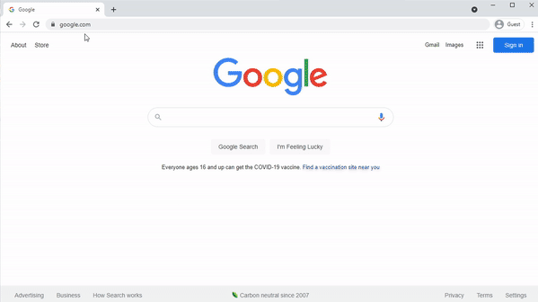
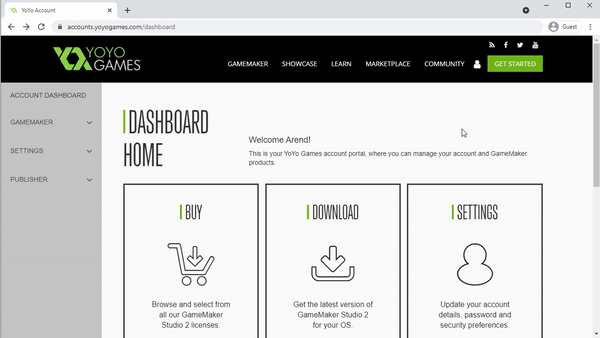
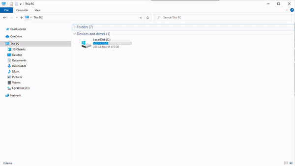
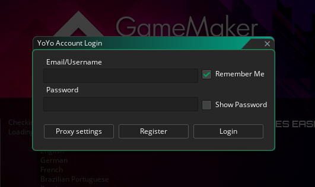

# Downloading and Installing Game Maker Studio

Here I'll go over how to navigate to the yoyogames website to download and install Game Maker Studio

## Register

Before downloading game maker you'll first need to register for an account

1. In your browser navigate to https://yoyogames.com
1. Click "Get Started"
1. Under "Free Trial", select "Register"
1. Continue registration process (setup account, verify email, etc.)

## Product Options

At the moment there are 4 categories of Game Maker products to choose from

* **Free Trial**: 30 Trial, this includes full Game Maker functionality, except you won't be able to create executables (so your friends won't be able to play your games unless they also have game maker)
* **Desktop**: Export executables for Mac or Windows
* **Developer**: Export executables for Desktop (which combines windows, mac, and ubuntu), Web, UWP, or Mobile (which includes android and iOS)
* **Console**: Export executables for Playstation, Xbox, or Switch. This also has an option for Ultimate edition, which includes all platforms

For this course, I recommend starting with **Free Trial**, and then, if you're interested, purchasing one of the **Desktop** options when your trial ends. From there you can expand further if you're interested in making a game for a particular platform

## Download

Next we can download Game Maker Studio

1. Login using the account you registered above, this should bring you to "Dashboard Home"
1. Select "View Downloads" under the download section
1. Select Windows or Mac depending on your machine

> NOTE: Game Maker is free to download regardless of the product you chose, we'll need to login later for Game Maker to know which version we're using

## Installing Game Maker Studio (for Windows)

Here's how we install Game Maker on Windows (if you're on mac you can skip to the next section)

1. Double click the installer you downloaded (usually it'll be in your Downloads folder)
2. If you get a prompt asking to allow the app to make changes "Yes"
3. If game maker is already installed, hit "Ok" to remove previous version, then select Uninstall
4. Click through the rest of the install process "I Agree", "Next", "Install", "Next", "Next", "Finish"
5. Now when you open your start menu and search for Game Maker you should be able to open it

## Installing Game Maker Studio (for Mac)

TODO

## Login

When you open Game Maker for the first time you'll be prompted to login

Enter the account information you created during the regitration step to continue

This is important for Game Maker to know whether you're on the free trial or using one of Game Maker's other product options
