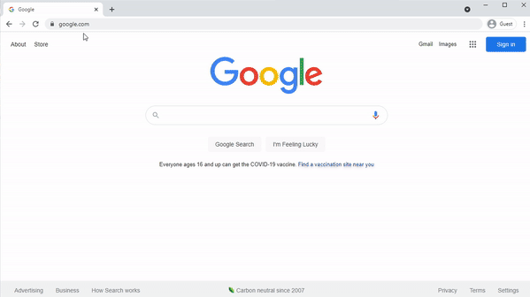
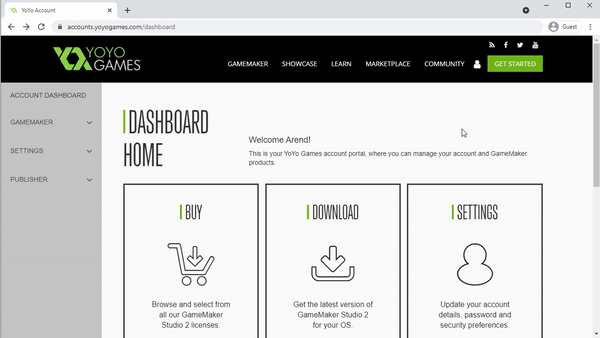
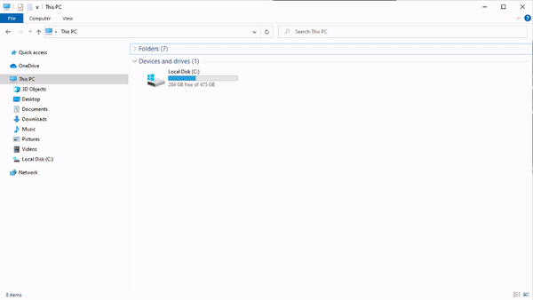
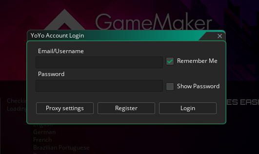

# Downloading and Installing Game Maker Studio

Here I'll go over how to navigate to the yoyogames website to download and install Game Maker Studio

## Register

Before downloading game maker you'll first need to register for an account

1. In your browser navigate to https://yoyogames.com
1. Under the "GameMaker" dropdown select "Pricing"
1. Under the "Free" tier select "Start Now, It's Free!"
1. Continue registration process (setup account, verify email, etc.)

## Product Options

At the moment there are 4 categories of Game Maker products to choose from

* **Free**: This gives you access to all of Game Maker's features, and let's you test your games from Game Maker. But if you want to export the game and share it with your friends, then GXC is your only option for the free version
* **Creator**: Exports to Mac + Windows ( + everything from previous tiers )
* **Indie**:  Exports to Android + iOS exports ( + everything from previous tiers )
* **Enterprise**: Exports to everything GameMaker supports, including Playstation, XBox, and Switch

For this course, I recommend starting with **Free**, and then upgrade to one of the other tiers if you want to export to a specific platform

## Download

Next we can download Game Maker Studio

1. Login using the account you registered above, this should bring you to "Dashboard Home"
1. Select "View Downloads" under the download section
1. Select Windows or Mac depending on your machine

> NOTE: Game Maker is free to download regardless of which subscription you chose, we'll need to login later for Game Maker to know which exports you have access to

## Installing Game Maker Studio (for Windows)

Here's how we install Game Maker on Windows (if you're on mac you can skip to the next section)

1. Click the download button for the Windows IDE
1. Double click the installer you downloaded (usually it'll be in your Downloads folder)
1. If you get a prompt asking to allow the app to make changes "Yes"
1. If game maker is already installed, hit "Ok" to remove previous version, then select Uninstall
1. Click through the rest of the install process "I Agree", "Next", "Install", "Next", "Next", "Finish"
1. Now when you open your start menu and search for Game Maker you should be able to open it

## Installing Game Maker Studio (for Mac)

Here's how you install on Mac

1. Click the download button for the Mac IDE (hit "Allow" if prompted)
1. Double click the installer you downloaded (I clicked it directly from Safari)
1. Click through the install process (provide your login info if prompted)
1. Move installer to trash if prompted (doesn't really matter though)
1. Open launch pad, scroll to the last page, and double click on Game Maker

## Login

When you open Game Maker for the first time you'll be prompted to login

Enter the account information you created during the regitration step to continue

This is important for Game Maker to know which subscription tier you're on
