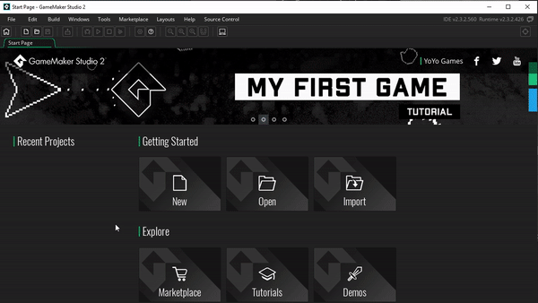

# Creating a new project (DnD vs GML)

This step will go into creating a new project, Drag and Drop versus GameMaker Language

## Create a new project

Let's make a new project!

1. Open Game Maker, this will take you to the start page
1. Select "New" under the "Getting Started"
1. Select GameMaker Language
1. Save the project as "Pong"

## Drag and Drop versus GameMaker Language

Drag and Drop, or GameMaker Language (i.e. code) is first decision you'll need to make whenever you start new projects. Here's the difference

* **Drag and Drop (DnD)** : This simplifies Game Maker's interface, allowing you to create your soling through dragging and dropping blocks, and connecting them to form your logic. Using DnD you can develop your games without ever writing a line of code, however you still have the option insert code snippets if you want
* **GameMaker Language (GML)** : If you prefer writing code, this option will remove all the DnD windows, and replace them with text editors. Game Maker uses Game Maker Language, which is loosely similar to writing Javascript

For my courses we'll be choosing **GameMaker Language**. DnD is definitely easier to learn if you're trying to pick it up on your own, but GML is also perfectly fine to start with if you're being guided through it. I prefer coding, and for the course I felt it would be smoother for your to start with GML rather than switch to DnD to GML later and relearn the basics

GML also serves as a great gateway into other programming languages. At this point I have experience with over a dozen different programming languages, but GML was my first, and mastering GML first made it easy for me to pickup more standard languages like Java and Python after that. With that in mind, I'll be linking what we learn in GML to more general programming concepts whenever possible

But don't get me wrong, DnD (as well as visual programming tools outside of game maker) is still very powerful, and there are many people who make great games without writing code. I hope you can follow along with this course and find that working with code isn't as bad as it seems, but if it doesn't click with you, there's also no shame in using DnD

Here's the official series on DnD

<iframe width="560" height="315" src="https://www.youtube.com/embed/IWXJbUHLYXA" title="YouTube video player" frameborder="0" allow="accelerometer; autoplay; clipboard-write; encrypted-media; gyroscope; picture-in-picture" allowfullscreen></iframe>

Here are some game devs who make their games w/o using code at all (They use Unity and Unreal, please contact me if you know of Game Maker examples I can add here)

<iframe width="560" height="315" src="https://www.youtube.com/embed/Y3Rs1z7it5M" title="YouTube video player" frameborder="0" allow="accelerometer; autoplay; clipboard-write; encrypted-media; gyroscope; picture-in-picture" allowfullscreen></iframe>

<iframe width="560" height="315" src="https://www.youtube.com/embed/sF3KGf5MBDo" title="YouTube video player" frameborder="0" allow="accelerometer; autoplay; clipboard-write; encrypted-media; gyroscope; picture-in-picture" allowfullscreen></iframe>
