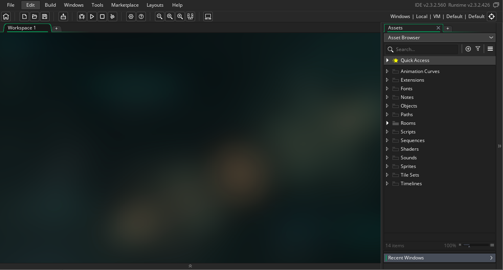
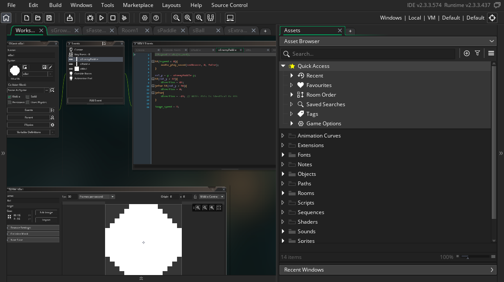
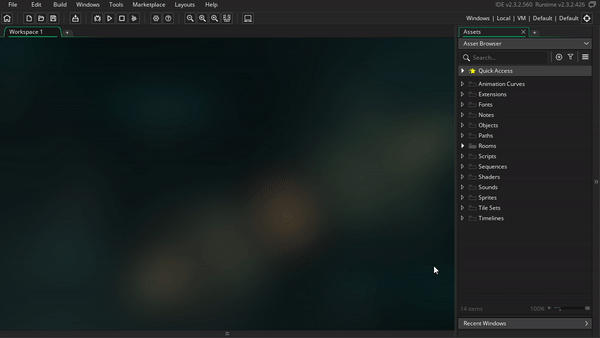
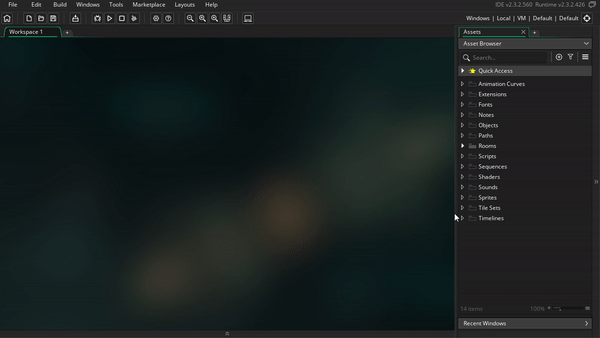

# Game Maker Studio Interface

Game Makers interface is made up of a bunch of windows, let's dive into them!

## Window Types

The **workspace** and the **Asset Browser**, are the windows you'll be using most often. There are several other types, and we'll learn about them as we go. By default your Asset Browser will be on the right side with your workspace taking the bulk of the Game Maker window

As our project grows, we'll continuously be adding new resources to the resource tree, and then we'll edit the resources in the workspace. As you edit resources, they'll generate more tabs and panes as needed

## Adjusting the window layout

You have a lot of flexibility to adjust the layout of the windows. For example you can minimize/maximize windows, as well as drag them to be either floating or docked

You can also remove windows, but don't worry, if you remove one by accident you can always add it back via the windows menu

