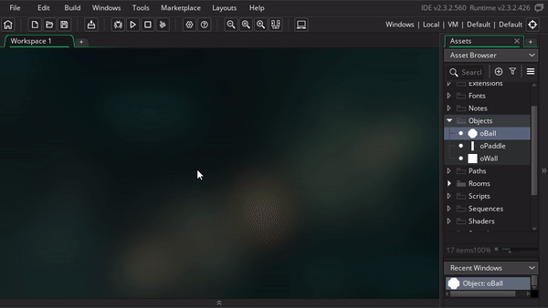
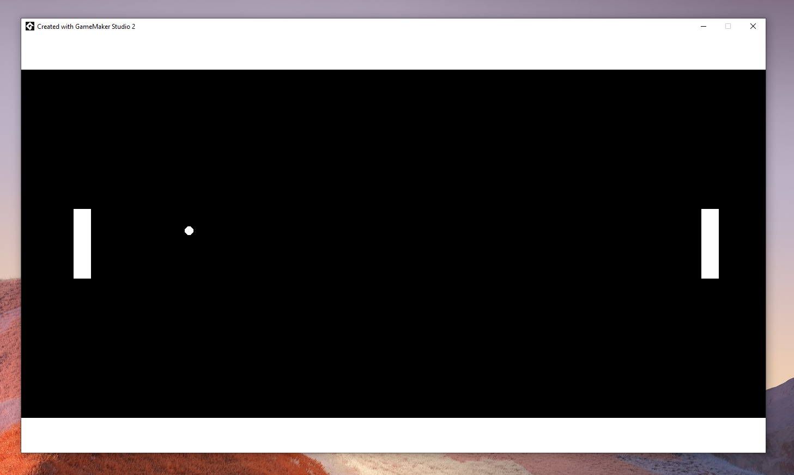

# Getting started with GML

In the previous section we just had a BIG first, we ran our game for the first time 😀. Now we're going to have another big first and write our first few lines of code 😎

## x / y axis

Let's look back at the instance properties in the room editor. Earlier we modified the scale x property, but there's much more where that came from and we'll quickly become familiar with all of them throughout the course. The most important properties here are the x and y, so we'll dig into those next.

You were probably wondering what the X by Scale X meant. x and y are pretty much just short hands for horizontal and vertical respectively. So why didn't they call it horizontal scale, and vertical scale instead? Well we refer to horizontal and vertical so often that it quickly becomes tedious to type, so we end of w/ x and y instead (can't be much shorter than that!)


So with that said the x and y variables represent where each instance is positioned in the room horizontally and vertically. If you drag one of your instances to the right you can see that the x increases. Similarly if you drag the instance down you see that y increases. I can also set the x and y directly in the instance properties.


If I set it to x = 0, and y = 0, where do you think the instance will move to? (I'm hiding the rest of the section for you to think about it 😉 )

<details data-summary="Where in the room is x = 0, y = 0?" markdown="1">

If you said, top left corner, you would be right! Since moving right and down made both variables bigger, that meant that moving left and up makes them smaller, and since x = 0 and y = 0 is the smallest number you can have without going negative (and you can go negative by the way), it makes sense for that to be the top left corner

This is can be really confusing because it's different from what you'll learn in your math and physics classes. In school, going up increases y (not down), and the x = 0 and y = 0 point is in the bottom left (not top left). So make sure flip the switch back to "up is more" when you go back to school, I'd hate for this course to hurt your grades


Another handy trick for viewing x, y is to look at the bottom left of the room editor. There you see 2 numbers (for example (841, 592)). Those represent the x, y position under your mouse cursor, and you can that to again verify the following:

 * Moving the mouse left decreases x
 * Moving the mouse right increases x
 * Moving the mouse up decreases y
 * Moving the mouse down increases y
 * Moving the mouse to (0, 0) is at the right spot


</details>

## Events

We're very close to digging into code, but first we need to understand events. Code is our tool to describe "What" should happen, but events show us "When" it should happen. For example, if we go to the ball object, and click "Add Event" we can see lot of options.



Luckily we only usually need a few of these. Here are the common ones we'll use today

 * **Create**: This is triggered when the instance is first created
 * **Step**: This is triggered every frame of the game (by default 30 times per second, but this can be tweaked)
 * **Keyboard events**: These are triggered in response to your keyboard inputs

For now, let's add a **Create** event. Once you've done that you should see a text editor pop up for us to start entering code (the natural "What" that triggers from the "When").


There's some default code already in the create event, but go ahead and remove all of it. This way we can start form a clean slate

## Variables

Yay! we can finally start coding (it's like my favorite thing 🥰). Since you now know what x and y are, let's make that our first coding task!

In coding terms, all the instance properties we were working with are actually called variables, and they each correspond with a variable name in GML. We'll be working with the variables for X and Y, which in code are just ``x`` and ``y``.

Here's how you assign values to variables in code

```
variable_name = new_value;
```

Example

```
x = 300;
```

The above code sets the ball's x to 300. We can run the game to verify this but before we do, try predicting where the ball will show on the screen (maybe you can use the mouse trick I showed you in the x/y axis section?). When you're ready run the game and see if you're right


<details data-summary="Where will the ball be placed?" markdown="1">

If you said "center leftish", you'd be right!!



</details>

Before we move on to adjusting more variables, I have some more details to share on assigning variables

 * **Assignment Operator**: In code, we call `=` the Assignment Operator. We can think of the variable name on the left as an empty box, and the assignment variable moves the value on the right into the box on the left. Unlike math there's no rule that the left side has start out with the same value as the right (although they will be the same once the assignment has been completed). For now these differences are subtle, but they'll be important to understand later
 * **Semi Colons**: The semi colon `;` marks the end of the statement, think of it like the period at the end of a sentence, it represents the end of a complete thought 😊. We use them here for the assignment statement, but we'll also need it on all future statements. Interestingly, you can actually remove semi colons, and your code will probably still work fine. However there's some specific situations where things could break, and if you hit those situations, it will be VERY hard to find the issue. For this reason yoyogames STRONGLY recommends using semi colons, so this is a good habit to keep
 * **Spacing**: I included a single space on either side of the equal sign, but I don't have a space before the semi colon. I almost always do it this way to keep things consistent, but Game Maker doesn't actually care at all. You can add as many spaces, tabs, or even new lines around you code, and Game Maker will handle it the same. This will be particularly useful when we start getting into functions later. Below are some examples of how we could rewrite our assignment statement

```
x = 30;
```

```
x=30;
```

```
        x      =           30             ;
```

```
x     
=
30
;
```

As another exercise, why don't you setting the x / y in the create event to position to the ball in the exact center of the room? This is a tad open ended, so be ready to do a bit of thinking and tinkering

<details data-summary="How do you put it in the exact center?" markdown="1">

Here it is!

```
x = 683;
y = 384;
```

To do this you need to figure out the width/height of the room, and then divide by 2. There are a couple ways you can do this

One way is to hover your mouse, or move an object, to figure out the x,y position at the bottom right corner of the room. Since the top left is (0, 0) the bottom right will be (width, height) (where you replace width, height with whatever the actual width/height is)

Another way is to inspect the room properties (located below the layers and layer properites by default). There you'll see that the default room width and height are 1366, and 768 respectively, but you can change them here if you want to.

Yet another way, (and if you got this you're really ahead of the curve, since I haven't taught this yet), is to find the variables for room width and height. Then you can do the math directly in code, and you'll end up with this

```
x = room_width/2;
y = room_height/2;
```

</details>

## Comments

Setting variables was our first GML concept, now comments will be our second one

Here's an example of a comment in our code, try adding it to your ball's create event then run the game and see what happens

```
// This is a comment
```

<details data-summary="What happens?" markdown="1">


Sorry that was a little mean, nothing actually happens

But that's the beauty of comments, you can enter // and then fill the rest of the line with whatever you want, and Game Maker won't care!

I recommend you use these as much as you can (especially when you're starting out). Code can be very confusing, so leverage comments to describe what your code is doing. This way future-you can come back to the code and still understand what it's doing

( Also side note, am I dating myself by using that meme? Is rick rolling still a fun thing kids do these days? oh boy 😢 )

</details>

``//`` is just one type of comment, another helpful format is ``/* comment */`` this lets you specify both the beginning and the end of a comment. This is helpful for if you want the comment to span multiple lines, or if you want the comment to end before the end of a line

```
/*
  this is
  a multi line comment
*/
```

```
x /* <- that's the x variable, and this is a comment I'm inserting in my code */ = 3;
```

There's also a 3rd type called a JSDoc comment. We actually saw it when we first made our create event (we immediately cleared it, but you can see it again by creating a new event)

```
/// @description I'm describing the create event within a comment :O
```

Using `///` signals to game maker that you're using JSDoc format, and Game Maker will try to use this for documentation. For now that just means you can add a little blurb next to your event, but there's a lot more you can do with it (particularly when you get into making your own functions, but that's outside the scope of this course)

We won't be using the `///` in this course, I still barely use them on my own, but I wanted to include them here for completeness
