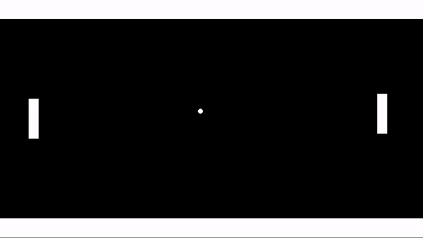
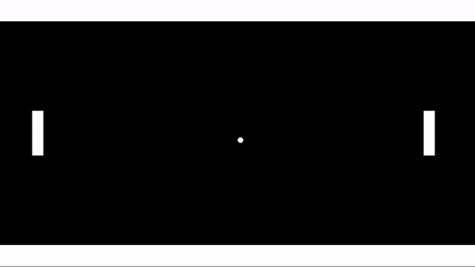

# User Input

So far our game doesn't really feel like a game. It's more like a picture. This next step is big since we'll add movement to take it from a picture to a movie, and even add user input to make it an actual game 😀

## Keyboard Input

Let's try making the paddle move up and down in response to the keyboard buttons

We'll use keyboard events for this, there's actually 3 types

 * **Key Pressed**: This event triggers once on the exact frame that you press the key
 * **Key Up**: This event triggers once on the exact frame that you release the key (This used to be called Released, I like the old name better)
 * **Key Down**: This event triggers every frame that the key is held down (if I was naming this, I probably would have said Key Held instead but yoyogames didn't ask me)

We're going to be simulating vertical movement by repeatedly adjusting our y value a little bit at a time. Which event type do you think we should use?

<details data-summary="Key Pressed, Key Released, or Key Down?" markdown="1">

**Key Down**

Since it's repeatedly updating every frame, Key Down is the way to go, Key Pressed/Released would have only activated once at a time

Go ahead and jump into oPaddle and add events for "Key Down > Up" and "Key Down > Down" (super confusing, again I wish I could say "Key Held > Down" 😭 )

</details>

For the up event code we want the y value to be moved a little bit up each frame. Here's the code for that

```
y = y - 4;
```

This is using the same variable assignment structure but there are a few extra curve balls here

In this case we want to set the new position **relative** to the old position instead of setting it to a specific number, so that's why we need to include y on the right side

This also further highlights the differences with the mathematical equals sign, since the left/right side are clearly unequal. The GML equals sign is actually saying "set the new y value to be the old y value minus 4". In fact, let's add that as a comment

```
// set the new y value to be the old y value minus 4
y = y - 4;
```

When you run this in game, you should see the paddle moving up in response to the up button

Now you can add the following in the Down event to support both directions

```
y = y + 4;
```

## Enemy Controls

Now let's practice this and see if you can add similar controls to ``oEnemyPaddle``. Instead of the arrow keys, let's use WASD

<details data-summary="Add Enemy Controls" markdown="1">

It ends up being the same code, just with different events

**Key Down > W**

```
y = y - 4;
```

**Key Down > S**

```
y = y + 4;
```

</details>

Great work! Now when we test it, we should be able to move both individually



Feel free to swap out 4 with a different number to find a speed that feels better

## Ball movement (w/ hspeed and vspeed)

Now it's time to get the ball rolling (hehe)

We're using a different movement approach for the ball. Instead of directly setting it's x/y position every frame, we'll set the speed in it's create event, and then let game maker update it's x/y for us. Add the following to oBall's create event (new variables, yay!)

```
hspeed = 4;
vspeed = 4;
```

The hspeed and vspeed variables represent how fast the ball is moving in the horizontal and vertical directions respectively. In a more literal sense, it represents how much we want the x/y values to change each frame. That said doing the following in the step event should get you the exact same results

```
// NOTE: don't actually add this to your project, this is just a example
x = x + 4;
y = y + 4;
```

Speaking of results, let's do a pop quiz, what do you think the results will be when we run the code?

<details data-summary="Which direction will the ball move?" markdown="1">

Diagonally down and to the right

Remember positive x and positive y are right and down respectively

Because we're doing both at the same time we end up with a diagonal effect



</details>

## Collisions

So we've got the ball rolling, but now it just keeps on rolling forever without any respect to walls or physics of any kind. To fix this we need collisions

In ``oBall`` add a collision event with ``oWall``. When this happens we want to reflect the ball's vertical motion, luckily there's a clever way to do that using the techniques we already know and love (or at least know, love will come with time)

```
vspeed = -vspeed;
```

Let's think through the cases

 * **Going Down to Up**: We start with ``vspeed = 4``, meaning the ball is going down. So ``vspeed = -vspeed`` would result in ``vspeed = -4`` ... which is up ... cool ✅
 * **Going Up to Down**: Here we have ``vspeed = -4``, meaning the ball is going up. So ``vspeed = -vspeed`` would result in ``vspeed = -(-4)``, and from our math classes we know that 2 negatives make a positive (you can punch -1 * -2 in to a calculator to validate). So that would result in ``vspeed = 4`` ... which is down .. cool ✅

So that works!

But we still need collisions with the paddles, can you do it?

<details data-summary="Using the same technique can you add horizontal collisions with the paddes?" markdown="1">

Should just be a matter of different collision events using the hspeed variable instead of vspeed

You can add 2 collision events to the ball (one for each paddle) and use the following code for both

``hspeed = -hspeed;``

</details>


The game is looking great, you can actually sort of play a game against someone now 😮. And this is all using only events and variable assignments 🤯, it's really cool how much you can make in game maker with so little
