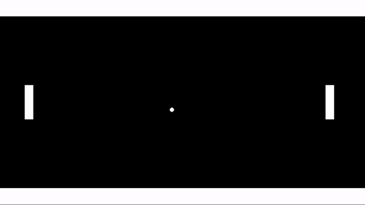
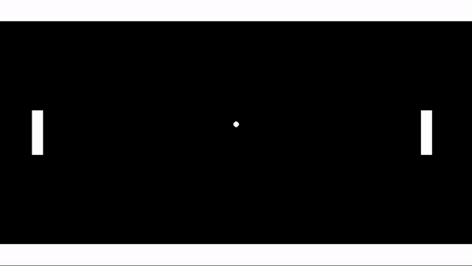

# GML Functions

At this point, I've milked variable assignments as much as I can and now it's time to move on

It's function time!!

## Restarting the game

Right now, you can "win", but that just means that the ball goes off the screen, and you and your friend are just stuck waiting for the rest of eternity. There are more elegant ways to handle this, but for now let's add a restart button as a quick fix

Just add a **Key Press** event for the letter R to ``oBall`` (this can be any object, but we're already in ``oBall`` so why not). Then add the following code

```
game_restart();
```

Now you should be able to press R in game and the game will restart!

We've got a few things to break down here. First off, what the heck are those `()`?

Well, `game_restart` is a function, and can always tell functions apart from variables by seeing if they have the `()` (sometimes there's more things between the parens, but we'll get to that later)

>  ahem 🤓, technically you can refer to functions without (), but () are required to actually "call" the function and make it do things. This distinction probably won't matter to you until years down the line but for some reason I felt the need to make the clarification anyway

Here's my working definition for functions:

> **function**: a command that does one or more of the following
 * Takes inputs
 * Performs an action
 * Gives back outputs

In our case `game_restart` performs an action (it restarts the game), but it does so without taking inputs or giving back outputs

Here's a general form for a function that does all 3:

```
output = function_name(input1, input2, input3)
```

We'll see plenty of examples for this later, so don't worry if it's confusing

On a smaller note, why did I choose **Key Press** instead of one of the other key events? Think about it first, there's not necessarily a right answer

<details data-summary="But here's an answer anyway" markdown="1">

In this case you could use any of the 3 w/o noticing much of a difference

Key Down would be a little weird. Remember key down triggers on every frame where the key is held down. This would be an odd choice, since we only need to restart the game once, but there's no harm in multiple restarts I suppose

For Key Press vs Key Released, there's an argument for both. Key Press will trigger faster, but sometimes I'll use Key Released if I want to communicate what you're interacting with before the action occurs.

For example, if I setup the spacebar to be a keyboard shortcut for a play button, I might use Key Released, and then also use Key Down to perform a short hover animation on the button. This way you can see which button you're triggering before it triggers

In this case we're not providing feedback anyway, so Key Press is probably ideal

</details>

## Fixing a bug using abs()

After playing the game for a while you might notice a bug in the collision system. Specifically, if you move the paddle to hit the ball vertically



Our collision logic assumes that the event will only be triggered once, but in reality a collision in game maker is synonymous w/ "overlap". So if it's still overlapping on the next frame the event could continue to trigger long after the initial contact

In our example the flipping horizontal direction on vertical collisions isn't enough un-collide the ball on the next frame. As a result the horizontal speed gets continuously flipped, and the ball stalls horizontally untile the collision/overlap ends

To fix this, I'll update the logic to force collisions with ``oPaddle`` and ``oEnemyPaddle``, to explicitly force the ball to move right and left respectively.

Here's oBall's collision event w/ oEnemyPaddle:

```
hspeed = abs(hspeed);
```

This uses ``abs()`` which takes the existing ``hspeed``, and then outputs a positive version, Effectively forcing the ball to move to the right regardless of the current hspeed. Here's some more formal ``abs()`` documentation

> **abs()**: Short for "absolute value", it returns the positive version of the number
* Input: an input number
* Action: if the number is negative, multiply it by -1 (2 negatives make a positive 😉), otherwise leave it unchanged
* Ouptut: positive version of the number

Then we can use similar same logic to force left movement when the ball hits the player's paddle

Here's oBall's collision event w/ oPaddle:

```
hspeed = -abs(hspeed);
```

When testing it out, this edge case should be fixed


## Randomize ball speed (featuring choose())

So far the ball has been really predictable, it just starts off in the same diagonal direction regardless of how many times you restart

Let's add some randomness to the start direction, and get some more function practice in while we're add it. Here's the new create event for ``oBall``:

```
hspeed = choose(-4, 4);
vspeed = choose(-4, 4);
```

Introducing the ``choose()`` function! This takes in a series of inputs, randomly "chooses" one, and then gives it back. So our hspeed and vspeed can both be either -4 or 4

Here's a more formal definition:

> **choose()**: randomly chooses from the inputs
* Input: 1 or more parameters representing the choices
* Action: Randomly chooses among the input parameters
* Output: The chosen parameter

Also note how we're using variable assignment and functions together in the same line. We're taking the output from choose, and then using the assignment operator to direct that output toward one of our variables

Now here's what it looks like when we press restart (i.e. the R key)


But it seems a little odd that it only goes diagonal. We certainly don't want it to go vertical (that would be a VERY long wait), but maybe horizontal? Why don't you give it a try?

<details data-summary="Update the code to have horizontal as possible direction" markdown="1">

Moving horizontally, means our vertical speed is zero. So adding 0 to the ``vspeed`` choices should do the trick

```
hspeed = choose(-2, 2);
vspeed = choose(-2, 0, 2);
```



On second thought, I don't like this very much, it's just ... boring 😴 (but good job on figuring it out 😉 )

</details>

## Reset the ball

The restart button is nice, but as I mentioned earlier it's certainly not the best way to go about reseting the ball. A better approach would be to have the ball reset on it's own once it leaves the room

There are lots of ways to do this, but since we're on function streak, let's run with that

Add the following code in the **Outside Room** event for ``oBall``:

```
instance_create_layer(xstart, ystart, layer, oBall);
instance_destroy();
```

woah, new event, new variables AND new functions 😨. Take a deep breath, let's break it down

First, here's the English translation

```
When I (meaning me the ball), go outside the room:
  Create a new oBall instance using my layer at the position where I originally spawned (meaning the center(ish) of the screen)
  Self destruct (it's that or wander in the endless space outside the room forever)
```

For the event, **Outside Room** should be pretty self explanatory. It'll be triggered once the ``x``/``y`` value of the instance goes out the dimensions of the room

Here are the new variables:

> ``xstart``: the x position where the instance was first created

> ``ystart``: (you guessed it 😉) the y position where the instance was first created

> ``layer``: represents the current layer of the object (so far that's always been the "Instances" layer, but we can just refer to the layer variable in case that changes)

> **Fun Fact**: I guess ``oBall`` is technically a variable? But you should think of it as a asset. And as a fun fact, you can refert to any of the assets in the asset browser in code. Here we used ``oBall``, but if you type out any of the other ones (like ``sPaddle``?) they should all be highlighted the same

and here's the functions:

> ``instance_create_layer()``: Creates an instance at a specified layer / position
* Input: x/y/layer for the new instance, as well as the object you want to create an instance of
* Action: create an instance using the specified parameters as properties for the instance
* Output: the id of the new instance (but you don't need to worry about this, we're not using it)

> ``instance_destroy()``: Destroys the current instance, no more events, it's over
* Input: nothing
* Action: Destroys the current instance (ahem 🤓, technically it won't get destroyed until the current frame is completed. I guarantee you'll forget this and then relearn it the hard way when you hit a weird bug, but I figured I'd mention it anyway)
* Ouptut: nadda

Testing this out should work. When a ball leaves the room, it will destroy it's self and a new ball will show up at the start allowing the game to continue


But that's kind of morbid don't you think? Does it have to die? Is there a way we can reuse the same ball?

Yes there is, and it's actually a lot simpler too. Can you think of it?

<details data-summary="How to reset the ball w/o destroying it?" markdown="1">

Yep, just use the following code in the outside room event

```
x = xstart;
y = ystart;
hspeed = choose(-2, 2);
vspeed = choose(-2, 2);
```

This just moves the existing ball back to it's starting position, and then it picks a random direction again

I'm not sure which approach I'd recommend. I prefer the reset position approach, but the problem is you'll need to rerun all of your create event code from the outside room event. This is fine for now, but it'll get annoying as we continue to make updates to the create event

I have a way around this problem, but you're not ready to learn that yet. So for you I recommend going with the instance create/destroy approach, and this is the approach I'll continue to use in the course. We can talk about the other approach more when we get there 😊

But that said, this highlights the creative side of programming. You only have limited tools, and there's always multiple ways to mix and match to achieve your goals

</details>

## Preview function names and inputs

Now that our function names are getting longer w/ more inputs, it'll probably get hard to remember the exact names and inputs

Game Maker has some tricks to help us with this, for example as you're typing a function name it'll try to predict which function you're looking for (this should happen automatically, but if not you can hit `ctrl + space`). This is really helpful if you only remember part of the function name


Then if you see the one you're looking for, you can just click on it (or use the arrow keys to navigate down to the one you're want and then press enter)

Also once you've entered the function, you can put your cursor between the parenthesis preview the input order


