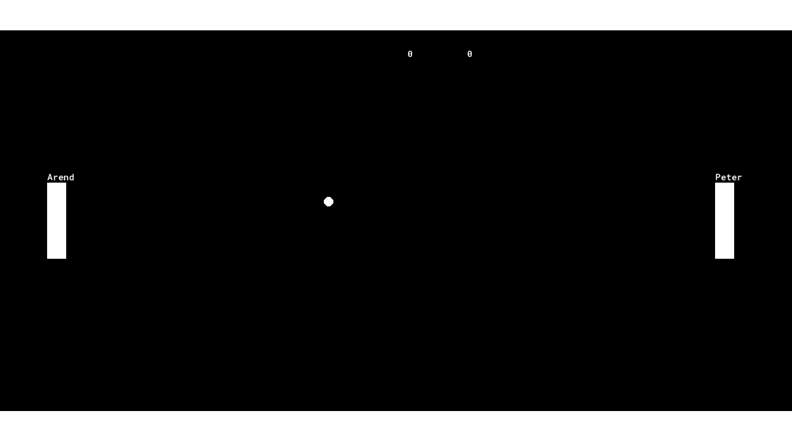
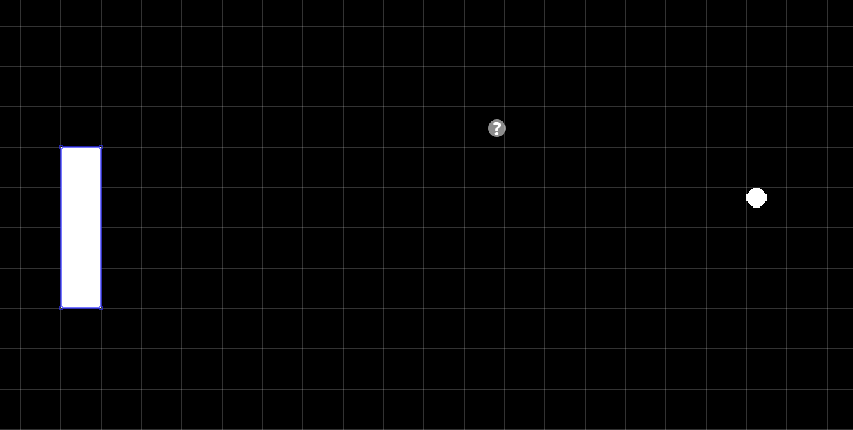
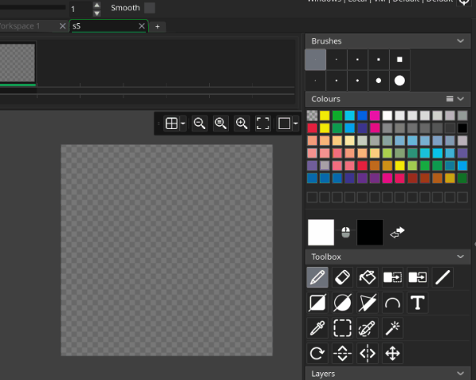
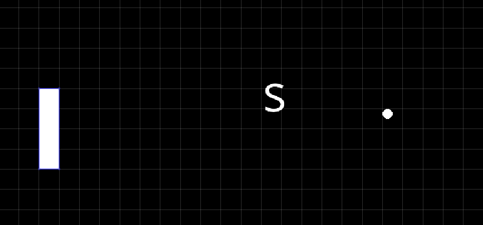

# Score Board

Right now, you can beat your friend at pong, but it's going really hard to claim bragging rights without an official record

Let's take away your friend's plausible deniability and add a score board 😈

## Drawing score

We'll start by getting the score to show up, we can handle the logic for updating the scores later

Let's create a new object, ``oScoreBoard`` (you can leave it's sprite unset), and then we can setup custom variables for the score, and draw them

```
// oScoreBoard Create Event
player_score = 0;
enemy_score = 0;

// oScoreBoard Draw Event
draw_text(700, 93, enemy_score);
draw_text(800, 93, player_score);
```

> **Copy/Paste tip**: The 2 lines in the draw event look pretty similar, so when typing that could be a good time to use copy/paste. You can do that by selecting the text and right click + copy (or pressing ctrl + c) to copy. Then you can paste it using right click + paste (or pressing ctrl + v). I did this when typing the code, but for short sections of code like this I actually recommend you retype it (it's better for the learning process). But that said, for longer sections of code I would definitely copy/paste instead, at that point it's too tedius to be worth it for learning alone

This is prety similar to the process we followed for drawing text, so I'll let you refer back there for details
https://guidetogamemaker.com/docs/1_Pong_YourFirstGame/'../0_Pong_YourFirstGame/5_GMLBasics.html#x--y-axis'

To figure out the positions for the score, I used my mouse to check positions in the room editor [see details here](5_GMLBasics.html#x--y-axis)

## Marker sprite

Of course making the object isn't enough for the score to show up, we also need to add it to the room. Since we're not using the x/y variables in the draw event it doesn't really matter where in the room we put it, so just add it anywhere. Once you've done that, the game should look something like this:



When you added it to the room, you probably noticed that it looked kind of weird, just a small question mark icon



This happens whenever we don't assign sprites to objects. It shows the question mark as a preview, but that won't show up in game

In this case that's fine since we're not drawing a sprite, but when I'm working with objects like this I like to still include a sprite so that I can recognize the object in the room editor (once you get to 2 or 3 question mark objects the room can look pretty confusing)


I'll just make a quick sprite using S for score. I didn't cover using text in the sprite editor back in the resources section, so here's a quick preview of how I did it

> SIDE STORY: As you can see I'm pretty quick and dirty with these marker sprites, but there was a time that I worked on a team with a pixel artist. He went through the effort to make pixel art for all of these, (even though player's never saw it) it was pretty neat



There, that looks much better in the room



As a final touch, I want to add a comment to the draw event, to make sure we remember that skipping ``draw_self()`` was intentional

```
// oScoreBoard Draw Event (Updated)
// NOTE: I'm not using draw_self() because we don't want the sprite to be drawn
draw_text(700, 93, enemy_score);
draw_text(800, 93, player_score);
```
