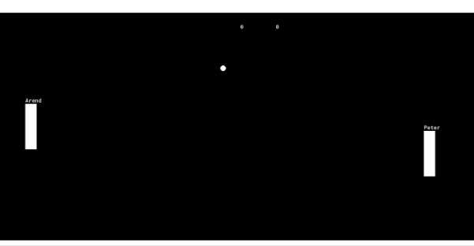

# GML If Statements

We're ready to actual increase our score values, but to do that we need another tool added to our tool chest. Introducing ... if statements!

## Increasing Player Score

Whenever the ball goes outside of the room we want to score a point for whoever "scored". Here's our ``oBall`` outside room event again for reference

```
// oBall Outside Room Event
instance_create_layer(xstart, ystart, layer, oBall);
instance_destroy();
```

This is a little tricky since there's actually 2 different actions we could posibly take, either we increase the player score, or we increase the enemy score, but how do we tell it which one? If we were writing it out in english iour logic might look something like this

```
if the ball is on the left side of the room then increase the oScoreBoard's player_score variable
if the ball is on the right side of the room then increase the oScoreBoards's enemy_score variable
```

If only Game Maker had a way to handle Ifs 🤔. Oh wait, it does 😜! Here's the format

```
if( condition ){
  code
}
```

If we relate this back to the english, **condition** represents everything between if and then, and the **code** capture's everything after then. The code section will only be executed if the condition section evaluates to true

Let's give that first sentence a try, here's our updated event

```
// oBall Outside Room Event (updated)

// if the ball is on the left side of the room then increase the oScoreBoards's player_score variable
if( x < 0 ) {
  oScoreBoard.player_score = oScoreBoard.player_score + 1;
}

// reset the ball
instance_create_layer(xstart, ystart, layer, oBall);
instance_destroy();
```

When we test it, we should see the score go up when the player scores 😄



Awesome! Now we have a couple things to break on that new code addition

## Comparison operators

Let's look into ``x < 0``

There are several ways to format conditions for our if statements. A common approach is to use comparison operators, so in this case we're checking to see if the ball is on the left side by checking if "x is less than 0". Here's a full list of comparison operators for future reference:

| Operator | Definition |
|---|---|
|< |less than|
|> |greater than|
|<=|less than or equal to|
|>=|greater than or equal to|
|==|equal to|
|!=|not equal to|

> NOTE: I want to make a special call out regarding ==, this is NOT the same as the assignent operator =. == is only used for comparison and doesn't actually modify the variable, where as = modifies variables, and doesn't compare

## Dot operator

So we've translated the if portion of our statement from english to gml, but there's another tricky part of the statement. The **'s**

We're currently working within the oBall object, and it doesn't have player_score varaible (only oScoreBoard does), so if we try to reference player_score from oBall normally, we'll get the "not set before reading" error that we saw when adding Paddle Names

This is why we need an **'s** equivalent in our code, we want to access oScoreBoard**'s** player_score variable, instead of oBall. To do this we simply replace **'s** with a **.**. So then we end up with the following line for increasing the player_score

```
oScoreBoard.player_score = oScoreBoard.player_score + 1;
```

> NOTE: All the variables we've been working with so far are considered "instance variables", that's why we can access the variable from within the instance, but not from other instances. I wanted to clarify, that "instance", is just one type of scoping for variables. Later we'll also talk about "temporary variables" which are only scoped to the current event. Game Maker also technically supports global variables (variables that can be accessed from anywhere). However global variables tend to be a bad idea (for various reason, I won't get into), so they're use is deprecated, and may even be removed in future versions of Game Maker

## Tab management

You also may have noticed I added some spacing before ``oScoreBoard.player_score = oScoreBoard.player_score + 1;``. We do this to clarify that the code is being execuated as part of the if statement, otherwise it could start looking confusing when we add more code after the if statement


```
if( x < 0 ) {
  oScoreBoard.player_score = oScoreBoard.player_score + 1;
}
```

To drive this point home, here's a more complicated if statement, one with tabbing and one without. Which one is easier to read? (note: there's several things we haven't learned yet, so don't worry if you don't understand parts of it)

```
if(keyboard_check(vk_right)){
if(keyboard_check(vk_up) or keyboard_check(vk_down)){
x = x + 4 * sqrt(2);
}else{
x = x + 4;
}
}
if(keyboard_check(vk_left)){
if(keyboard_check(vk_up) or keyboard_check(vk_down)){
x = x - 4 * sqrt(2);
}else{
x = x - 4;
}
}
if(keyboard_check(vk_down){
if(keyboard_check(vk_left) or keyboard_check(vk_right)){
y = y + 4 * sqrt(2);
}else{
y = y + 4;
}
}
if(keyboard_check(vk_up)){
if(keyboard_check(vk_left) or keyboard_check(vk_right)){
y = y - 4 * sqrt(2);
}else{
y = y - 4;
}
}
```

```
if(keyboard_check(vk_right)){
    if(keyboard_check(vk_up) or keyboard_check(vk_down)){
        x = x + 4 * sqrt(2);
    }else{
        x = x + 4;
    }
}
if(keyboard_check(vk_left)){
    if(keyboard_check(vk_up) or keyboard_check(vk_down)){
        x = x - 4 * sqrt(2);
    }else{
        x = x - 4;
    }
}
if(keyboard_check(vk_down){
    if(keyboard_check(vk_left) or keyboard_check(vk_right)){
        y = y + 4 * sqrt(2);
    }else{
        y = y + 4;
    }
}
if(keyboard_check(vk_up)){
    if(keyboard_check(vk_left) or keyboard_check(vk_right)){
        y = y - 4 * sqrt(2);
    }else{
        y = y - 4;
    }
}
```

### Tabs versus Spaces

Another question you might ask is what type of spacing should you use? Tabs or Spaces? This is an age old argument among programmers, but I personally use tabs. By default a single tab takes the same space as 4 spaces (but this can be adjusted in the Game Maker preferences), so I feel like tabs require a lot less key presses than spaces

> NOTE: To play devil's advocate 🤓, a spaces fan would say that you can disable the "Keep Tabs" setting in preferences and effectively get the best of both worlds. In that case you can press tab, and then it will automatically insert 4 spaces (depending on what you have the tab size set to). A space advocate would also say that using spaces ensures to code looks consistent across all systems, since different people can set their tab size to different values. All of that said "Keep Tabs" is the default setting, so it's probably safe to say that the vast majority of Game Maker users just use tab

## Increasing Enemy Score

Now you should be able to apply that knowledge to add scoring for the enemy as well

<details data-summary="How do you add scoring for the enemy?" markdown="1">

```
// oBall Outside Room Event (updated)

// if the ball is on the left side of the room then increase the oScoreBoards's player_score variable
if( x < 0 ) {
  oScoreBoard.player_score = oScoreBoard.player_score + 1;
}

// if the ball is on the right side of the room then increase the oScoreBoards's enemy_score variable
if( x > 1366 ) { // 1366 is the width of the room
  oScoreBoard.enemy_score = oScoreBoard.enemy_score + 1;
}

// reset the ball
instance_create_layer(xstart, ystart, layer, oBall);
instance_destroy();
```

</details>
