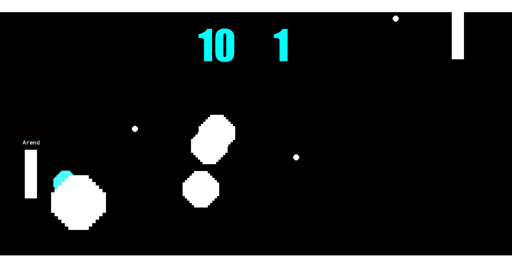

In this module we'll be building our basic pong project into an EXTREME edition. It should feel like a more fleshed out interesting game when we're done

Here's some of the features we'll be adding

 * Allow paddles to "aim" the ball
 * Make ball faster over time
 * Add AI
 * Add Sounds
 * Animate bounce
 * Power Ups
