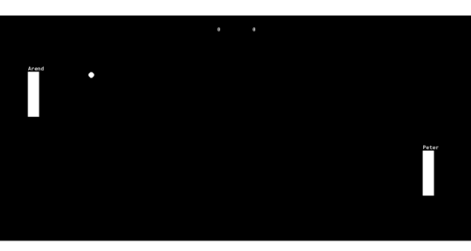
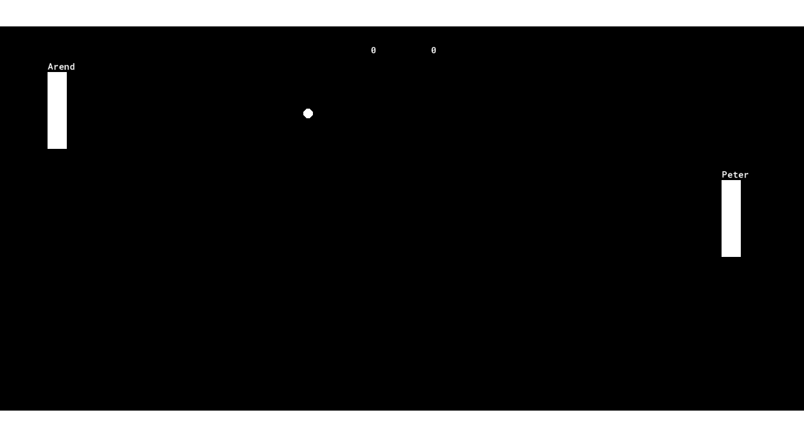

# Enemy AI

We have if statements figured out, let's use this to add some basic AI 😁

## Boolean data type

So we want the enemy to have AI support, but I still want it to have an "on/off switch", so I can go back to 2 player mode if we want

So we'll make a variable ``is_ai`` to represent whether we're using AI, but what data should we put into it? So far we've worked with numbers and strings, but neither of those seem quite right

Introducing boolean types! Boolean means there's only 2 states, and we can represent it by just typing true or false, so let's write our variable as follows

```
// oEnemyPaddle Create Event
is_ai = true;
```

Now that we've started to accumulate more data types, let's look at them together in a table

| data type | example | definition |
| --- | --- | --- |
| real | ``6.28`` | any number (whole or decimal) |
| string | ``"Hello World!"`` | any text, it must always be surrounded with "" |
| boolean | ``false`` | either true or false, works great when there are only 2 options |

These are pretty much all the basic data types used in Game Maker. This is much less than other languages, for example you need to learn 8 primitive data types when using Java 😨

> 🤓 I listed 3 data types for Game Maker, but "technically" Game Maker only has 2. false and true are just built in real variables that are set to 0 and 1 accordingly. When game maker is trying to evaluate whether a condition is true or false, it's just checking if it's more or less than 0. They let's you do something like if(5){ /* do something */ }. BUT, it's super confusing, so we're better off just pretending that true and false aren't numbers

## Disabling keyboard events

We'll start by disabling the keyboard events. In oEnemyPaddle we can update the keyboard events as follows

```
// oEnemyPaddle Keyboard W Down Event
if(is_ai == false){
  y = y - 4;
}

// oEnemyPaddle Keyboard S Down Event
if(is_ai == false){
  y = y + 4;
}
```

Here we're just surrounding the existing logic with ``if(is_ai == false){ ... }``. This will effectively disable those events whenever is_ai is set to true (meaning that ``is_ai == false`` would be a false statement)

Now if you test it, we should be able to move the player paddle but not the enemy paddle

## Adding AI

Now we can add the AI to the step event. The idea is the paddle should move up if the ball is above, and it should move down if the ball is below

```
// oEnemyPaddle Step Event
if(is_ai == true){
	if( y > oBall.y){ // paddle is below the ball
		y -= 6; // move up
	}else{
		y += 6; // move down
	}
}
```

This is our first time using the step event 😮. The step event just triggers every frame, hopefully this isn't too ground breaking since we've been working with a lot of different events lately. Step event is probably the most popular event, when I'm working on my games, the step event usually has the most code in it

Here we have **nested if statements**, meaning multiple if statements inside each other. Since the inner  if statement (i.e. ``y > oBall.y``) is part of the code block for the outer if statement (i.e. ``is_ai == true``), the inner if statement will only be checked, if the outer if statement passes. It's still just following the rules that we learned when first covering if statements, but reading code with nested if statements still takes some getting used to

> technically 🤓, you never actually need to use comparison operators with boolean datatypes. The if statements conditions are just statements that evaluate to true or false. So ``if(is_ai == true)...`` works, but is_ai on it's own is already a condition that evaluates to true or false, so ``if(is_ai)...`` is equally valid, while also being a tad cleaner. Anyway, get take your time getting comfortable with ``is_ai == true`` first, but eventually I'll start trying to convert you to just use ``is_ai``

Now when we test it out, it *mostly* works. It probably just looks a bit weird. The enemy paddle is trying to align the top of the paddle, with the ball, but really we'd expect it to align the center with the ball 🤔



## Adding an offset

I mentioned earlier that x/y refers to the top right corner of the sprite. So in this case that means that ``y > oBall.y`` is really saying, ``is my top left corner greater than the ball's top left corner``. We'll learn to fix this later by adjusting the sprite offset, but I want you to be comfortable solving it the adhoc way first, so we can do that

```
// oEnemyPaddle Step Event
if(is_ai == true){
	if( y + 64 > oBall.y){ // ball is below the paddle's center
		y -= 6; // move up
	}else{
		y += 6; // move down
	}
}
```

This is just the exact same logic except I've added the ``+ 64``

So if ``y`` corresponds with the top of the paddle, and the paddle's sprite is 128 pixels tall, that means ``y + 64`` corresponds to the center for he paddle. Using this knowledge we can just substitute ``y`` with ``y + 64`` and it should have a much better effect



But I've got another challenge for you, right now the logic is ``is my center below the ball's top``, but to makes this even smoother we could update this to ``is my center below the ball's center``, how would you update that?

<details data-summary="Update the AI to use the balls center" markdown="1">

The ball's sprite is 16 pixels tall, so the ball's center is ``oBall.y + 8``

```
// oEnemyPaddle Step Event
if(is_ai == true){
	if( y + 64 > oBall.y + 8){ // ball is below the paddle's center
		y -= 6; // move up
	}else{
		y += 6; // move down
	}
}
```

</details>

> technically 🤓, as a former Amazon software engineer, if I was reviewing this code I'd complain about **magic numbers**. When working in teams, it's important that code is intuitive, and if someone's not familiar with your code they'd be confused at all the random numbers (64? 8? 6? what do all these mean 😭). To avoid this we can make better use of variables. We could store 6 in an ``ai_speed`` variable, and maybe do ``sprite_height/2`` instead of ``64`` (you don't know that variable yet, but we'll use it more soon).  That way it's clear that the logic represents half the sprite's height. Similarly we can do ``oBall.sprite_height/2`` instead of ``8``. We'll get to all this later, I'm just giving you a little taste 😉
