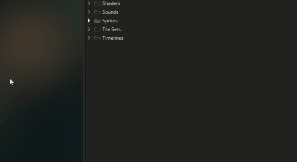
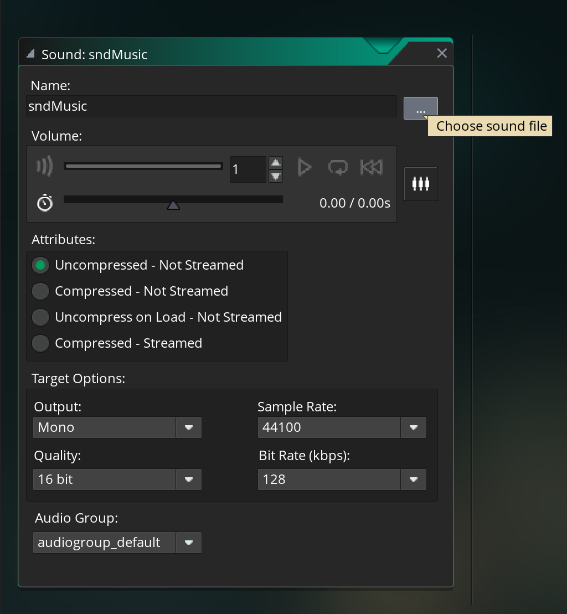
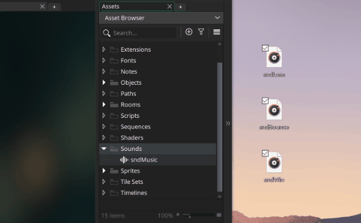
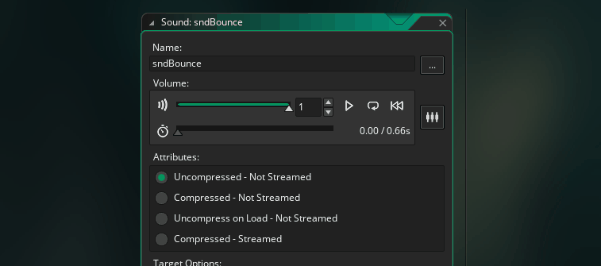
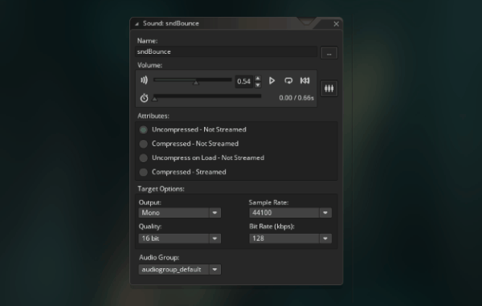

# Sound

Part of making our pong game more **Extreme** is to use more of the game maker resources, so add some sound

## Music

Let's add some background music!

The first step in each of these sound sections is to import sounds someone else made (I'm afraid I don't know how to make sounds, just program them). This a track was made by my friend Juli, go ahead and download it from sound cloud [here](https://soundcloud.com/yuli_indigo/trajectory-final/s-jJfy8btQWFa?si=507ba3c01d0a4730976541c82cc1e9d7&utm_source=clipboard&utm_medium=text&utm_campaign=social_sharing)

Next let's jump into Game Maker and make a sound resource. You can right click on the sound folder and hit add sound (just like all the other resources)



Then we can name the sound ``sndMusic`` and you can hit "choose sound file" to select the sound file that you downloaded



Now the music is in Game Maker, but we need to add a line of code to actually play it. It doesn't really matter where we add that line, but we seem to be doing everything in `oBall` so let's just continue there

```
// oBall Create Event

... // INSERT PREVIOUS CODE HERE

// play music
audio_play_sound(sndMusic, 0, true);
```

The ``audio_play_sound`` takes 3 parameters: which sound to play, the priority, and whether or not it should loop. The sound is just the resource we just created. The priority won't matter too much unless we're playing a lot of sounds, so I'll just put ``0``. For the final parameter, we'll say ``true`` (good thing we just learned about booleans 😉) since we want the music to continuously loop whenever we reach the end of the song

When you run the game, you should be able to hear the music

## Sound Effects (SFX)

Game Maker handles both Music and SFX the same way, they're both imported as sound resources. The only difference is usually that we make music loop, and we usually don't do that with SFX

That said, I'm going to show you a new trick for importing sound resources (and this also works with sprites btw). Here are the links to the remaining sound files. Save them to your desktop, and name them ``sndBounce``, ``sndWin``, and ``sndLose`` accordingly

- [sndBounce](https://freesound.org/people/bumpelsnake/sounds/456563/): bounce1.wav by  bumpelsnake
- [sndWin](https://freesound.org/people/ProjectsU012/sounds/341695/): Coins 1 by ProjectsU012
- [sndLose](https://freesound.org/people/EVRetro/sounds/501104/): 8-bit damage sound.wav by EVRetro

Now we can just drag them from you desktop into game maker to import the sounds. Much faster 😉



> **Note on copyright:** Whenever you use sounds from other people assets, make sure you have their permission. I got Juli's permission to use her music, and the sound effect files are creative commons by attribution (well one of them didn't require attribution, but I attributed them anyway)

Now let's add a some audio lines for winning and losing points

```
// oBall Outside Room Event (updated)

// if the ball is on the left side of the room then increase the oScoreBoards's player_score variable
if( x < 0 ) {
  oScoreBoard.player_score = oScoreBoard.player_score + 1;
  audio_play_sound(sndWin, 0, false); // <- new
}

// if the ball is on the right side of the room then increase the oScoreBoards's enemy_score variable
if( x > 1366 ) { // 1366 is the width of the room
  oScoreBoard.enemy_score = oScoreBoard.enemy_score + 1;
  audio_play_sound(sndLose, 0, false); // <- new
}

...
```

Again, this is pretty much the same as the music except that we don't want to make the sfx loop (hence the ``true`` was replaced with a ``false``). Now I've got 2 challenges for you 😉


<details data-summary="Can you update the score logic to use the += syntax?" markdown="1">

May as well make some improvements while we're here, right? Here's the updated version using the shortened ``+=`` syntax

```
// oBall Outside Room Event

// if the ball is on the left side of the room then increase the oScoreBoards's player_score variable
if( x < 0 ) {
  oScoreBoard.player_score += 1;
  audio_play_sound(sndWin, 0, false); // <- new
}

// if the ball is on the right side of the room then increase the oScoreBoards's enemy_score variable
if( x > 1366 ) { // 1366 is the width of the room
  oScoreBoard.enemy_score += 1;
  audio_play_sound(sndLose, 0, false); // <- new
}

...
```

</details>

<details data-summary="Can you figure out how to add the bounce sound?" markdown="1">

It's just once line of code, but we're bouncing with a lot of things so we need to tag it onto a lot of events

```
// oBall collision w/ oWall Event  
...
audio_play_sound(sndBounce, 0, false);

// oBall collision w/ oPaddle Event
...
audio_play_sound(sndBounce, 0, false);

// oBall collision w/ oEnemyPaddle Event
...
audio_play_sound(sndBounce, 0, false);
```
</details>

Now when you play the game, you should hear sound effects as well as the music

## Sound Mixing

As you play the game longer, you may start to feel like some sounds are too loud or too soft

In particular, I thought ``sndBounce`` seemed too loud. To fix this, just double click on ``sndBounce``, then you can drag the audio slider to adjust the volume and hit play to test it



Testing it might be a bit tricky, sometimes it's hard to know whether a sound is too loud or soft without hearing it together with all the other sounds. To make this easier you can use the sound mixer. Click the **sound group mixer** button, then select the default audio group



Now you can tweak all the volumes at the same time

## Fix rapidly repeating sounds

You might notice that we sometimes get rapid bounce sounds if the balls bounces with the paddle multiple times in a row. We can add a quick if statement to the bounces to make sure that the bounce sound only plays once

```
// oBall collision w/ oPaddle Event
if(hspeed > 0){ // if we're moving to the right
    audio_play_sound(sndBounce, 0, false); // <- new
}

...

// oBall collision w/ oEnemyPaddle Event
if(hspeed < 0){ // if we're moving to the left
    audio_play_sound(sndBounce, 0, false); // <- new
}

...
```

``hspeed > 0``: This checks if we're moving to the right, if we hit ``oPaddle`` and we're moving to the right, that means that we haven't bounced back yet (and haven't played the sound yet), so we're clear to play the sound

``...``: I moved the ``...`` from before the if statement to after. Make sure you move the audio sound above your directional logic. Otherwise the direction could update the hspeed before we try playing the audio, and they audio might never play
