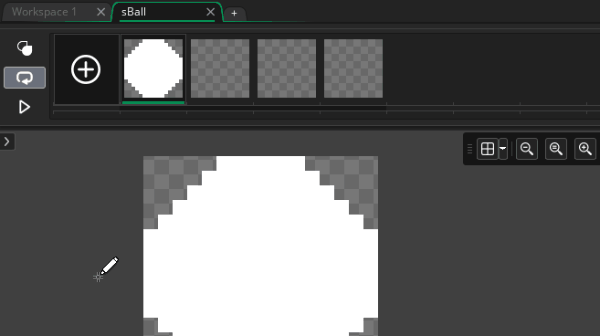
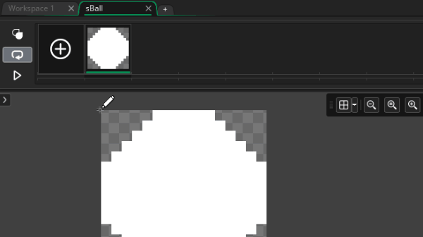
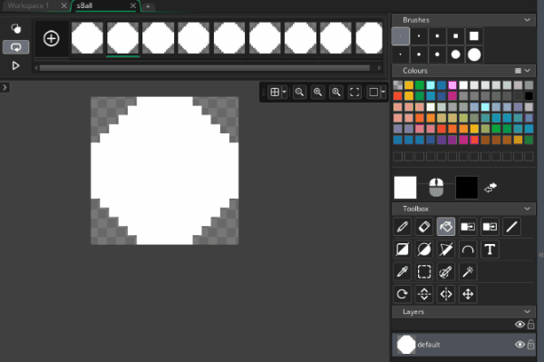
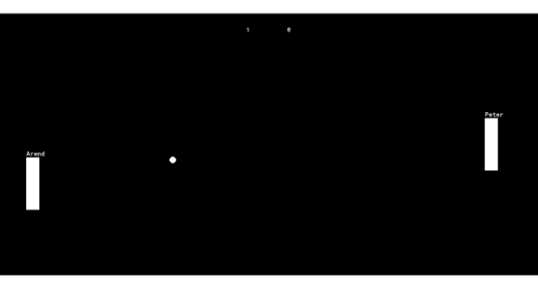
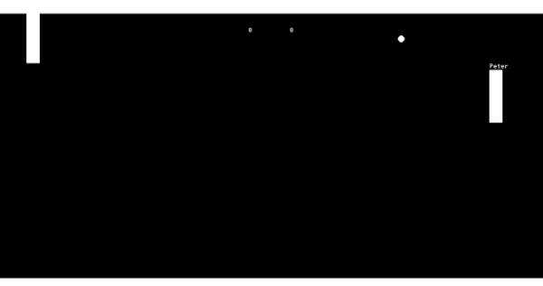

# Animation

Pong doesn't necessarily need animation, but since we're doing the extreme addition (and since this is a game maker course first), let's try adding some animation

## Animate ball

Let's give the ball a little pulse animation every time it bounces against things

Double click ``sBall``, **Edit Image** so that we can add an animation

### Add Animation Frames

Animations are just a series of different drawings (i.e. frames) played one after another. We can see all the frames on the top bar of the sprite editor. Click the **+** icon on that bar to add frames


### Delete Animation Frames

Hmm, but the **+** icon seems to only add empty frames. For this particular case, I think I'd rather have the same frame duplicated as a starting point. To undo try one of the following

 * **Delete w/ Mouse**: Hover over the top right of the frames, and press the X button that appears
 * **Delete w/ Keyboard**: Left click on the frames we just added and hit the ``Del`` or ``Backspace`` buttons
 * **Undo**: To literally undo you can hit ``Ctrl + Z``



### Duplicate Animation Frames

Now let's duplicate the initial ball frame, so that we can use that as a starting point. Again, you can choose between mouse and keyboard

 * **Duplicate frames w/ Mouse**: Right click on the first frame, and select Copy, then right click again and hit paste
 * **Duplicate frames w/ Keyboard**: Left click on the first frame, then hit ``Ctrl + C`` to copy, and ``Ctrl + V`` to paste

 We actually want to hit paste a bunch of times so that we have plenty of frames to work with



Now we can edit each frame to form our animation, and hit the play button to preview. Wonderful!

### Create Animation



Cool, so you'll notice that I went with a pretty simple animation. I selected a blue color, and filled the white space w/ it. Then did the same thing on every frame, adjusting the saturation closer to white every time. Eventually, I bumped it down enough to be back at white

This is definitely not my strong suit, so feel free to try your own ideas if you don't want to copy mine

Now when you test the game you should see the ball animates continuously. Cool 😁! Now let's make it smarter to only animate when it bounces against things



## Animation Logic

We're about to learn some more built in variables 😃! Feels like it's been a while

### Freeze the Animation from the start

Add the following code to the ball to freeze the animation (then we can start it animating again later)

```
// oBall Create Event

...

// freeze animation
image_speed = 0;
```

Now it should be stuck to white again, just like before we added the animation

``image_speed`` just represents how fast we're animating. A speed of 1 means it's using the animation speed specified in the sprite. (by default that's 30 fps, so one frame per step if you haven't updated your game's room_speed)

### Start the Animation on bounce

In all our collision events, we can move ``image_speed`` back to 1 to restart the animation

```
// oBall collision w/ oWall Event
...
image_speed = 1;

// oBall collision w/ oPaddle Event
...
image_speed = 1;

// oBall collision w/ oPaddle  Event
...
image_speed = 1;
```

Now when we test it, it animates on bounce, but then it just keeps animating, hmm

### Stop the Animation once it's done animating

Let's make sure that we go back to normal once the animation stops. The key trick here is the **Animation End Event** (which is under **Other** btw) this will trigger whenever the current animation get to the end (at the point where it would normally reset)

```
// oBall Animation End Event
image_speed = 0;
image_index = 0;
```

So updating image_speed to 0 will make it stop animating, but to make sure it stops at the right spot we're also setting the frame

``image_index`` let's us do that, and yes, 0 is indeed the first frame of the animation. You'll notice starting with 0 is somewhat of a trend in programming, you'll get used to it 😉


**TODO**


Now we've got a little ball animation to add some pop to our game 🍾. There are many more animations you could add, but I'll leave that to you. Feel free to experiment to your hearts content 😁
