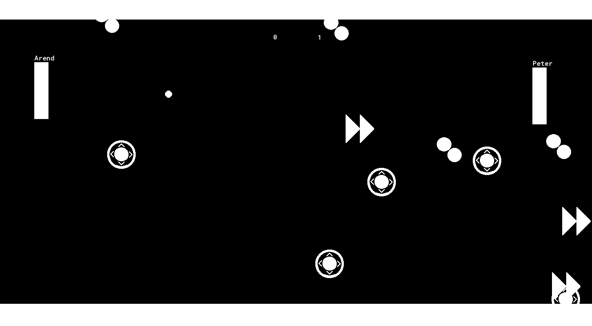
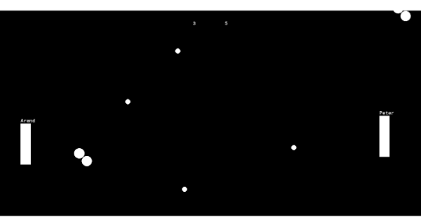
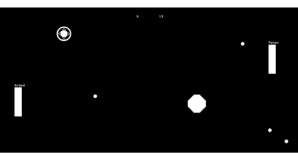
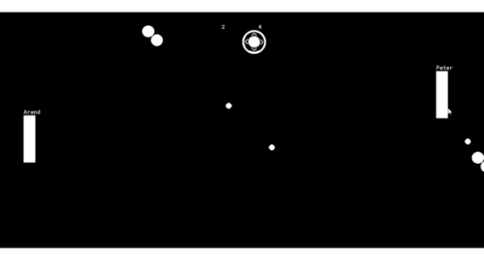
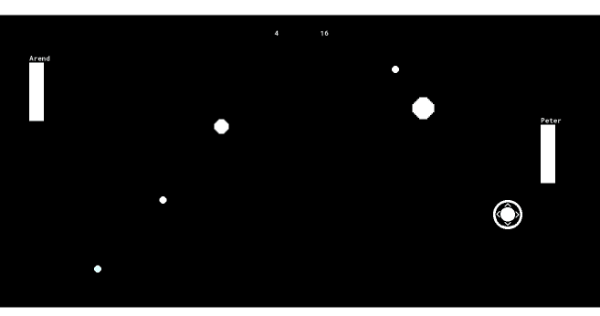
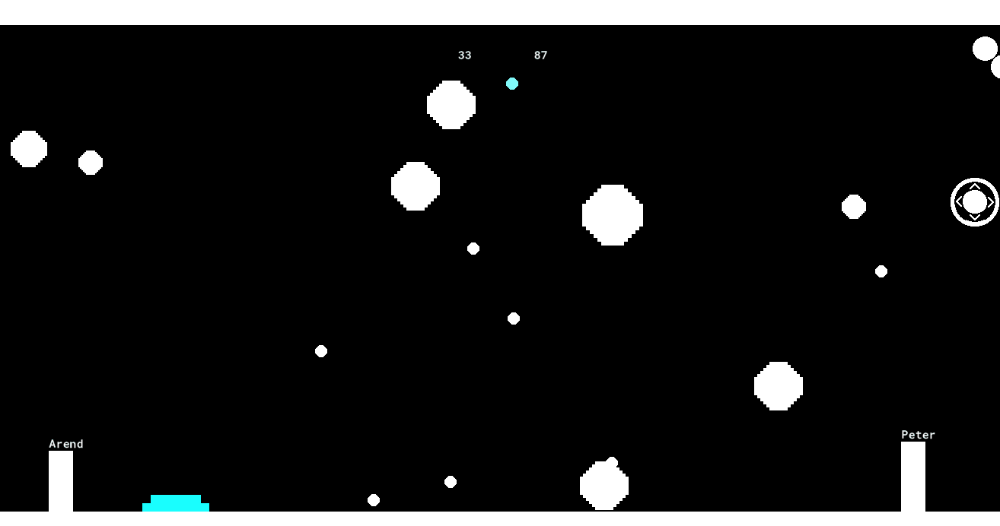

# Power Ups

Next we'll be adding super powers to the game 💪! And by that I mean, a bunch of power ups that'll randomly spawn, and if you can get the ball to hit them it'll make the game more interesting

Here's the power ups we'll be adding

 * **Extra Ball**: Hitting this will add an extra ball to the game
 * **Grow Ball**: Hitting this makes the ball bigger
 * **Speed Up Paddle**: Hitting this will make one of the paddles faster

## New Sprites

First off we'll need sprites for all these power ups, here are links to the images I used

**TODO**: add links

* [sExtraBall](link)
* [sGrowBall](link)
* [sFasterPaddle](link)

Download them, and make sprites (maybe you can try importing them by dragging from your desktop like I did in the sound section? (TODO: link))

## New Objects

Now make objects for each of the sprites (``oGrowBall``, ``oExtraBall``, ``oFasterPaddle``). And then, to start out, we want to program each of them to die as soon as they hit the ball. Can you do that?

<details data-summary="Make the power ups die when they hit the ball" markdown="1">

Just gotta add instance_destroy() to the ball collision event

```
// oGrowBall Collision w/ oBall Event
instance_destroy();

// oExtraBall Collision w/ oBall Event
instance_destroy();

// oFasterPaddle Collision w/ oBall Event
instance_destroy();
```

Hopefully you remember us using ```instance_destroy()``` in the previous chapter 😉, if not don't worry about it, fluency will come w/ time

</details>

TODO: change music to only play in the player paddle (can't do ball anymore since there's going to be multiple)
TODO: maybe also add explanation of the oControl/oPersistent pattern

You can place some in the room temporarily to verify that they work as expected, but be sure to remove them afterwards, we don't want the powerups to be there right away

## Spawning Power Ups

To spawn the power ups we're going to use **Alarms**

Alarms in game maker work the same as alarms in real life (although timers actually a better analogy, so I'll use that). Let's say you just put a cake in the oven, and you want to make sure you take it out on time. In this case you'd set a timer for maybe 60 minutes , then when it goes off you'll take it out. (I still remember a time when I'd actually do this with a physical timer, but those seem to be a thing of the past now 😢)

Same in Game Maker. In our case, we don't want the power ups to spawn right away. Maybe we'll wait 4 seconds first? In this case we can set the Game Maker Alarm to 120 steps (30 steps per second for 4 seconds is 30*4=120), and then can have our spawning code in the alarm event so that the power up will spawn when the alarm goes off. Here's the code

```
//oPaddle Create Event
alarm[0] = 120; // 4 seconds

//oPaddle Alarm 0 Event
instance_create_layer(
	random(1366), // 1366 is the room width
	random(768), // 768 is the room height
	layer,
	choose(oGrowBall, oExtraBall, oPaddleSpeed),
);
alarm[0] = 300; // 10 seconds
```

``alarm[0]`` is pretty much the only new thing here. Those square brackets are kind of odd (and they'll come up more later), but for now you can think of it as part of the variable name. Using that variable we can set alarm 0 to 120 steps. Then it'll count down every stuff until, 4 seconds later, the variable will reach 0 and then trigger the alarm 0 event.

In the alarm 0 event we spawn a power up, and then reset ``alarm[0]`` to 300. Resting ``alarm[0]`` will ensure that the alarm triggers every 10 seconds after the first time that the event triggers

> **sttill want to know more about the ``[]``?** 🤓 oh ok, if you're really want to know what the square brackets mean, I guess I can give you a sneak peak. ``[]`` are used when you're using array variables. Essentially if you have a bunch of variables that are similar (like a bunch of alarm variables for example), then it can be nice to group them together, into an array. You can sort of think of arrays as a list of variables (lists usually refer to something different in programming, but the difference between arrays and lists is a tad technical), and you can use the number to indicate which one you're refering to. As usually with programming, lists tend to start at 0 and then count up from there. Refering to variables by their array index (i.e. the number), let's you do a lot of cool tricks but we'll get into those later (probably in a later course tbh)

"But what about the ``0``?", Good question! you can actually have multiple alarms if you wanted to. Here we're setting alarm 0, and we're triggering the corresponding event, but I could also set a bunch of other alarms if I wanted to (game maker currently supports 0-11, which is a total of 12, although I'm pretty sure I've ever needed more than 4)

We've got somewhat of a revival of all the functions we've learned. ``instance_create_layer``, ``random``, and ``choose`` functions that we learned back in the GML Functions, **TODO** link, section

Using those functions we can create an instance randomly in the room, and have the instance object be randomly chosen from ``oGrowBall``, ``oExtraBall``, or ``oPaddleSpeed``

When you test it out, you should see the power up show up every few seconds 😊



## Magic Numbers

I'm going to go on a little tangent on Magic Numbers, but please don't skip over it, I promise this will be helpful to your programming endeavors!

So, what are Magic Numbers? I mentioned it briefly in a previous nerd side bar, but now it's going to become core curriculum. Magic Numbers are when you use numbers but the purpose isn't clear (we don't know how they work, hence they're magical).

Magic Numbers are bad, because if you or someone else comes back to the code later, they might not remember what the numbers were for and it will be harder to update the code (which in turn means it'll take longer for you to finish your game). If you come back to this code in a month, are you going to remember that 1366 is the width of your room?

There's a couple things you can do to alleviate the Magic Number problems, but the best thing to do is substitute variables

```
//oPaddle Create Event
alarm[0] = 4 * room_speed;

//oPaddle Alarm 0 Event
instance_create_layer(
	random(room_width),
	random(room_height),
	layer,
	choose(oGrowBall, oExtraBall, oPaddleSpeed),
);
alarm[0] = 10 * room_speed;
```

There we go, now we've replaced the numbers with the room_width, room_height, and room_speed variables. Which are the width of the room, height of the room, and steps per second accordingly

Now we don't have to wonder what 1366 means, it's just room_width, much better 😎

Using variables has an additional benefit. Let's say you change room size. Well previously you'd have to find all Magic Numbers related to the room dimensions and update them. Now we can freely change our room size (or even the game's framerate). Using variables will ensure that we're always using the correct value

**TODO** also mention hard coding, it's essentially a synonym

### Comments to explain Magic Numbers

But wait! What about the comments? Didn't they serve the same purpose? Well yes and no. I have a few beefs with using comments so if the code is clear on it's own I prefer to avoid comments (much of this is personal opinion, you might get different answers if you asked a different Software Engineer). Here are specific issues w/ comments

 * **Tedius**: Comments can take a long time to write
 * **Upkeep**: As you update your code, it's very easy to forget to update the comments. As a result your comments could end up incorrect and mislead future readers of your code

So yeah, I'm not a fan of comments in general, but they still have their place. I do my best to make my code clear, but when it's not clear, comments are the best option I have to make it understandable. I actually use comments as a incentive to write better code. If I feel like I need to write a long essay in comment form, then

Anyway, this was all a long way of saying, that I won't hold back on you all anymore 😊. When you all were new to Game Maker, I didn't want to throw too many variables at you at once. Numbers are easier to pickup, so I wanted you to get comfortable there fist. But now that you all are basically veterans, there's no need to hold back. If I think introducing you to a bunch new variables and functions is going to improve the code, then I'll do it. I know you all can handle it now 💖

## Extra Balls

Now back to coding our power ups! We can just add little code snippets to each of them. For ExtraBall I think you can already handle it, so why don't you try it first

<details data-summary="How are extra balls are implemented?" markdown="1">

Just another ``instance_create_layer()`` call 😉

```
// oExtraBall Collision w/ oBall Event
instance_create_layer(
  oBall.xstart,
  oBall.ystart,
  layer,
  oBall
);
```

You could have done this using a collision event in ``oBall`` instead, I just figured I'd do it in the power up, since ``oBall`` is starting to get cluttered (also this code also seems more closely related to the power up)
</details>

Here's what it looks like when testing (hint, update the spawn logic to only spawn ``oExtraBall`` to make testing easier )




## Grow Ball

This ones a little more involved. I can drive for this one

### Reference by object

Here's the first way we might implement this

```
// oGrowBall Collision w/ oBall Event
oBall.image_xscale += 1;
oBall.image_yscale += 1;
```

``image_xscale`` and ``image_yscale`` are new. They control the scaling of instances along the horizontal and vertical directions

Initially I was setting the scale to 2, but I think it's cooler to add 1. That way the ball(s) can keep getting bigger and bigger 😈



If you play w/ this for a while, you might notice that the growth behaviour might not work as you expect. Every power up seems to update ALL balls

Remember ``oBall`` is an object not an instance, so changing ``oBall.image_xscale`` changes the scale across all balls. Not only that but retrieving ``oBall.image_xscale`` will still only give you one value. So ``oBall.image_xscale = oBall.image_xscale + 1;`` (the equivalent of ``oBall.image_xscale += 1;``) will retrieve ``oBall.image_xscale`` from a single ``oBall`` instance, add one and then set that across all ``oBall`` instances. So in the example, it happened to use the ``oBall.image_xscale`` from the biggest ball, so everything else skipped several ranks

It's not totally clear how these power ups should interact w/ each other, so take a second to think about which option sounds more logical to you

### Apply growth to colliding ball (using other)

Let's say you only want to apply the growth to one ball. In this case it makes the most sense, for the colliding ball to always receive it. Here's how you'd do that

```
// oGrowBall Collision w/ oBall Event
other.image_xscale += 1;
other.image_yscale += 1;

...
```

``other`` is a special keyword that can be used in collision events as well as a few other places. This let's us refer to the specific ``other`` instance that was involved with the collision. Note other **instance** not other **object**, this means it really is that specific ball, and not the ``oBall`` object in general



### with keyword

Cool, we'll make all the balls grow in a second. But first I want to talk a bit about ``with``. ``with`` is a keyword you can use to execute code in a different instance or object. For example, here's how I'd rewrite the above code using with

```
// oGrowBall Collision w/ oBall Event
with(other){
  image_xscale += 1;
  image_yscale += 1;
}

...
```

For this particular case, using ``with(other)`` versus ``other.`` is a matter of preference. For longer snippets I tend to use ``with``, but for shorter snippets (1 or 2 lines), I'd probably use ``.``

### Apply growth to all balls (using with)

Here's how we can use with to perform the scaling on all balls

```
// oGrowBall Collision w/ oBall Event
with(oBall){
  image_xscale += 1;
  image_yscale += 1;
}

...
```

It looks almost identical, but there is a critical difference. When you pass a object (like ``oBall``) into a ``with`` statement instead of a instance (like ``other``), it actually acts like a loop. The above code will repeat that snippet of code across across all instances of ``oBall``, thus making all of them grow by one



Now that I've given you a few options, I'll leave it up to you which approach to move foward with. It really only depends on which one you like best for your specific pong game

## Refactor paddle speed

I'd like to start working on the power ups to make the paddles faster, but right now that's kind of hard since we're hard coding the paddle speeds in the paddle code (I'll use the terms hardcoding and magic numbers interchangably, they're pretty much the same for our purposes).

**TODO** insert refactoring definition
**TODO** mention that hard coding is a broader concept that magic numbers

It would be much better if we had a variable that our power up could adjust. Can you add a variable called max_speed to each of the paddles, and then refer to that when you move the paddle?

<details data-summary="Adding a max_speed variable to the paddles" markdown="1">

Luckily our paddles don't have too many events, but there's still a decent amount of refactoring to be done

I also opted to change our math logic to the superiour `+=` 😉

```
// oPaddle Create
max_speed = 4;

// oPaddle Key Down - Up
y -= max_speed;

// oPaddle Key Down - Down
y += max_speed;

// oEnemyPaddle Create
max_speed = 4;

// oPaddle Key Down - W
if(is_ai == false){
  y -= max_speed;
}

// oPaddle Key Down - S
if(is_ai == false){
  y += max_speed;
}
```

</details>

> **Why not just say speed instead of max_speed?** Well, max_speed is more correct, because the paddles can have 0 speed if they're not moving. But I also specifically avoided speed because it's a builtin variable. We saw with the ball logic, that setting speed will cause the instance to automatically move in accordance with the direction logic. The paddles don't use to the speed/direction approach and to ensure it stays that way I need to avoid setting speed/direction

## Speed Up Paddle

Now that the refactoring is done, adding the new feature will be pretty easy (this is usually how it goes)

```
//oSpeedUpPaddle Collision w/ oBall

if(other.hspeed < 0){ // if the ball if moving left
    oPaddle.max_speed += 2;
}else{
    oEnemyPaddle.max_speed += 2;
}
```

For speeding up the paddle, I want the paddle that last hit the ball to be the one who gets the speed boost, presumably that's the paddle that aimed the ball to the power up. To figure out which paddle that was, I check whether the ball is going left or right

Aside from that the code should be pretty simple. Most of the effort really was in refactoring our code to use a max_speed variable



## Spawn Range

After playing with power ups for a bit, you may have noticed that the power ups sometimes spawn in awkward places. How about you try fixing that? (Hint: try looking at [random_range](https://manual.yoyogames.com/GameMaker_Language/GML_Reference/Maths_And_Numbers/Number_Functions/random_range.htm))

<details data-summary="Reducing power up spawn positions" markdown="1">

```
//oPaddle Alarm 0 Event (updated)
instance_create_layer(
	random_range(200, room_width-200),
	random_range(200, room_height-200),
	layer,
	choose(oGrowBall, oExtraBall, oPaddleSpeed),
);
alarm[0] = 10 * room_speed;
```

Now I've got a 200 pixel margin along the edges where power ups won't spawn

Note that in the spirit of reducing magic numbers, I'm still using room_width/room_height to ensure the margin adjusts to different room sizes even though it requires some extra math
</details>

And there you go, power ups! This made our little pong game a lot more interesting 😎
