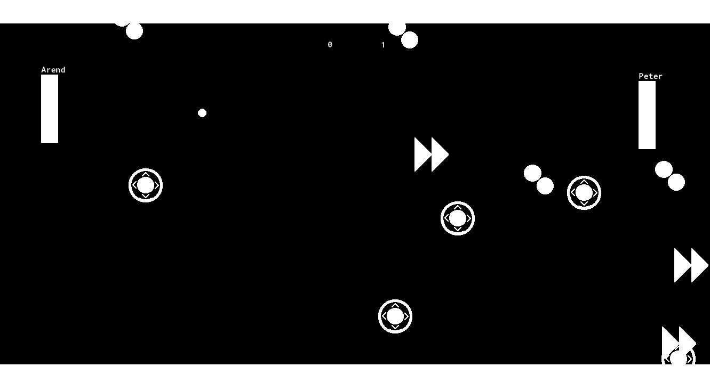

# Power Ups

Next we'll be adding super powers to the game 💪! And by that I mean, a bunch of power ups that'll randomly spawn, and if you can get the ball to hit them it'll make the game more interesting

Here's the power ups we'll be adding

 * **Extra Ball**: Hitting this will add an extra ball to the game
 * **Grow Ball**: Hitting this makes the ball bigger
 * **Speed Up Paddle**: Hitting this will make one of the paddles faster

## New Sprites

First off we'll need sprites for all these power ups. I just drew some super quick images for those, but I'm sure you can do better


> Don't worry, we'll be using actually pretty art in the upcoming games, I just figured we could use Pong as an oppurtunity to learn the sprite editor and our own art skills

## New Objects

Now make objects for each of the sprites (``oGrowBall``, ``oExtraBall``, ``oFasterPaddle``). And then, to start out, we want to program each of them to die as soon as they hit the ball. Can you do that?

<details data-summary="Make the power ups die when they hit the ball" markdown="1">

Just gotta add ``instance_destroy();`` to all the ball collision events

```
// oGrowBall Collision w/ oBall Event
instance_destroy();

// oExtraBall Collision w/ oBall Event
instance_destroy();

// oFasterPaddle Collision w/ oBall Event
instance_destroy();
```

Hopefully you remember us using ```instance_destroy()``` in the previous chapter 😉, if not don't worry about it, fluency will come with time

</details>

You can place some in the room temporarily to verify that they work as expected, but be sure to remove them afterwards, we don't want the power ups to be there right away

## Spawning Power Ups

To spawn the power ups we're going to use **Alarms**

Alarms in game maker work the same as alarms in real life (although a timer actually a better analogy, so I'll use that). Let's say you just put a cake in the oven, and you want to make sure you take it out on time. In this case you'd set a timer for maybe 60 minutes , then when it goes off you'd take it out. (I still remember a time when I'd actually do this with a physical timer, but those seem to be a thing of the past now 😢)

Same in Game Maker! In our case, we don't want the power ups to spawn right away. Maybe we'll wait 4 seconds first? In this case we can set the Game Maker Alarm to 120 steps (30 steps per second for 4 seconds is 30*4=120), and then can have our spawning code in the alarm event so that the power up will spawn when the alarm goes off. Here's the code

```
//oPaddle Create Event
alarm[0] = 120; // 4 seconds

//oPaddle Alarm 0 Event
instance_create_layer(
	random(1366), // 1366 is the room width
	random(768), // 768 is the room height
	layer,
	choose(oGrowBall, oExtraBall, oPaddleSpeed),
);
alarm[0] = 300; // 10 seconds
```

``alarm[0] = 120;``: This is pretty much the only new thing here. Those square brackets are kind of odd (and they'll come up more later), but for now you can think of it as part of the variable name. Using that variable we can set alarm 0 to 120 steps. Then it'll count down every step until, 4 seconds later, the variable will reach 0 and then trigger the alarm 0 event

In the **Alarm 0** event we spawn a power up, and then reset ``alarm[0]`` to 300. Reseting ``alarm[0]`` will ensure that the alarm triggers every 10 seconds after the first time that the event triggers

> **But what about the ``0``?**, Good question! you can actually have multiple alarms if you wanted to. Here we're setting alarm 0, and we're triggering the corresponding event, but I could also set a bunch of other alarms if I wanted to (game maker currently supports 0-11, which is a total of 12, although I'm pretty sure I've never needed more than 4)

> **I still want to know more about the ``[]``?** 🤓 oh ok, if you really want to know what the square brackets mean, I guess I can give you a sneak peak. ``[]`` are used with array variables. Essentially if you have a bunch of variables that are similar (like a bunch of alarm variables for example), then it can be nice to group them together into an array. You can sort of think of arrays as a list of variables (lists usually refer to something different in programming, but the difference between arrays and lists is a tad technical), and you can use the number to indicate which one you're refering to. As usual with programming, arrays tend to start at 0 and then count up from there. Refering to variables by their array index (i.e. the number), let's you do a lot of cool tricks but we'll get into those later (probably in a later course tbh)

``instance_create_layer(...);``: We've got somewhat of a revival of all the functions we've learned. The ``instance_create_layer()``, ``random()``, and ``choose()`` functions that we learned back in the [GML Functions section](7_GMLFunctions.html#randomize-ball-speed-featuring-choose). Using those functions we can create an instance randomly in the room, and have the instance object be randomly chosen from ``oGrowBall``, ``oExtraBall``, or ``oPaddleSpeed``

When you test it out, you should see the power up show up every few seconds 😊



## Magic Numbers

I'm going to go on a little tangent on Magic Numbers, but please don't skip over it, I promise this will be helpful to your programming endeavors!

So, what are Magic Numbers? I mentioned it briefly in a previous nerd side bar, but now it's going to become core curriculum. Magic Numbers are when you use numbers but the purpose isn't clear (we don't know how they work, hence they're magical).

Magic Numbers are bad, because if you or someone else comes back to the code later, they might not remember what the numbers were for and it will be harder to update the code (which in turn means it'll take longer for you to finish your game). If you come back to this code in a month, are you going to remember that 1366 is the width of your room?

There's a couple things you can do to alleviate the Magic Number problems, but the best thing to do is substitute variables

```
//oPaddle Create Event
alarm[0] = 4 * room_speed;

//oPaddle Alarm 0 Event
instance_create_layer(
	random(room_width),
	random(room_height),
	layer,
	choose(oGrowBall, oExtraBall, oPaddleSpeed),
);
alarm[0] = 10 * room_speed;
```

There we go, now we've replaced the numbers with the room_width, room_height, and room_speed variables. Which are the width of the room, height of the room, and steps per second accordingly

Now we don't have to wonder what 1366 means, it's just room_width, much better 😎

Using variables has an additional benefit. Let's say you change room size. Well previously you'd have to find all Magic Numbers related to the room dimensions and update them. Now we can freely change our room size (or even the game's framerate). Using variables will ensure that we're always using the correct value

**TODO** also mention hard coding, it's essentially a synonym

### Comments to explain Magic Numbers

But wait! What about the comments? Didn't they serve the same purpose? Well yes and no. I have a few beefs with using comments so if the code is clear on it's own I prefer to avoid comments (much of this is personal opinion, you might get different answers if you asked a different Software Engineer). Here are specific issues w/ comments

 * **Tedius**: Comments can take a long time to write
 * **Upkeep**: As you update your code, it's very easy to forget to update the comments. As a result your comments could end up incorrect and mislead future readers of your code

So yeah, I'm not a fan of comments in general, but they still have their place. I do my best to make my code clear, but when it's not clear, comments are the best option I have to make it understandable. I actually use comments as a incentive to write better code. If I feel like I need to write a long essay in comment form, then

Anyway, this was all a long way of saying, that I won't hold back on you all anymore 😊. When you all were new to Game Maker, I didn't want to throw too many variables at you at once. Numbers are easier to pickup, so I wanted you to get comfortable there fist. But now that you all are basically veterans, there's no need to hold back. If I think introducing you to a bunch new variables and functions is going to improve the code, then I'll do it. I know you all can handle it now 💖
