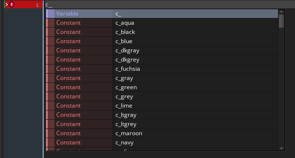
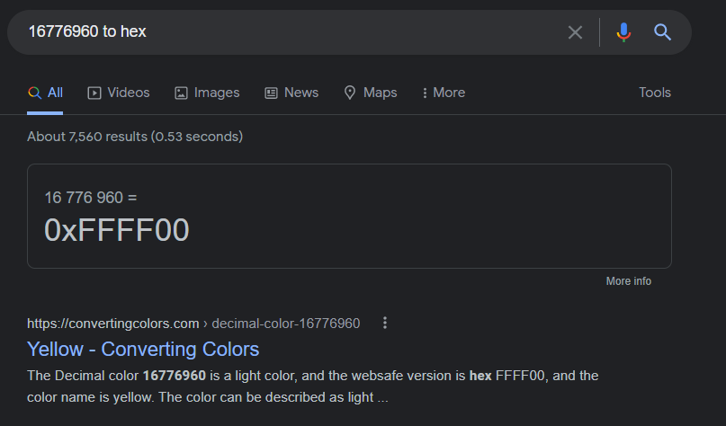
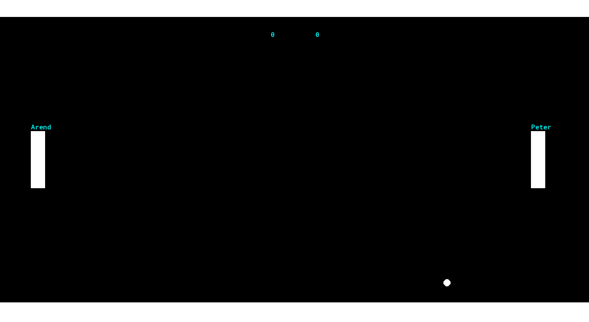
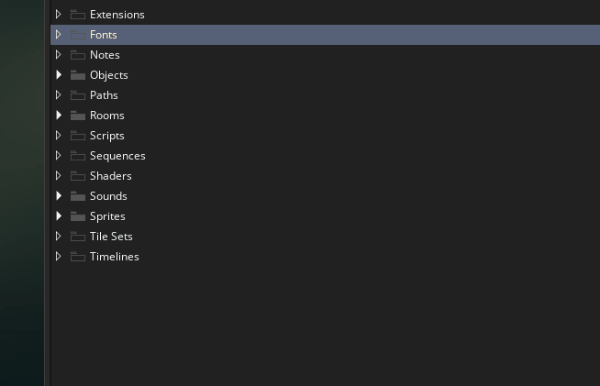
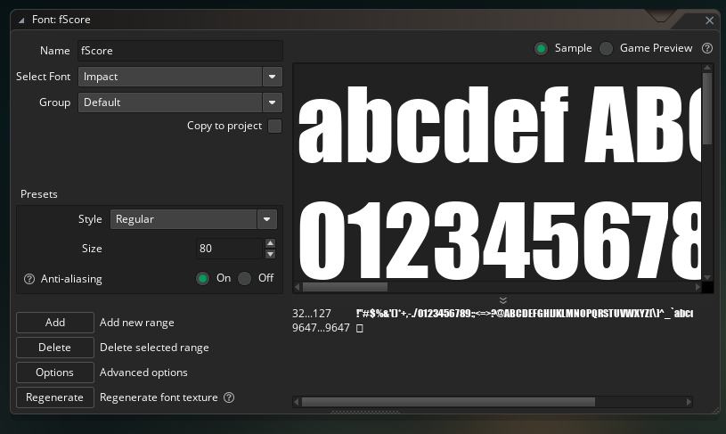
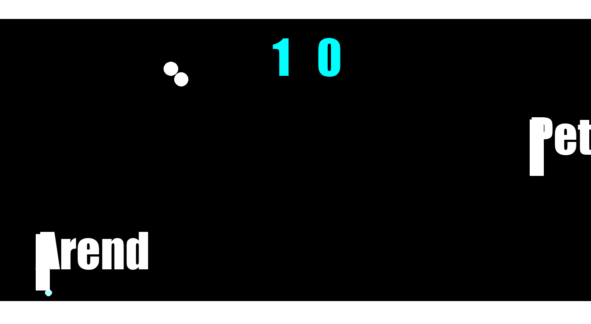
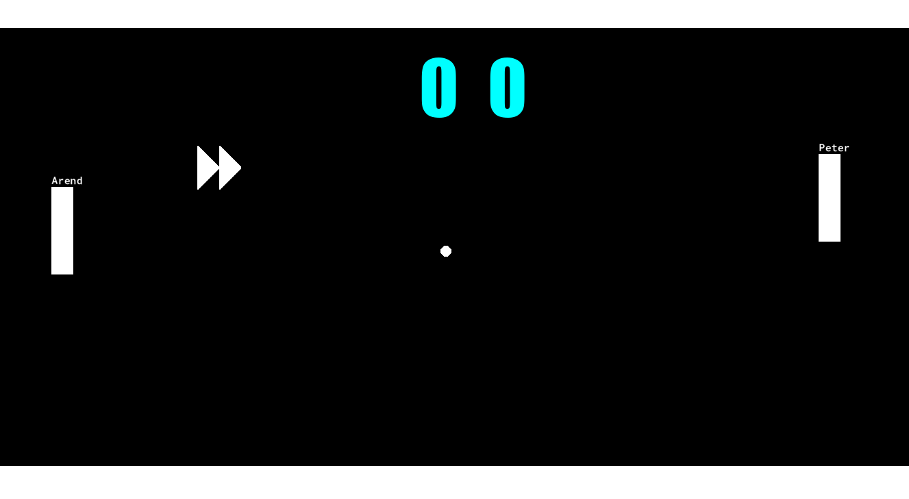

# Fonts

One of my goals for this chapter was to get you familiar with all of Game Maker's most common resource types. To finish that up, let's talk about fonts! (and we'll also cover the world of ``draw_set_`` functions)

## Text Color

Pong is usually just black and white, but now that've added some color to our ball animation, maybe we'd like to know how to update our text color as well?

Usually when we want to update the way a function operates, we just add a parameter, but if you look at the ``draw_text(x, y, text)`` function, you'll notice that it doesn't give us any parameters for color 🤔

This is because ``draw_text`` and most other draw functions (with the exception of ``draw_sprite``) rely on ``draw_set_`` functions. So for example, let try changing our score text color to light blue (or cyan as game maker calls it)

```
// oScoreBoard Draw Event (updated)
draw_set_color(c_aqua);
draw_text(room_width/2-50, 93, enemy_score);
draw_text(room_width/2+50, 93, player_score);
```

``draw_set_color``: So as you can see, ``draw_set_color()`` works a little different than some other functions we've worked with. Just calling the function doesn't actually do anything, it just impacts the way future draw functions operate. You can think of it as a painters brush. Before a painter puts anything on the canvas, they need to select their paint brush, and select which paint to dip the brush into. Setting up the brush doesn't impact the canvas, but it's still an important step. Similarly you can use ``draw_set_color()`` to select the "brush color", and then, since you're reusing the brush, all future ``draw_text()`` calls will use the same color.

I started out with color since it fit my painter analogy best, but in Game Maker there are a lot more properties you can assign to your "brush". The big ones we'll be covering today are the font, and text alignment

``c_aqua``: When I set the color I selected ``c_aqua``, where did this come from? Well computers use an simple number system to represent colors, in particular aqua color is just ``16776960``. Wait did I say simple? I meant to say complicated 😢. It's kind of a neat system but you don't need to understand it just yet. The point is if everyone had to do ``draw_set_color(16776960)`` to make aqua, not many people would do it right? So instead Game Maker included the variable ``c_aqua`` as well as a bunch of other colors, so you can just type those out instead. You can do auto complete on ``c_`` to see other color options



**constants**: These are actually special variables called **constants**. This means they're always a constant value, and you can't change them. This makes sense because ``c_aqua`` should always equal ``16776960``, it would be confusing if you tried to change it. Even if you tried doing ``c_aqua = 5;`` Game Maker would give you an error. Another popular Game Maker constant is ``pi``, this will always be set to ``3.141...``, again it would be very confusing if you tried to change this, so Game Maker doesn't let you

> **Wait, I want to know more about 16776960!**: I'm so glad you asked 🤓. So computers like representing colors using a single number, but that's tricky since colors are usually represented using 3 numbers (red, green, and blue), they range from 0-255. For aqua it's 3 numbers are blue=255, green=255, and red=0, and these are included in 16776960. But how! Well, to start you should know that the format is much simpler is hex form. Our decimal numbers mean the digits can range from 0 to 9 (i.e. 10 digits), with hex the digits can range from 0 to 9, and A to F (i.e. 16 digits). You can use google to do the conversion, and then you get 16776960 is 0xFFFF00 in hex. Cool, so each digits corresponds to different colors. This is like saying blue=FF, green=FF, and red=00, or if we convert it back to decimal it's blue=255, green=255, and red=0. In other words, aqua!



> **But I'm still confused, google said 0xFFFF00 is yellow**: Ah yes, this is kind of a sad story 😢. So we figured out how to represent 3 numbers in one using the hex format. But then people still need to decide which parts of the hex number corresponded to which color channel. Game Maker decided that the first 2 hex digits should be blue, the next 2 should be green, and the final 2 should be red (so bbggrr). But literally everyone else decided on rrggbb, that's why google says yellow, because red=255, green==255, blue=0 corresponds to yellow. I have no idea why Game Maker decided to go against the grain, it's quite annoying

``room_width/2-50``: You'll also notice that I updated the code to remove the hardcoded numbers and instead do some math on ``room_width``/``room_height``. The old ``700`` and ``800`` were meant to signify *"a little to the left of the center"*, and *"a little right of the center"*. Well now we're referring to the center more directly by doing ``room_width/2`` and then I'm doing ``+/- 50`` to handle the *"little to the left"*/*"little to the right"* logic. Even though I'm still using math/numbers, this variation looks a lot closer to English, and it makes our code more readable



Wait a second! I thought we were only changing the score color. Why is it also changing the name color 😲. Let's get into that on the next section

## Resetting Text Color

Let me reemphasize my previous ``draw_set_color`` description. "... since you're reusing the brush, **all** future ``draw_text()`` calls will use the same". I literally mean ALL other ``draw_text()`` calls, even those that are happening in other instances. So once ``oScoreBoard`` sets the color, that color will also continue to be used for ``oPaddle`` and ``oEnemyPaddle`` when they draw their names

To fix this we can either have ``oScoreBoard`` reset back to the default color (the *"clean up after yourself"* mentality), or we can have ``oPaddle`` and ``oEnemyPaddle`` set to white before drawing text (the *"every man (or woman or person) to himself (or herself or themselves)"* mentality). I'll go with *"everybody to themselves"* for this one

```
// oPaddle Draw Event
draw_set_text(c_white);
draw_self();
draw_text(x, y-20, name);

// oEnemyPaddle Draw Event
draw_set_text(c_white);
draw_self();
draw_text(x, y-20, name);
```

There, this fixes the issue


> **Why did you use "everybody to themselves"? Wouldn't "clean up after yourself" have been easier?**: Ah yes, that would be better but thus is the tragedy of the commons 😢. But seriously, there isn't really a right answer here. It actually depends 🤓. If there's a clear "default" option for my situation and most things use that default, then I use "clean up after yourself". That way I don't have to waste lines of code resetting to the default, I can just clean up after myself in the 1% of cases where I don't need the default. If there isn't a clear default, I go with "everybody to themselves". In this case, it would be hard to know the "default" reset value for "clean up after yourself", even if we did, it would have limited value if most other objects will be resetting again to a non default anyway. Color is an example of "everybody to themselves", because most objects tend to use different colors (Although, pong may be an exception). Alpha (or transparency), is an example of "clean up after yourself", because the vast majority of draw calls are opaque (alpha=1). So I just reset back to 1 when I'm done for the cases where I have a non-zero alpha

## Font Resources

So far we've been drawing all our text using the ugly default font. Let's make a better one ourselves. To get started, right click on the fonts folder and select *"Create > Font"*



Then go ahead and configure the font the way you want it. I named it ``fScore`` since I'll use this as the score. I also set the font to impact, set the font size to 80 (should be pretty massive), and left the rest at the default. But that said, I'm not usually the person to select fonts on the team, so take my recommendation w/ a grain of salt



Now we need to actually set the font in our code. It's very similar to the ``draw_set_color()`` pattern

```
// oScoreBoard Draw Event (updated)
draw_set_font(fScore);
draw_set_color(c_aqua);
draw_text(room_width/2 - 50, 93, enemy_score);
draw_text(room_width/2 + 50, 93, player_score);
```

``draw_set_font(fScore)``: So we just call ``draw_set_font()`` and then all future ``draw_text()`` calls will use that font.



oh geez, something went wrong here 😲. Why are the paddle names so massive!? Actually, I think you might know why 😉, but it might still require some googling to fix it, I believe in you

<details data-summary="How to make the paddles use the old font?" markdown="1">

```
// oScoreBoard Draw Event (updated)
draw_set_font(fScore);
draw_set_color(c_aqua);
draw_text(room_width/2 - 50, 93, enemy_score);
draw_text(room_width/2 + 50, 93, player_score);
draw_set_font(-1);
```

``draw_set_font(-1)``: Same as with colors, ``draw_set_font()`` sets the font across all objects, so we need to reset. In this case I'm using the "clean up after yourself" pattern, so I'm resetting at the end of ``oScoreBoard``, and we use ``-1`` to represent Game Maker's default font



</details>
