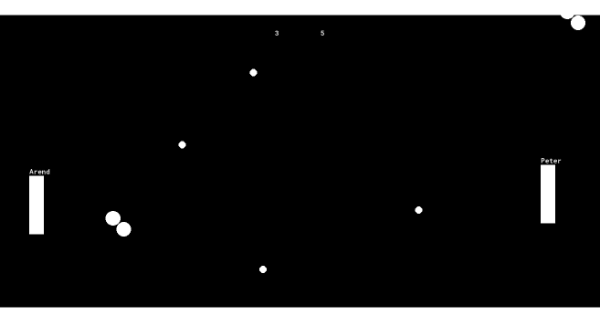
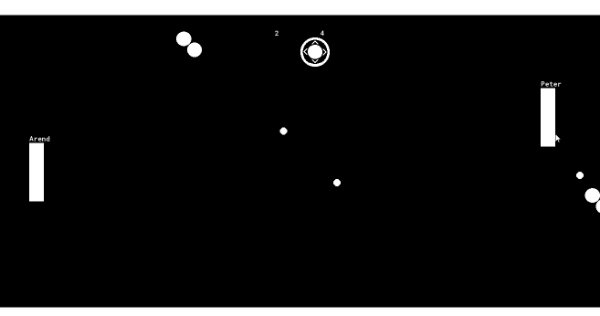

## Extra Balls

Now back to coding our power ups! We can just add little code snippets to each of them. For ExtraBall I think you can already handle it, so why don't you try it first

<details data-summary="How are extra balls are implemented?" markdown="1">

Just another ``instance_create_layer()`` call 😉

```
// oExtraBall Collision w/ oBall Event
instance_create_layer(
  oBall.xstart,
  oBall.ystart,
  layer,
  oBall
);
```

You could have done this using a collision event in ``oBall`` instead, I just figured I'd do it in the power up, since ``oBall`` is starting to get cluttered (also this code also seems more closely related to the power up)
</details>

Here's what it looks like when testing (hint, update the spawn logic to only spawn ``oExtraBall`` to make testing easier )




## Grow Ball

This ones a little more involved. I can drive for this one

### Reference by object

Here's the first way we might implement this

```
// oGrowBall Collision w/ oBall Event
oBall.image_xscale += 1;
oBall.image_yscale += 1;
```

``image_xscale`` and ``image_yscale`` are new. They control the scaling of instances along the horizontal and vertical directions

Initially I was setting the scale to 2, but I think it's cooler to add 1. That way the ball(s) can keep getting bigger and bigger 😈


If you play w/ this for a while, you might notice that the growth behaviour might not work as you expect. Every power up seems to update ALL balls

Remember ``oBall`` is an object not an instance, so changing ``oBall.image_xscale`` changes the scale across all balls. Not only that but retrieving ``oBall.image_xscale`` will still only give you one value. So ``oBall.image_xscale = oBall.image_xscale + 1;`` (the equivalent of ``oBall.image_xscale += 1;``) will retrieve ``oBall.image_xscale`` from a single ``oBall`` instance, add one and then set that across all ``oBall`` instances. So in the example, it happened to use the ``oBall.image_xscale`` from the biggest ball, so everything else skipped several ranks

It's not totally clear how these power ups should interact w/ each other, so take a second to think about which option sounds more logical to you

### Apply growth to colliding ball (using other)

Let's say you only want to apply the growth to one ball. In this case it makes the most sense, for the colliding ball to always receive it. Here's how you'd do that

```
// oGrowBall Collision w/ oBall Event
other.image_xscale += 1;
other.image_yscale += 1;

...
```

``other`` is a special keyword that can be used in collision events as well as a few other places. This let's us refer to the specific ``other`` instance that was involved with the collision. Note other **instance** not other **object**, this means it really is that specific ball, and not the ``oBall`` object in general



### with keyword

Cool, we'll make all the balls grow in a second. But first I want to talk a bit about ``with``. ``with`` is a keyword you can use to execute code in a different instance or object. For example, here's how I'd rewrite the above code using with

```
// oGrowBall Collision w/ oBall Event
with(other){
  image_xscale += 1;
  image_yscale += 1;
}

...
```

For this particular case, using ``with(other)`` versus ``other.`` is a matter of preference. For longer snippets I tend to use ``with``, but for shorter snippets (1 or 2 lines), I'd probably use ``.``

### Apply growth to all balls (using with)

Here's how we can use with to perform the scaling on all balls

```
// oGrowBall Collision w/ oBall Event
with(oBall){
  image_xscale += 1;
  image_yscale += 1;
}

...
```

It looks almost identical, but there is a critical difference. When you pass a object (like ``oBall``) into a ``with`` statement instead of a instance (like ``other``), it actually acts like a loop. The above code will repeat that snippet of code across across all instances of ``oBall``, thus making all of them grow by one


Now that I've given you a few options, I'll leave it up to you which approach to move foward with. It really only depends on which one you like best for your specific pong game

## Refactor paddle speed

I'd like to start working on the power ups to make the paddles faster, but right now that's kind of hard since we're hard coding the paddle speeds in the paddle code (I'll use the terms hardcoding and magic numbers interchangably, they're pretty much the same for our purposes).

**TODO** insert refactoring definition
**TODO** mention that hard coding is a broader concept that magic numbers

It would be much better if we had a variable that our power up could adjust. Can you add a variable called max_speed to each of the paddles, and then refer to that when you move the paddle?

<details data-summary="Adding a max_speed variable to the paddles" markdown="1">

Luckily our paddles don't have too many events, but there's still a decent amount of refactoring to be done

I also opted to change our math logic to the superiour `+=` 😉

```
// oPaddle Create
max_speed = 4;

// oPaddle Key Down - Up
y -= max_speed;

// oPaddle Key Down - Down
y += max_speed;

// oEnemyPaddle Create
max_speed = 4;

// oPaddle Key Down - W
if(is_ai == false){
  y -= max_speed;
}

// oPaddle Key Down - S
if(is_ai == false){
  y += max_speed;
}
```

</details>

> **Why not just say speed instead of max_speed?** Well, max_speed is more correct, because the paddles can have 0 speed if they're not moving. But I also specifically avoided speed because it's a builtin variable. We saw with the ball logic, that setting speed will cause the instance to automatically move in accordance with the direction logic. The paddles don't use to the speed/direction approach and to ensure it stays that way I need to avoid setting speed/direction

## Speed Up Paddle

Now that the refactoring is done, adding the new feature will be pretty easy (this is usually how it goes)

```
//oSpeedUpPaddle Collision w/ oBall

if(other.hspeed < 0){ // if the ball if moving left
    oPaddle.max_speed += 2;
}else{
    oEnemyPaddle.max_speed += 2;
}
```

For speeding up the paddle, I want the paddle that last hit the ball to be the one who gets the speed boost, presumably that's the paddle that aimed the ball to the power up. To figure out which paddle that was, I check whether the ball is going left or right

Aside from that the code should be pretty simple. Most of the effort really was in refactoring our code to use a max_speed variable


## Spawn Range

After playing with power ups for a bit, you may have noticed that the power ups sometimes spawn in awkward places. How about you try fixing that? (Hint: try looking at [random_range](https://manual.yoyogames.com/GameMaker_Language/GML_Reference/Maths_And_Numbers/Number_Functions/random_range.htm))

<details data-summary="Reducing power up spawn positions" markdown="1">

```
//oPaddle Alarm 0 Event (updated)
instance_create_layer(
	random_range(200, room_width-200),
	random_range(200, room_height-200),
	layer,
	choose(oGrowBall, oExtraBall, oPaddleSpeed),
);
alarm[0] = 10 * room_speed;
```

Now I've got a 200 pixel margin along the edges where power ups won't spawn

Note that in the spirit of reducing magic numbers, I'm still using room_width/room_height to ensure the margin adjusts to different room sizes even though it requires some extra math
</details>

And there you go, power ups! This made our little pong game a lot more interesting 😎
