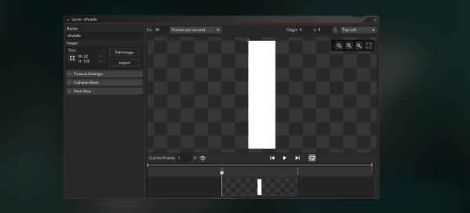

# Alignment and Offset

Alignment and offset might sound boring, but unfortunately alignment problems come up all the time when making games 😭. Hopefully taking some extra time to talk about it now can reduce your time spent in the future 😉

## Text Alignment

There's something else that might be bothering you (at least it's been bothering me). The name text isn't centered 😤! Luckily we can fix this by altering the text alignment

When we draw things we only specify one x/y position, but obviously you need more than one pixel to draw text. So in addition to which position to draw text, we can also configure which direction it extends. This is called the text alignment. Here are some examples


So by default, horizontal align is to the left, and vertical align is on the bottom. This means that the x/y position of the text represents the bottom left corner. Since we want the text to be centered, and still be drawn above the paddles, I think center and bottom makes more sense for us. Here's how we'd program that

```
// oPaddle Draw Event
draw_set_color(c_white);
draw_set_halign(fa_center);
draw_set_valign(fa_bottom);
draw_self();
draw_text(x, y-20, name);

// oEnemyPaddle Draw Event
draw_set_color(c_white);
draw_set_halign(fa_center);
draw_set_valign(fa_bottom);
draw_self();
draw_text(x, y-20, name);

// oScoreBoard Draw Event
draw_set_color(c_aqua);
draw_set_font(fScore);
draw_set_halign(fa_right);
draw_set_valign(fa_bottom);
draw_text(room_width/2 - 50, 93, enemy_score);
draw_set_halign(fa_left);
draw_set_valign(fa_bottom);
draw_text(room_width/2 + 50, 93, player_score);
draw_set_font(-1);
```

``draw_set_halign()`` / ``draw_set_valign()``: These will change the alignment the next time you draw text (btw ``draw_set_color()`` can be applied to most draw functions, but ``draw_set_font()``, ``draw_set_halign()``, ``draw_set_valign()`` only apply to text)

``fa_center`` / ``fa_bottom`` : Similar to ``c_white`` when doing ``draw_set_color()``, the Game Maker provides us with several constants which make it easier to specify our alignments

**What's going on w/ oScoreBoard**: Oh, I generally follow the "everybody for themselves" principle for text alignment, so I had to update ``oScoreBoard`` to make sure updating the paddles doesn't mess up the text alignment there. In particular I've setup the horizontal alignment to make sure the scores "grow" in different directions. Even if the scores grow to massive numbers, they should never overlap. It's the power of text alignment 💪🏿


## Sprite Origin

So we've fixed our text alignment, but it still doesn't look right (in fact it kind of looks worse?). So our text is centered properly, but the sprite is still "aligned" to it's top left, and centering above the top left of the sprite looks bad

One way to solve this is to change the position where we draw the text. Maybe I'd start drawing the names at ``x + sprite_width/2`` (oh new variable 😮 , but I bet you can guess what it is 😉), instead of just ``x``. That way it'll be drawn above the center of the sprite

But since we just talked about text alignment, I figured we could make this an opportunity to talk about "sprite alignment" (except it's actually called the **sprite origin**).

The **sprite origin** can be updated by opening the sprite, and dragging the origin indicator. You can also use a preset origin by selecting from the drop down in the top right. The origin is made up of and **x offset** and a **y offset**. Top left means the x and y offset are both 0, and increasing them shifts the **sprite origin** left and down respectively



Here's some examples of how different sprite origins will impact our game (the paddle is a bit cut off for some of them, I didn't want to make the graphic too big)


So you'll recall from the text alignment that the alignment represents which section of the text corresponds to the x/y position of the text (ex. an alignment of center-bottom means that x/y you choose in ``draw_text()`` corresponds to the center bottom of the text). The sprite origin is similar, when you set the sprite origin, you're saying that the position you draw the sprite at corresponds to the selected origin on the sprite (since we're using ``draw_self()`` it's just using the x/y of the object, but we could be passing a different x/y if we were using ``draw_sprite`` or ``draw_sprite_ext()``). The sprite origin is more powerful that text alignment, because you can choose ANY x/y value, not just along the corners/edges/center. Although that said I still usually place my sprite origin along the corners/edges/center

In this case top center is probably the best for complementing our text alignment, so I'll go with that


> **Is updating the sprite offset better than adding sprite_width/2?**: Actually for this case, I think I would have leaned slightly toward sprite_width/2, but it doesn't really matter for a small game like this. As your game gets more complicated, you'll find that updating the sprite origin is a powerful change that will end up impacting a lot of areas of the game. Even in our small project, if we decided to update the y offset it would impact how our AI is written. So with that in mind, it's often easier to update your draw position instead. I still update sprite origins in my games, but I usually do it to solve more complicated problems, like rotation, or aligning multiple sprite animations

> **Why is the default origin in the top left corner?**: ooh, I have a tangent on this one too 🤓. It's consistent with the rooms "origin" ( (0,0) point ) being in the top left corner. That's just how computers store graphics, so many 2D engines tend to use top left as the origin point to be consistent. That said, 3D engines are a different story, in that case engines find it more intuitive to use a center origin for the sprites and rooms (or actually they're called scenes in those engines). This is also why Unity and Godot use center even when making 2D games, it keeps things consistent even when switching back to 3D


## Ball Origin

Speaking of origin, it's always kind of bothered me that the ball's origin is in the top left. This is particular clear when watching the AI try to track larger balls. How would you adjust the ball's origin to fix this?

<details data-summary="How would you adjust the ball's sprite origin to make the AI track it better?" markdown="1">
Setting ``sBall``'s sprite origin to the center greatly improves this 😃
</details>
