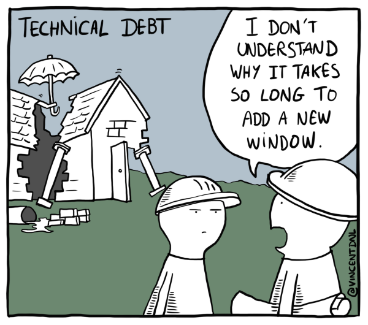

# Upkeep

The power ups were pretty cool, but if you play the game for a while you might notice some issues, particularly with the multiple balls power up. Let's go back and do some upkeep

## Multi ball reset logic

If there's multiple balls, what should happen if they go outside the room? If they just keep resetting, then the extra balls will just keep accumulating and it'll get out of control. That sounds fun for the first time, but it's probably not something we want to keep up in the final version

Instead I'm thinking we'll have it reset if it's the last ball, and if it's not the last ball it'll destroy it's self. This way getting the power up will create a temporary increase in balls, but they still have a way to decrease again. Here's how I'd code that

```
// oBall Outside Room Event
if(instance_number(oBall) == 1){
  instance_create_layer(xstart, ystart, layer, oBall);
}
instance_destroy();
```

``instance_number(oBall)``: This gives me the number of balls in the room, so ``instance_number(oBall)`` is checking if we're the last one. And if so, we can create a new ball

After running the check, and possibly creating a new ball, we destroy ourselves. Since this happens regardless of the results of the if condition, we should see balls die off in all cases, and decrease if we have multiple

## AI tracking multiple balls

You may have also noticed that the AI logic doesn't work quite right anymore.


The problem is that it uses ``oBall.y`` but this value is unpredictable when there's multiple balls (well I guess you *could* predict it, but it's just confusing and overall a bad idea). What we really want is to use the y value of the ball that's closest to us. Here's how I'd do that

```
// oEnemyPaddle Step Event
if(is_ai){
    // find closest ball position
    closest_ball_x = 100000; // arbitrarily large
    closest_ball_y = 0; // doesn't matter
    with(oBall){
        if(x < other.closest_ball_x){
            other.closest_ball_x = x;
            other.closest_ball_y = y;
        }
    }

    // apply AI
	if( y + 64 > closest_ball_y){
		y -= max_speed; // move up
	}else{
		y += max_speed; // move down
	}
}
```

``with(oBall)``: We covered this pattern when we added the power ups, but it's a little tricky so may as well repeat it. ``with()`` let's us run a code snippet within other instances, but if you supply an object it'll exectue the code on all instances of that object. So in this case it's an easy wall to run a snippet of code on all the balls. As we're looping over the balls, we're also updating the ``closest_ball_x`` and ``closest_ball_y`` variables. The idea is that we update those variables every time the with finds a better ball to be the closest ball

``other``: We've used other before, but that time it was inside a collision event and it referred to the instance you were colliding with. What does it mean outside a collision event? Well, when it's used in ``with()`` other refers to the instance that ``with()`` was called from. So we're calling ``with()`` from ``oEnemyPaddle``, but when we're inside the ``with()`` we're effectively running code within ``oBall`` so we can use other to access variables that belong to ``oEnemyPaddle`` (like ``closest_ball_x`` and ``closest_ball_y``)

By the end of the ``with()``, ``closest_ball_x`` and ``closest_ball_y`` should match the x and y values of whatever the closest ball is (and since we know the enemy paddle is on the left, finding the smallest x is good enough for determining the closest(ish)). Then we can run the same AI logic using ``closest_ball_y`` instead of ``oBall.y``

When we test it again, our enemy AI should be smarter 😀


## Game Architecture (Games as Systems)

Doing this upkeep touches on a broader issue that comes up in games and software development in general. We made one system, AI, and then added another system, power ups, and then we had to update the first system to make sure the new system was supported

These sorts of issues will come up more and more as your games get bigger. Here's a summary of your future in game development

1. Learn to add cool things to your projects
2. Learn to add cool things that are easy to update so that you can add more cool things

Following tutorials that illustrate any single effect is one thing, but there's a whole new set of problems that arise when you're trying to add the same features to a larger game and it needs to interact nicely with all your existing systems

Adding new systems will naturally require updates to other systems, but's some things you can do to make that process easier (I'm skimming the surface here, we'll understand these better as we write more code)

 * **Decoupling**: If you're systems are designed to be decoupled (i.e. independent) from each other, it'll reduce updates needed for new systems [further reading](https://en.wikipedia.org/wiki/Loose_coupling). When I was talking about ``draw_set_color()`` and the "everybody for themselves" versus the "clean up after yourself" methodology, this was in service to minimizing the impact one object has on another (i.e. decoupling those objects)
 * **Single Responsibility Principle (SRP)**: Each system should only have a few responsibilities (ideally a *single* one). SRP also implies that you'll end up with more smaller systems rather than a few bulky ones. Small/Simple systems are easier to update that Big/Complicated ones [further reading](https://en.wikipedia.org/wiki/Single-responsibility_principle). So far we've been mixing quite a bit, for example ``oBall`` manages the ball physics, and also updates the score. And ``oPaddle`` handles user input, as well as playing the background music
 * **Code Reuse**: We have a lot of situations where we copy the same code to multiple places (``oEnemyPaddle`` and ``oPaddle`` in particular share a lot of code). Later we'll find ways to define code in one place, and share it across objects. This way updates to the shared code can also be made in one place, and there's no risk of forgetting to update one of the copies
 * **Readable code**: Using logical structure, as well as good variable names, and comments will make your code easier to understand, and thus easier to update (this is why I talked about **Magic Numbers** earlier)
 * **Over Engineering**: All of the above principles are important, but it's also possible to take them to go overboard with them. For example, I mentioned how ``oPaddle`` handles music earlier. In bigger games figuring out which music needs to be played when can be a big task, and in accordance with SRP we might give it it's own object (ex. ``oMusicController``) to handle it. But that said, in our tiny pong game, it's just 1 line of code. In that case breaking it our into ``oMusicController`` would make are code more complicated, not less complicated. So it's better to let the music system grow a bit bigger first. One of the most famous quotes in computing is *"Premature optimization is the root of all evil" -Don Knuth*. Optimization is a separate beast from the principles I've mentioned so far, but it's the same idea

**TODO** Insert tech debt definition, and also recenter the conversation around game architecture

**Why are you telling me this now? I only just learned to make Pong**: I just want you to be aware of this as an over arching goal as you continue following my courses. In addition to showing you how to do cool things in Game Maker, I want to sprinkle in some lessons on coding principles. If we don't use good coding principles, our game could become a complicated mess of code that's impossible to update with new things


