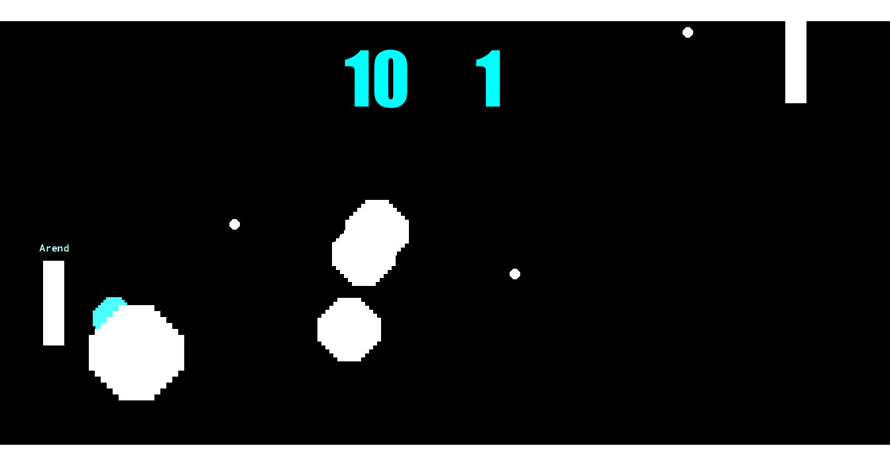

# Review: Pong Extreme Edition

## Resource Types

This chapter added several more resource types for you to work with

* **Sounds**: We added both music and sound effects
* **Fonts**: Yay, no more ugly default font (but you also know you can use ``draw_set_font(-1)`` if you ever wanted to go back)

We also learned **Animation** as an add on to the **Sprite** resource

This pretty much all the resources you'll need for this course (with the exception of **Tilesets** which I'll be covering in a future chapter). Congrats 🎊

## Events

For Events it looks like the only new one is **Alarms**. You can set alarms using the ``alarm[0]`` variable (the number can range from 0-11), and then the variable will count down every step until it hits 0 and the alarm event is triggered

I skimmed ahead to see if there are any new ones, and I think you already know 95% of the ones that I frequently use. I'll sprinkle one in every now and then but for the most part I think it's fair to say you've also graduated from learning new events 🎉🎓

## GML

**Variables**: We learned lots of new builtin variables. It's at the point where I'm starting to throw them in there without a formal introduction. If I think introducing a new variable will make the code better then I'm going to use it 😊

 * ``direction`` / ``speed`` : Which speed and direction the instance is moving (an alternative to ``hspeed`` / ``vspeed``)
 * ``room_width`` / ``room_height``: The dimensions of the current room
 * ``room_speed``: Number of steps per second the game is running at, by default it's 30, but this can be updated
 * ``image_xscale`` / ``image_yscale``: The scaling of the instances sprite
 * ``sprite_width`` / ``sprite_height``: The dimensions of the instances sprite (I didn't mention this earlier but this is actually the dimensions of the sprites resource scaled by the instance's scaling. So different instances with the same sprite can have a different ``sprite_width``)

**Constants**: We also learned that these are a thing. As a reminder, constants are built in variables that can't be changed

 * ``pi``: π, a circle's width divided by it's circumference. You won't be using this often, but it's a good example of a constant
 * ``c_aqua``: There are a series of ``c_`` constants representing a variety of built in colors. This way you don't need to remember the number codes for all of them
 * ``fa_center``: When aligning text you use ``fa_center``, ``fa_left``, ``fa_top``, etc

**Functions**: Also learned some new functions, but mostly the ``draw_set_`` variety. Those are special since they impact the way other functions are executed

 * ``audio_play_sound()``: Plays sounds, and you can even loop them if you want
 * ``random_range()``: Selects a random number of a range (ex. give me a random number between 23 and 97)
 * ``draw_set_color()``: Sets the color for the next draw call (for now it's just ``draw_text()``, but it could also be lines, rectangles, etc)
 * ``draw_set_font()``: Sets the font for the next ``draw_text()`` call
 * ``draw_set_halign()``: Sets the horizontal alignment for the next ``draw_text()`` call
 * ``draw_set_valign()``: Sets the vertical alignment for the next ``draw_text()`` call

**Syntax / Keywords**: Several new GML syntax and keyword patterns

 * ``if else``: We learned if statements in the previous chapter, but now we added on ``if`` and ``else`` (as well as ``else if`` 😎)
 * ``+=``: Instead of ``x = x + 4;`` we now know how to shorten it down to ``x += 4;``
 * **boolean**: We learned about the strings and reals data types in the previous chapter, now we can add boolean (true/false data), to that list
 * ``with``: Use this to execute code within another instance. If you give it an object it will execute the code on all instances of that object. For example ``with(oBall){ instance_destroy(); }`` will destroy all instances of ``oBall``
 * ``other``: This let's you reference the ``other`` instance, but that meaning changes based on context. In a collision, it's the instance you're colliding with. Within a ``with`` statement, it's the instance that's outside the ``with`` statement

## Programming Concept

Lot's of new Game Maker and programming concepts

 * **Sprite Origin**: The sprite origin is made up of a horizontal and vertical offset which determine which spot on the sprite corresponds to it's ``x``/``y``. By default this is the top left corner, but there are a lot of situations where you'll want this to be different
 * **Magic Numbers**: Using a lot of numbers can make your code hard to read, if you don't know what the numbers mean, then they're impact on the game is just "magic", and "magic" is bad if you're trying to understand how something works. It's best to replace magic numbers with variables whenever possible. For example, ``room_width/2`` is a lot easier to understand than ``683`` don't you think?
 * **Cartesian vs Polar**: There's several ways to think of position and velocity. Cartesian breaks it down into horizontal and vertical components, and this corresponds to Game Maker's ``x``, ``y``, ``hspeed`` and ``vspeed`` variables. On the other hand Polar breaks it down by an angle and direction. Game Maker's doesn't have a position equivalent for polar (but if it did it would probably be called ``r`` and ``theta``), however the velocity equivalent is ``direction`` and ``speed``
 * **Resetting draw_set_**: The ``draw_set_`` functions apply globally. So whenever you use them you also need to think about how they're reset. You can either follow the **clean up after yourself** pattern, or the **everybody for themselves** pattern. I switch between them depending on the variable
 * **Color Codes**: When covering the color constants (ex. ``c_aqua``) I mentioned that these store the numbers corresponding to that color (ex. ``c_aqua`` is ``16776960``). In one of the 🤓 side tangents we went over how these numbers can be broken down into the red, green, blue color components by converting it to hex
 * **Game Architecture**: We added a lot of systems to the game in this chapter (ai, music, power ups, etc). As we do that we should put more and more thought into our architecture (how we organize these systems). A good architecture means that we can continue to add new systems to our game even after we've been working on it for many months (or even years) without breaking everything. I'll continue to revisit this as a theme in future chapters
