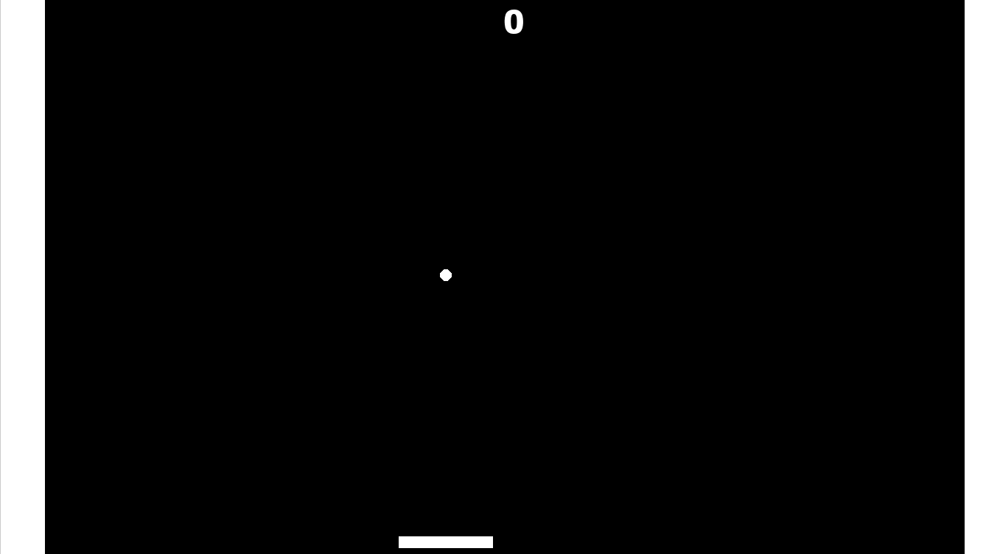

# Side Projects

At the end of each game I'll give you some optional side projects as homework. These are chosen to compliment the new skills you picked up from the previous chapter

If you're having trouble, I give hints in the FAQ section, and you're also welcome to download my projects here (TODO: insert github link)

Also don't feel limited by my example, if there's more you want to add then go ahead and give it a try! (For example, I didn't include power ups, but you can if you want)

My goal is to bring you to a point where you can make your own games without my help, and one of the first steps is getting comfortable implementing new things when you have an idea. So by all means, make these side projects your own 😀

## Juggler

The first side project is the juggler. A ball is falling, and you'll use your paddle to keep it up in the air as long as possible

Everytime the ball bounces your score increases, and when it goes offscreen it resets

I haven't shown you how to do gravity yet, you can try reading the documentation [here](https://manual.yoyogames.com/GameMaker_Language/GML_Reference/Asset_Management/Instances/Instance_Variables/gravity.htm) when you're working on that part (there's also more details in the FAQ)

## Breaker

Next we have breaker. Here the ball bounces (w/o gravity this time), against the walls, and the bricks. The bricks give you points each time

There are 4 types of bricks, and they each give you a different number of points: 1, 3, 5, and 7 points from bottom to top

The ball should speed up on every bounce. Once it goes outside the room, the position and speed should reset. If it resets 3 times, the game will restart

You may find that getting the bounce to work will be harder for this project, if so you can read up on the [move_bounce_all()](https://manual.yoyogames.com/GameMaker_Language/GML_Reference/Movement_And_Collisions/Movement/move_bounce_all.htm) function
