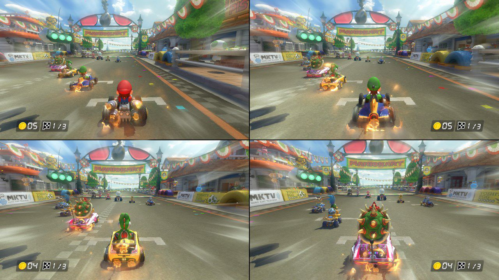

# Views

Now we'll add a camera, this will let's us have much longer levels rather than restricting them to the room

## Update room size

First we'll make our room wider

Navigate over to room properties, and update the width to ``3000`` (or longer if you like, go crazy 🥳)

If you run the game, you'll notice that it still works, the game dimensions just get really weird (most of your displays are probably less than 3000 px wide, so Game Maker is actually shrinking the game so that it'll fit)

## Setup Camera

Next, in the same room properites panel, expand **Viewports and Cameras** as well as **Viewport 0**. Then you'll check **Enable Viewports**, and **Visible** under **Viewport 0**

**What's the difference between camera and viewport?**: Good question, the **Camera** represents which portion of the room is being captured. You can see a preview of the **Camera** in the room as a white square, you can try changing the **Camera** values and see how they impact the preview. It's also often referred to a view (technically their different, but the difference is mostly only relevant to 3D games). Then **Viewport** represents which area of the window will be occupied by the camera. For most games, your **Viewport** will just match the window size (and you can adjust the viewport dimensions, if you want a different window size). The main reason to use an alternate **Viewport** is if your game has split screen. Then you'll want your viewports to be smaller, and you'll need to make sure that they don't overlap with other view ports

For this case, we'll just leave the camera and viewport values at the default (which matches the original room size)

When we test it out, our window size should be back to normal, and it'll only show a small section of the room

## Make Camera Follow Bird

Now the bird can go to the end of the level, but we'll only see the bird for the first part, let's make the camera follow the bird to fix that

If you go back under the camera settings, you'll see there's a section to make the camera follow an object. Select ``oBird``

then we can test the game

Now the view follows the bird just fine, but it's really hard to play the game because the view doesn't start shifting until the bird is right at the edge of the screen

To fix this we'll update the **Horizontal Border** from in the camera section. The represents the threshold for how close the object needs to get to the side of the screen before it moves. If we make the **Horizontal Border** larger than half the camera width, then it should just keep the bird centered, so let's try changing it to ``700``

Let's test it out

There's also the horiztontal/vertical speeds for object following. We won't be using these, but if you set them above 0, then this represents the max speed of the view. So if the object it's following is too fast, then the camera would lag behind and slowly catch up. That effect isn't really relevant to flappy bird, so I'll just leave it as is
