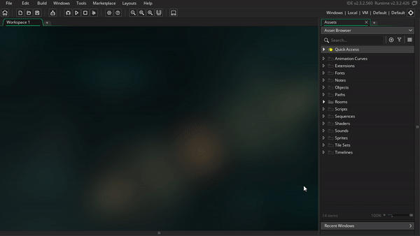
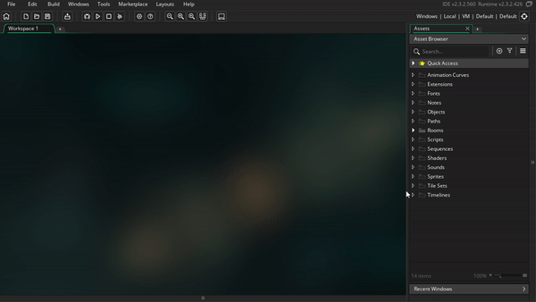

# Game Maker Studio Interface

## Panel Types

The **workspace** and the **resource tree**, are the 2 main panels to be aware of.

As our project grows, we'll continuously be adding new resources to the resource tree, and then we'll edit the resources in the workspace

> TODO: show screen shot of busy workspace, and show how workspace items correspond w/ the resource tree

As you edit resources, they'll generate more tabs and panes as needed

> TODO: show screen shot w/ examples of sprite editor tab, and room editor tab

## Adjusting the panel layout: Minimize, Move, Add, Remove

You have a lot of flexibility to adjust the layout of the panels. For example you can minimize / maximize them, as well as move them to other positions
as well as add or remove panels to your liking

You can also remove panels, but don't worry, if you remove one by accident you can always add it back via the windows menu

TODO: dig through windows menu to see if there's more I want to highlight
