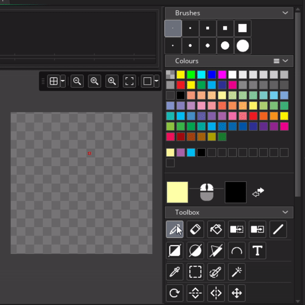

# Game Maker Studio Resource Types

Game Maker has many different resource types to work with, but some are more important than others. When starting out your bread and butter will be Sprites, Objects, and Rooms. Let's quickly create some, and then run our game for the first time

## Sprites

**Sprites** are essentially pictures / images. In general, the term usually refers to small, 2D, pixel art images, however in Game Maker all images (character art, backgrounds, tilesets, etc), are initially imported as sprites.

There's a lot of ways to create sprites, but my prefered method is to right click on the sprites folder and select "Create > Sprite" (if you want to be fancy you can also hit alt + s). This will spawn a sprite resource window in your workspace. We'll name the first sprite "sPaddle"

> TODO: gif creating a new sprite

As a side note, the sprites folder, and folders in general, don't really mean anything. You can drag sprites into other folders, and delete folders as you please. That said I still prefer to keep resources in their corresponding folders. This is why I specifically right click on the folder when creating new sprites.

> TODO: gif moving sprite between folders

## Naming convention

We can name resources whatever we want in Game Maker, but most Game Maker users like to follow a convention depending on the resources. I start my names with lower case letter(s) for the type, then I capitalize the first letter of the name. For example, sPaddle, oPaddle, and rmRoom are names for a sprite, object, and room respectively. I've also seen people use the convention spr_paddle, obj_paddle, and rm_game (this is probably more common than mine, but I like the shorter names)

## Sprite Editor

Let's make a paddle for the pong game!

By default, Game Maker will use 64x64 as the sprite size. But we want our paddle to be tall and skinny so we'll also resize it to 32x64. To do this we'll hit the resize button then adjust the numbers under "Scale Image" before hitting "Apply"

> TODO: gif resizing the image

From here we can click "Edit Image", this will open the sprite editor in a new tab. Then use the fill tool to make the entire image white. This will automatically update the sprite preview

> TODO: insert gif doing the above, also it should highlight the preview update

For this course, we won't be focusing too much on making the art, since that's not really my skill, but here's a handful of sprite editor tips to help you get by

| Tip | GIF |
| --- | --- |
| Paintbrush |  |
| Left and Right click |  |

Add solid and ball as well
