# Game Maker Studio Resource Types

Game Maker has many different resource types to work with, but some are more important than others. When starting out your bread and butter will be Sprites, Objects, and Rooms. Let's quickly create some, and then run our game for the first time

## Sprites

**Sprites** are essentially pictures / images. In general, the term usually refers to small, 2D, pixel art images, however in Game Maker all images (character art, backgrounds, tilesets, etc), are initially imported as sprites.

There's a lot of ways to create sprites, but my prefered method is to right click on the sprites folder and select "Create > Sprite" (if you want to be fancy you can also hit alt + s). This will spawn a sprite resource window in your workspace. We'll name the first sprite ``sPaddle``

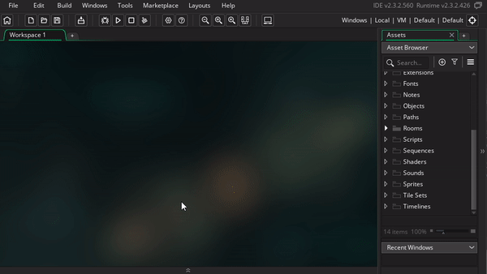

As a side note, the sprites folder, and folders in general, don't really mean anything. You can drag sprites into other folders, and delete folders as you please. That said I still prefer to keep resources in their corresponding folders. This is why I specifically right click on the folder when creating new sprites.

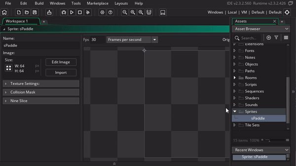

## Naming convention

We can name resources whatever we want in Game Maker, but most Game Maker users like to follow a convention depending on the resources. I start my names with lower case letter(s) for the type, then I capitalize the first letter of the name (this is called camel case). For example, ``sPaddle``, ``oPaddle``, and ``rmMenu`` are names for a sprite, object, and room respectively. I've also seen people use the snake case convention ``spr_paddle``, ``obj_paddle``, and ``rm_menu`` (this is more common than mine, but I like the shorter names).

If your curious, you can find the full list of word combining conventions [here](https://en.wikipedia.org/wiki/Naming_convention_(programming)#Examples_of_multiple-word_identifier_formats)

## Sprite Editor

Let's make a paddle for the pong game!

By default, Game Maker will use 64x64 as the sprite size. But we want our paddle to be tall and skinny so we'll also resize it to 32x128. To do this we'll hit the resize button then adjust the numbers under "Scale Image" before hitting "Apply"

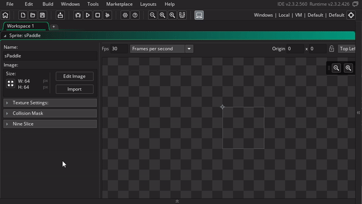

From here we can click "Edit Image", this will open the sprite editor in a new tab. Then use the fill tool to make the entire image white. This will automatically update the sprite preview

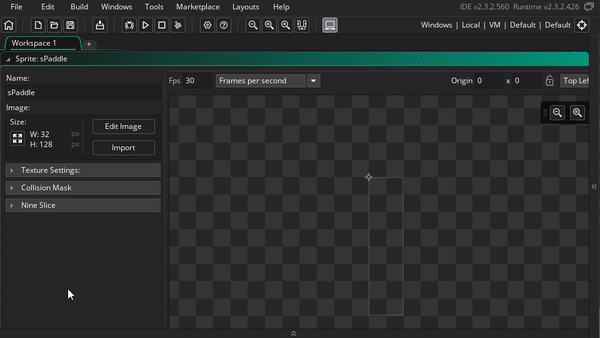

For this course, we won't be focusing too much on making the art ( it's not really my skill), but here's a handful of sprite editor tips to help you get by

| Paintbrush Tool |  | Left and Right click |  |
| Brushes | 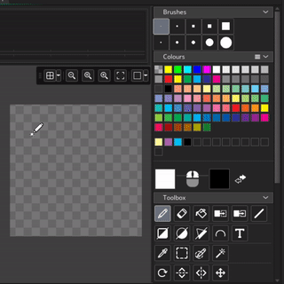 | Change Color | 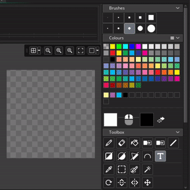 |
| Filled Rectangle Tool | 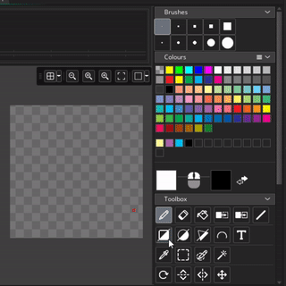 | Rectangle Outline Tool | 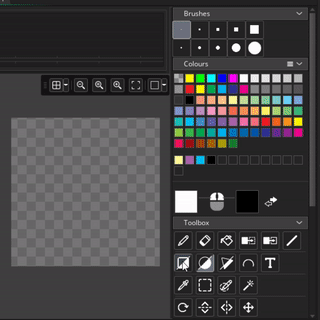 |
| Filled Circle Tool | 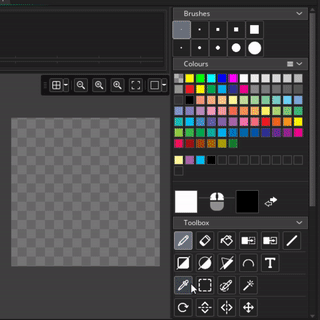 | Circle Outline Tool | 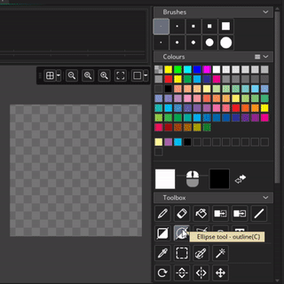 |
| Erase Tool | 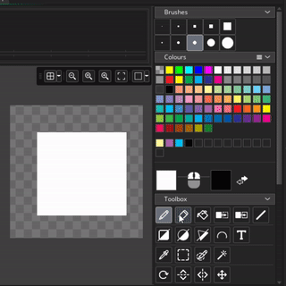 | Line Tool |  |

To put your skills to the test, go ahead and add sBall (16x16) and sWall (64x64)

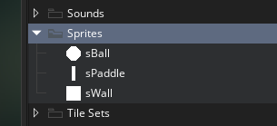

## Objects

Next we'll add objects for each of the sprites. You can think of objects as sprites w/ brains. We'll be spending most of the course working inside objects making them smarter, but for now we'll just make empty objects with sprites attached

Similar to the sprites, right click on the folder and select "Create > Object" to create an object (or hit (ALT + O) if you want to show off ). From there we'll name the first one ``oPaddle``

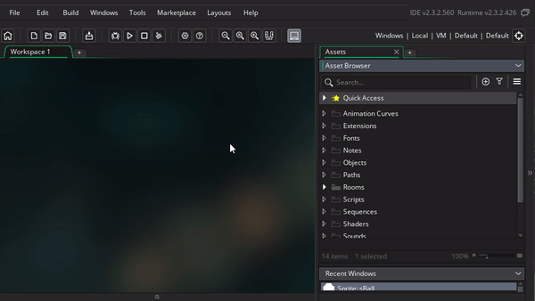

then we can set the sprite accordingly

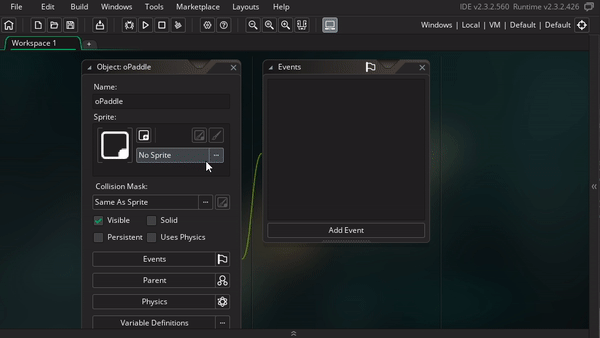

Rinse and repeat for ``oBall``, ``oWall``, and ``oEnemyPaddle`` (enemy paddle will use the same sprite as ``oPaddle``, and that's ok ;) )

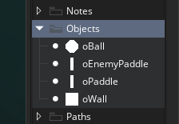

## Rooms

Rooms are essentially levels, it represents what will be shown on the screen. We can place a bunch of objects, sprites, and other resources here to form levels, menus and any other room we can think of. (side note: most other game engines refer to rooms as "Scenes" )

We'll just use the default room for now. When we click in there, we can drag objects from our asset browswer into the room. Go ahead and added 2 paddles and a ball

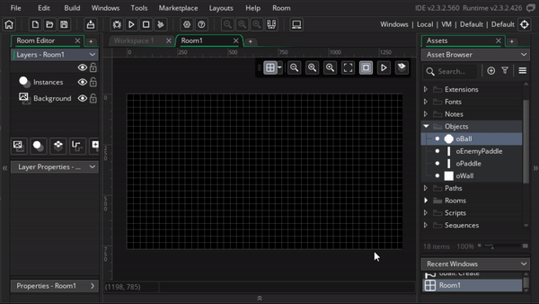

## Objects vs Instances

When I add objects to the room, they're not technically objects anymore. They're instances. You can see this my double clicking on the instances. You get an instance window, and they have a different name. You can think of objects as a blueprints, and instances as creations (or instantiations) of the blueprints. This distinction is important because we can see each instance has properties, and instances can have different properties despite coming from the same object

As an example, let's stretch some walls to span the top and bottom of the room. When we do this you can see the scale properties can be different for each instance.

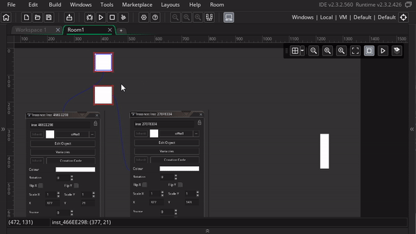

We'll be digging a lot more into properties as we go, but this is enough for now to complete our first level :D. Your room should now look as follows

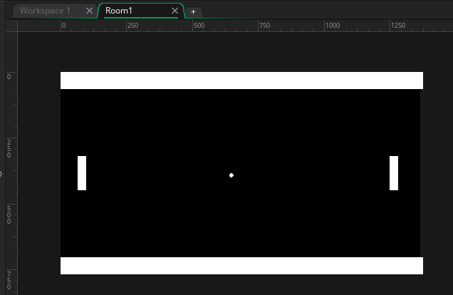

> NOTE: Java and many other languages have the concept of static vs non-static. It's very confusing to new students, but the concept is identical to the object vs instance distinction we just made. So if you're learning that in the future, and get confused, feel free to come back here for a refresher ;)

### Layers

We're almost ready to run the game, but before we do I quickly want to highlight room layers. As you're adding resources to your game, you can use the layers to determine what order they're drawn

In this case we can see all the instances are under the Instances layer. You can tell by toggling the visibility on the layer, as well as seeing the instance list under the instance layer properties

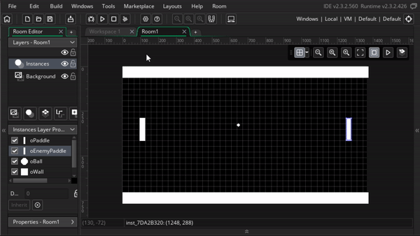

The other default layer is the Background layer. All this layer does is fill the room with this solid black color. We can change the color if we dig into it's properties, it works pretty much the same as the color selection from the sprite editor

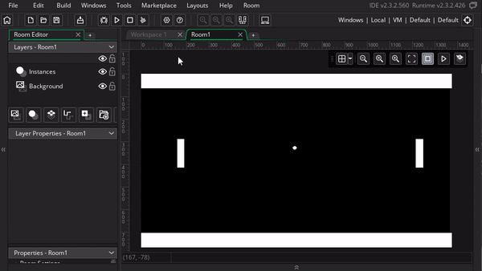

As a test to see the layer order in action, we can swap the order of the Background and the Instances layer. You'll notice that all our instance dissapear because now they're behind the background

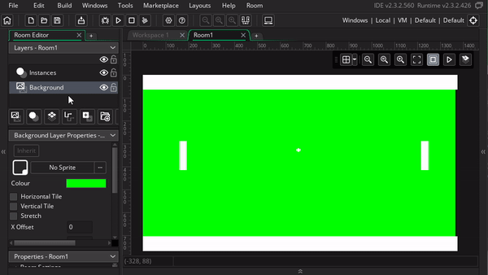

There are several more layer types, and we'll be diving into several of them, but sticking to these 2 will be sufficient for now

## Run the game

When your room's ready, you can hit the run button in the toolbar (or F5), and then we'll see our level in the game window :D

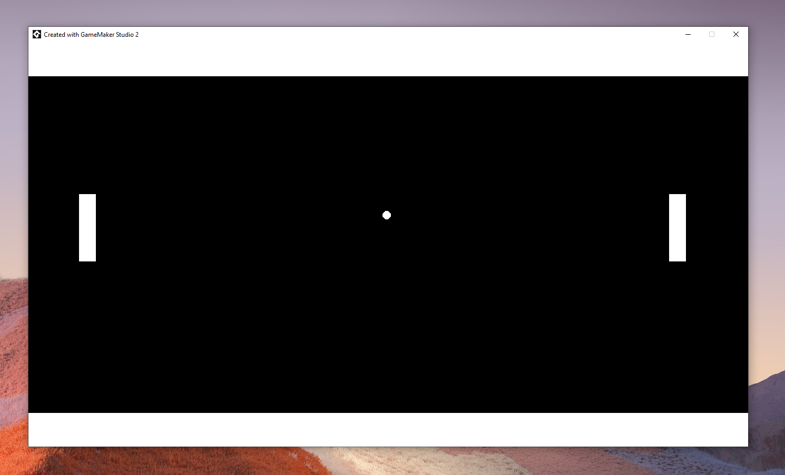

This is a special moment, you just made something, and it's running in real life program on your computer. It's beautiful :')

TODO:
	add section on scrolling and zooming on the interface
    - ctrl + scroll zoom
    - middle click pan
    - different contexts: demo w/ sprite editor
    - drag windows
    - laptop control zoom
    - laptop alt pan
	add note on "maintain aspect ratio"
	add hint that ball uses circle tool
  add note that instance layer needs to be selected to add instances
	add note on room grid tool (also note that grid settings is saved per layer)
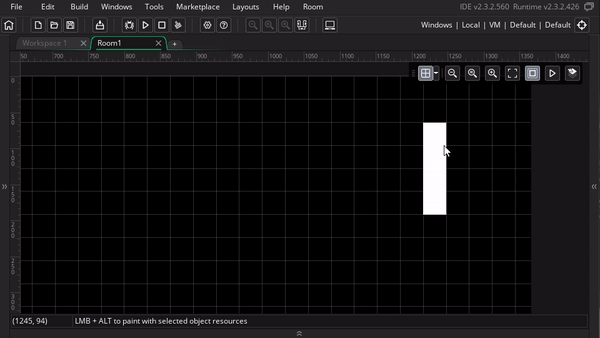
  insert image of game run button
  resize classic xy
