# Getting started with GML

The the previous section we just had a BIG first, we ran our game for the first time :D. This section will be a rapid fire of more BIG firsts. Here's the list

 * We'll change instance positions with code 😎
 * We'll use keyboard input to make the game interactive 😲
   * and we add a local versus mode while we're at it 😵
 * We'll make instance interact with each other 🤯

That's all on this page!! Let's do it!

## x / y axis

Let's look back at the instance properties in the room editor. Earlier we modified the scale x property, but there's much more where that came from and we'll quickly become familiar with all of them throughout the course. The most important properties here are the x and y, so dig into those next. You were probabaly wondering what the X by Scale X meant. x and y are pretty much just short hands for horizontal and vertical respectively. So why didn't they call it horizontal scale, and vertical scale instead? Well we refer to x and y so often that they it wouldn't quickly become tedious to always need to say horizontal or vertical.

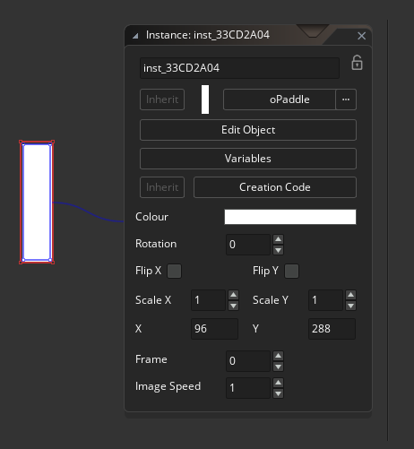

So with that said the x and y variables represent where each instance is positioned in the room horizontally and vertically. If you drag one of your instances to the right you can see that the x increases. Similarly if you drag the instance down you see that y increases. I can also set the x and y directly in the instance properties.

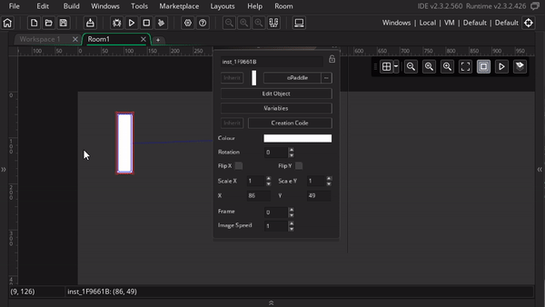

If I set it to x = 0, and y = 0, where do you think the instance will move to? (I'm hiding the rest of the section for you to think about it 😉 )

<details>
<summary> <b>Where in the room is x = 0, y = 0?</b> click to see </summary>

<p>
If you said, top left corner, you would be right! Since moving right and down made both variables bigger, that meant that moving left and up makes them smaller, and since x = 0 and y = 0 is the smallest number you can have without going negative (and you can go negative by the way), it makes sense for that to be the top left corner
</p>

<p>
This is can be really confusing because it's different from it's different from what you'll learn in your math and physics classes. In school, going up increses y (not down), and the x = 0 and y = 0 point is in the bottom left (not top left). So make sure flip the switch when back to "up is more" when you go back to school, I hate for this course to hurt your grades
</p>

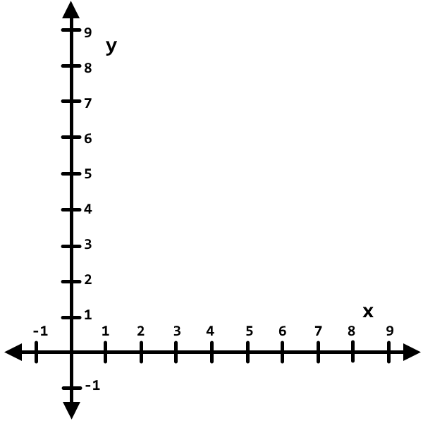

<p>
Another handy trick for viewing x, y is to look at the bottom left of the room editor. There you see 2 numbers (for example ``(841, 592)``). Those represent the x, y position under your mouse cursor, and you can that to again verify the following:
</p>

<ul>
 <li> Moving the mouse left decreases x </li>
 <li> Moving the mouse right increases x </li>
 <li> Moving the mouse up decreases y </li>
 <li> Moving the mouse down increases y </li>
 <li> Moving the mouse to (0, 0) is at the right spot </li>
</ul>

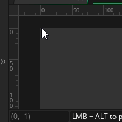

</details>

## Events

We're very close to digging into code, but first we need to understand events. Code is our tool to describe "What" should happen, but events show us "When" it should happen. For example, if we go to the ball object, and click "Add Event" we can see lot of options.

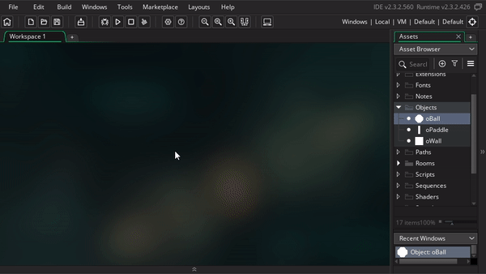

Luckily we only usually need a few of these. These are the common ones we'll use today

 * **Create**: This is triggered when the instance is first created
 * **Step**: This is triggered every frame of the game (by default 30 times per second, but this can be tweaked)
 * **Keyboard events**: These are triggered in reseponse to your keyboard inputs

For now, let's add a **Create** event. Once you've done that you should see a text editor pop up for us to start entering a code (the natual "What" that triggers from the "When").

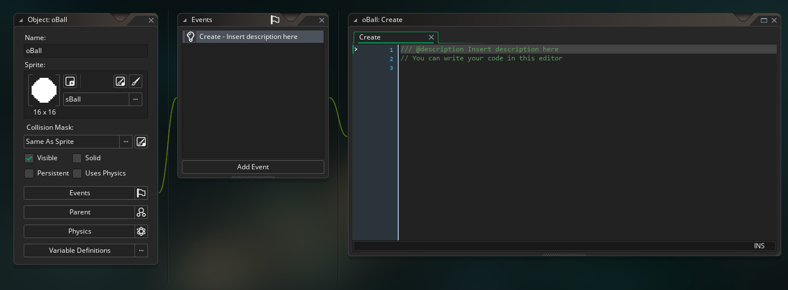

There's some default code already in the create event, but go ahead and remove all of it. This way we can start form a clean slate

## Variables

Yay! we can finally start coding (it's like my favorite thing 🥰). Since you now know what x and y are, let's make that our first coding task!

In coding terms, all the instance properties we were working with are actually called variables, and they each correspond with a variable name in GML. We'll be working with the variables for X and Y, which in code are just ``x`` and ``y``.

Here's how you assign values to variables in code

```
variable_name = new_value;
```

Example

```
x = 300;
```

The above code sets the ball's x to 30. We can run the game to verify this but before we do, try predicting where the ball will show on the screen (maybe you can use the mouse trick I showed you in the x/y axis section?). When you're ready run the game and see if you're right

<details>
<summary> <b> Where will the ball be placed? </b> Expand to find out</summary>

<p>
If you said "center leftish", you'd be right!!
</p>

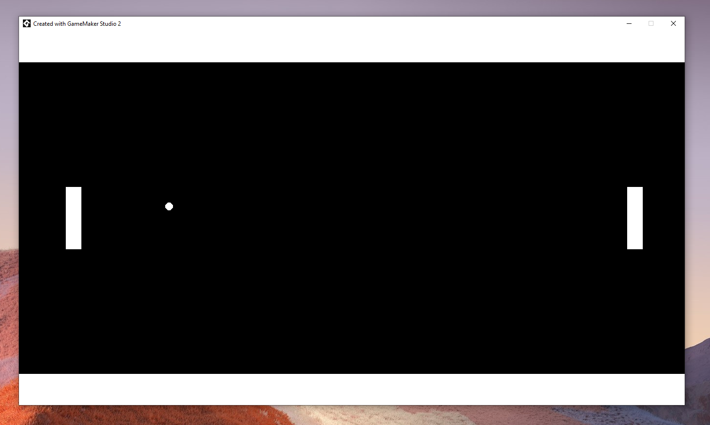

</details>

Before we move on to adjusting more variables, I have some more details to share on assigning variables

 * **Assignment Operator**: In code, we call `=` the Assignment OperatorWe can think of the variable name on the left as a box, the assignment variable moves the value on the right into the box. Unlike math there's no rule that the contents of the box has to be the same as the value for the statement to be valid (although they will be the same once the value is moved into the box). For now these differences are subtle, but they'll be important to understand later
 * **Semi Colons**: The semi colon, `;`, marks the end of the statement, think of it like the period at the end of a sentence, it represents the end of a complete thought 😊. We use them here for the assignment statement, but we'll also need it on all future statements. Interestingly, you can actually remove semi colons, and your code will probably still work fine. However there's some specific situations where things could break, and if you hit those situtations, it will be VERY hard to find the issue. For this reason yoyogames STRONGLY recommends using semi colons, so this is a good habit to keep.
 * **Spacing**: I included a single space on either side of the equal sign, but I don't have a space before the semi colon. I almost always do it this way to keep things consistent, but Game Maker doens't actually care at all. You can add as many spaces, tabs, or even new lines around you code, and Game Maker will handle it the same. This will be particularly useful when we start getting into functions later. Below are some examples with our assignment statement.

```
x = 30;
```

```
x=30;
```

```
        x      =           30             ;
```

```
x     
=
30
;
```

As another exersize, why don't you setting the x / y in the create event to position to the ball in the exact center of the room? This is a tad open ended, so be ready to do a bit of thinking and tinkering

<details>
<summary><b>How do you put it in the exact center?</b> expand to find out</summary>

Here it is!

<div class="highlight">
<pre class="highlight">
<code>x = 683;
y = 384;</code>
</pre>
</div>

To do this you need to figure out the width/height of the room, and then divide by 2. There are a couple ways you can do this
<br>
One way is to hover your mouse, or move and object, to figure out what the x,y position is at the bottom right corner of the room. Since the top left is (0, 0) the bottom right will be (width, height) (where you replace width, height with whatever the actual width/height is)
<br>
Another way is to inspect the room properties (located below the layers and layer properites by default). There you'll see that the default room width and height are 1366, and 768 respectively, but you can change them here if you want to.
<br>
Yet another way, (and if you got this you're really ahead of the curve, since I haven't taught this yet), is to find the variables for room width and height. Then you can do the math directly in code, and you'll end up with this

<div class="highlight">
<pre class="highlight">
<code>x = room_width/2;
y = room_height/2;</code>
</pre>
</div>

</details>

## Comments

Setting variables was our first GML concept, now comments will be our second one

Here's an example of a comment in our code, try adding it to your ball's create event then run the game and see what happens

```
// This is a comment
```

<details>
<summary><b>What happens?</b> Expand to find out</summary>


<p>
Sorry that was a little mean, nothing actually happens
<br>
But that's the beauty of comments, you can enter ``//`` and then fill the rest of the line with whatever you want, and Game Maker won't care!
<br>
I recommend you use these as much as you can (especially when you're starting out). Code can be very confusing, so leverage comments to describe what your code is doing. This way future you can come back to it the code and still be able to understand what your code is doing
<br>
( Also side note, am I dating myself by using that meme? Is rick rolling still a fun thing kids do these days? oh boy :'( )
</p>

</details>

``//`` is just one type of comment, another helpful format is ``/* comment */`` this lets you specify both the beginning and the end of a comment. This is helpful for for if you want the comment to span multiple lines, or if you want the comment to end before the end of a line

```
/*
  this is
  a multi line comment
*/
```

```
x /* <- that's the x variable, and this is a comment I'm inserting in my code */ = 3;
```

There's also a 3rd type called a JSDoc comment. We actually saw it when we first made our create event (we immediately cleared it, but you can see it again by creating a new event)

```
/// @description I'm describing the create event within a comment :O
```

Using `///` signals to game maker that you're using JSDoc format, and Game Maker will try to use this for documentation. For now that just means you can add a little blurb next to your event, but there's a lot more you can do with it (particularly when you get into making your own functions, but that's outside the scope of this course)

We won't be using the `///` in this course, I still barely use them on my own, but I wanted to include them here for completeness

## Keyboard Input

Now we're ready to make our game interactive :D, and in particular we're going to make our paddle move up and down in response to the keyboard buttons

We'll use keyboard events for this, there's actually 3 types

 * **Key Pressed**: This event triggers once on the exact from that you press the key
 * **Key Released**: This event triggers once on the exact from that you release the key
 * **Key Down**: This event triggers every frame that the key is held down (if I was naming this, I probably would have said Key Held instead but yoyogames didn't ask me)

We're going to simulating vertical movement by repeatedly adjusting our y value a little bit at a time. Which event type do you think we should use?

<details>
<summary> <b>Key Pressed, Key Released, or Key Down?</b> click to see </summary>

<b>Key Down</b>
<br>
Since it's repeatedly updating every frame, Key Down is the way to go, Key Pressed/Released would have only activated once
<br>
Go ahead and jump into oPaddle and add events for "Key Down > Up" and "Key Down > Down" (super confusing, again I wish I could say "Key Held > Down" :'( )

</details>

For the up event code we want the y value to be moved a little bit up each frame. Here's the code for that

```
y = y - 4;
```

This is using the same variable assignment structure but there are a few extra curve balls here

In this case we want to set the new position **relative** to the old position instead of setting it to a specific number, so that's why we need to include y on the right side

This also further highlights the differences with the mathematical equals sign, since the left/right side are clearly unequal. Instead the GML equals sign is actually saying "set the new y value to be the old y value - 4". In fact, let's add that as a comment

```
// set the new y value to be the old y value - 4
y = y - 4;
```

When you run this in game, you should see the paddle moving up in response to the up button

Now you can add the following in the Down event to support both directions

```
y = y + 4;
```

## Enemy Controls

Now let's practice this and see if you can add similar controls to ``oEnemyPaddle``. Instead of the arrow keys, let's use WASD

<details>
<summary> <b>Add Enemy Controls</b> click to see </summary>

It ends up being the same code, just with different events

<br>
<b>Key Down > W</b>

<div class="highlight">
<pre class="highlight">
<code>y = y - 4;</code>
</pre>
</div>


<b>Key Down > S</b>

<div class="highlight">
<pre class="highlight">
<code>y = y + 4;</code>
</pre>
</div>

</details>

Great work! Now when we test it, we should be able to move both individually

Feel free to swap out 4 with a different number to find a speed that feels better

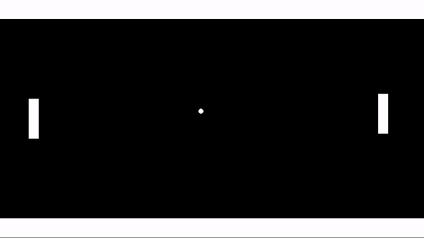

## Ball movement (w/ hspeed and vspeed)

Now it's time to get the ball rolling (hehe)

We're using a different movement approach for the ball. Instead of directly setting it's x/y position every frame, we'll set it's speed in the beginning, and then let game maker update it's x/y for us. Add the following to oBall's create event (new variables, yay!)

```
hspeed = 4;
vspeed = 4;
```

The hspeed and vspeed variables represent how fast the ball is moving in the horizontal and vertical directions respectively. In a more literal sense, it represents how much we want the x/y values to change each frame. That said doing the following in the step event should get you exact same results

```
// NOTE: don't actually add this to your project, this is just a example
x = x + 4;
y = y + 4;
```

Speaking of results, let's do a pop quiz, what do you think the results will be when we run the code?

<details>
<summary><b>Which direction will the ball move?</b> Click to find out</summary>

Diagonally down and to the right

Remember positive x and positive y are right and down respectively

Because we're doing both at the same time we end up with a diagonal effect

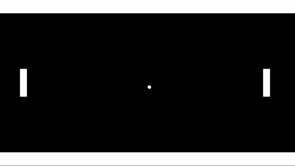

</details>

## Collisions

So we've got the ball rolling, but now it just keeps on rolling w/o any respect to walls or physics of any kind. To fix this we need collisions

In ``oBall`` add a collision event w/ ``oWall``. When this happens we want to reflect the ball's vertical motion, luckily there's a clever way to do that using the techniques we already know and love (or at least know, love will come w/ time)

```
vspeed = -vspeed;
```

Let's think through the cases

 * **Going Down to Up**: We start with ``vspeed = 4``, meaning the ball is going down. So ``vspeed = -vspeed`` would result in ``vspeed = -4`` ... which is up ... cool ✅
 * **Going Up to Down**: Here we have ``vspeed = -4``, meaning the ball is going up. So ``vspeed = -vspeed`` would result in ``vspeed = -(-4)``, and from our math class we know that 2 negatives make a positive (you can punch -1 * -2 in to a calculator to validate). So that would result in ``vspeed = 4`` ... which is down .. cool ✅

So that works!

<details>
<summary><b>Using the same technique can you add horizontal collisions w/ the paddes?</b> Click to see</summary>

Should just be a matter of different collision events w/ using the hspeed variable instead of vspeed

You can add 2 collision events to the ball (one for both paddles) and use the following code for both

<div class="highlight">
<pre class="highlight">
<code>hspeed = -hspeed;</code>
</pre>
</div>

</details>


## Restarting the game

The game is looking great, you can actually sort of play a game against someone now 😮. And this is all using only events and variable assignments 🤯, it's really cool how much you can make in game maker with so little

But that said, I've milked variable assignments as much as I can and now it's time to move on

Right now, you can "win", but that just means that the ball goes off the screen, and you and your friend are just stuck waiting for the rest of eternity. There are more elegant ways to handle this, but for now let's add a restart button as a quick fix

Just add Key Press event for the letter R to ``oBall`` (this can be any object, but we're already in ``oBall`` so why not). Then add the following code

```
game_restart()
```

Now you should be able to press R in game and the game will restart!

We've got a few things to break down here. First off, what the heck are those `()`?

Well, game_restart is a function, and can always tell functions apparent from variables by seeing if they have the `()` (sometimes there's more things between the parens, but we'll get to that later)

>  ahem 🤓, technically you can refer to functions without (), but () is requried to actually "call" the function and make it do things. This distinction probably won't matter to you until years down the line but for some reason I felt the need to make the clarification anyway

Here's my working definition for functions

> **function**: a command that does 1 or more of the following
1. Takes inputs
2. Performs an action
3. Gives back outputs

In our case game_restart performs an action (it restarts the game), but it does so without taking inputs or giving back outputs

Here's a general form for a function that does all 3

```
output = function_name(input1, input2, input3)
```

We'll see plenty of examples for this later, so don't worry if it's confusing

On a smaller note, why did I choose Key Press instead of one of the other key events? Think about it first, there's not necessarily a right answer

<details>
<summary>but that said click here for an answer</summary>

In this case you could use any of the 3 w/o noticing much of a difference

Key Down would be a little weird. Remember key down triggers on every frame where the key is held down. This would be an odd choice, since we only need to restart the game once, but there's no harm in multiple restarts I suppose

For Key Press vs Key Released, there's an argument for both. Key Press will trigger faster, but sometimes I'll use Key Released if I want to communicate what you're interacting with before the action occurs.

For example, if I setup the spacebar to be a keyboard shortcut for a play button, I might use Key Released, and then also use Key Down to perform a short hover animation on the button. This way you can see which button you're trigger before it triggers

In this case we're not providing feedback anyway, so Key Press is probably ideal

</details>

## Fixing a bug using abs()

After playing the game for a while you might notice a bug in the collision system. Specifically, if you move the paddle to hit the ball vertically


The assumption in our collision logic, is that the event will only be triggered once, and that flipping the speed will be enough to ensure the collision doesn't trigger on the next frame

Thing is, a collision in game maker is synonymous w/ "overlap", so if it's still overlapping the event will continue to trigger long after the initial contact. So in our example the horizontal direction is continuously being flipped, and the ball is stuck

To fix this, I'll update the logic to force collisions with ``oPaddle``, and ``oEnemyPaddle``, to explicitly force the ball to move right and left respectively.

oBall's collision event w/ oEnemyPaddle

```
hspeed = abs(hspeed)
```

This uses abs() to take the existing hspeed, and then output a positive version. Effectively forcing the ball to move to the right regardless of the current hspeed. Here's some more formal abs() documentation

> **abs()**: Short for "absolute value", it returns the positive version of the number
Input: an input number
Action: if the number if negative, multiply it by -1 (2 negatives make a positive 😉), otherwise leave it unchanged
Ouptut: positive version of the number

Then we can use similar same logic to for it to the left on the players paddle

oBall's collision event w/ oPaddle

```
hspeed = -abs(hspeed)
```

When testing it out, this edge case should be fixed


## Randomize ball speed (featuring choose())

So far the ball has been really predictable, it just starts off in the same diagonal direction regardless of how many times you restart

Let's add some randomness the start direction, and get some more function practice in while we're add it. Here's the new create event for ``oBall``

```
hspeed = choose(-4, 4);
vspeed = choose(-4, 4);
```

Introducing the choose function! This takes in a series of inputs, randomly "chooses" one, and then gives it back. So our hspeed and vspeed can both be either -2 or 2

Here's a more formal definition using the my earlier specificaion

> **choose()**: randomly chooses from the inputs
Input: 1 or more parameters representing the choices
Action: Randomly chooses among the input parameters
Output: The chosen parameter

Also node how we're using variable assignment and functions together in the same line. We're taking the output from choose, and then using the assignment operator to direct that output toward one of our variables

Now here's what it looks like when we press restart

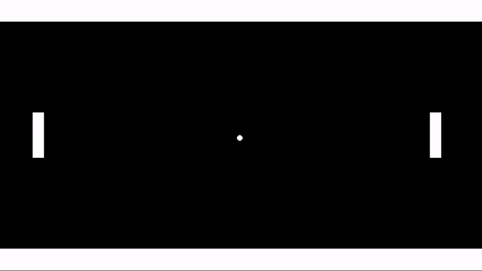

But it seems a little odd that it only goes diagonal. We certainly don't want it to go vertical (that would be a VERY long wait), but maybe horizontal? Why don't you give it a try?

<details>
<summary> <b>Update the code to have horizontal as possible direction</b> Click for code </summary>

test

<pre><code>hspeed = choose(-2, 2);
vspeed = choose(-2, 0, 2);</code></pre>

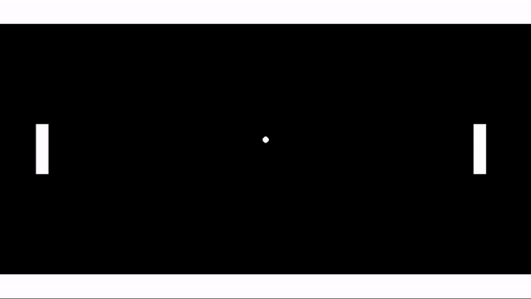

On second thought, I don't like this very much, it's just ... boring 😴 (but good job on figuring it out 😉 )

</details>

## Reset the ball

The restart button is nice, but as I mentioned earlier it's certainly not the best way to go about reseting the ball. A better approach would be to have the ball reset on it's own once it leaves the room

There are lots of ways to do this, but since we're on function streak, let's run with that

Add the following code in the outside room event for ``oBall``:

```
instance_create_layer(xstart, ystart, layer, oBall);
instance_destroy();
```

woah, new event, new variables AND new functions 😨. Take a deep breath, let's break it down

First, here's the english translation

```
When I (meaning me the ball), go outside the room:
  Create a new oBall instance using my layer at the position where I originally spawned (meaning the center(ish) of the screen)
  Self destruct (it's that or wander in the endless space outside the room forever)
```

For the event, outside room should be pretty self explanatory. It'll be triggered once x/y value of the instance goes out the dimensions of the room

Here are the new variables

> **xstart**: the x position where the instance was first created

> **ystart**: (you guessed it 😉) the y position where the instance was first created

> **layer**: represents the current layer of the object (so far that's always been the "Instances" layer, but we can just refer to the layer variable in case that changes)

> **Fun Fact**: I guess oBall is technically a variable? But you should think of it as a asset. And as a fun fact, you can refert to any of the assets in the asset browser in code. Here we used oBall, but if you type out any of the other ones (like sPaddle?) they should all be highlighted the same

and here's the functions

> **instance_create_layer()**: Creates an instance at a specified layer / position
Input: x/y/layer for the new instance, as well as the object you want to create an instance of
Action: create an instance using the specified parameters as properties for the instance
Output: the id of the new instance (but you don't need to worry about this, we're not using it)

> **instance_destroy()**: Destroys the current instance, no more events, it's over
Input: nothing
Action: Destroys the current instance (technically 🤓 it won't get destroyed until the current frame is completed. I guarantee you'll forget this and then relearn it the hard way when you hit a weird bug, but I figured I'd mention it anyway)
Ouptut: nadda

Testing this out should work, when a ball leaves the room, it will destroy it's self and new ball will show up at the start allowing the game to continue

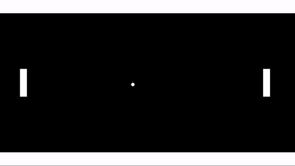

But that's kind of morbid don't you think? Does it have to die? Is there a way we can reuse the same ball?

Yes there is, and it's actually a lot simpler too. Can you think of it?

<details>
<summary> <b>How to reset the ball w/o destroying it?</b> Click to find out</summary>

Yep, just use the following code in the outside room event

<pre><code>x = xstart;
y = ystart;
hspeed = choose(-2, 2);
vspeed = choose(-2, 0, 2);
</code></pre>

This just moves the existing ball back to it's starting position, and then it picks a random direction again

Resetting the position is probably the preferred approach, I mainly showed the destroy/recreate approach since I wanted to teach you more functions 🤫

But that said, this highlights the creative side of programming. You only have limited tools, and there's always multiple ways to mix and match to achieve your goals

</details>

## Summary

You learned a TON of new things just now, serious kudos for making it this far

 * **variables**: ``x``, ``y``, ``hspeed``, ``vspeed``, ``xstart``, ``ystart``, ``layer``
 * **events**: Create, Step, Keyboard input, Collision, Outside Room
 * **variable assignment**: ex. ``x = 50;``
 * **commenting**: ex. ``// this is a comment``
 * **functions**: ``game_restart()``, ``abs(..)``, ``choose(..)``, ``instance_create_layer(..)``, ``instance_destroy()``
